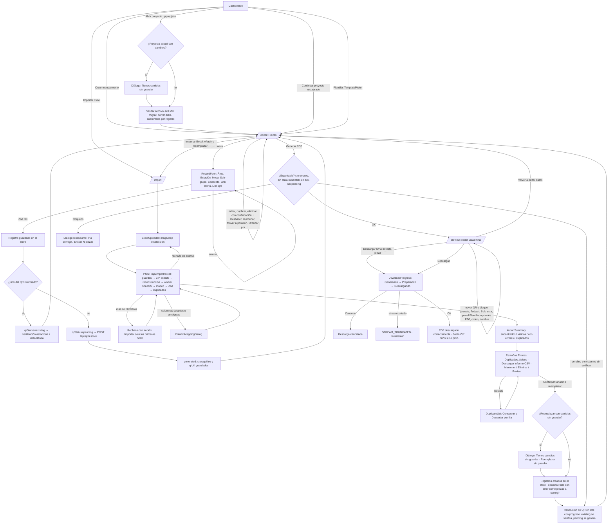
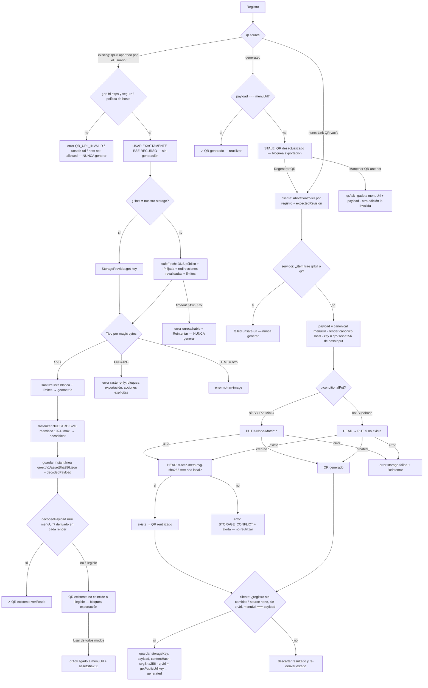
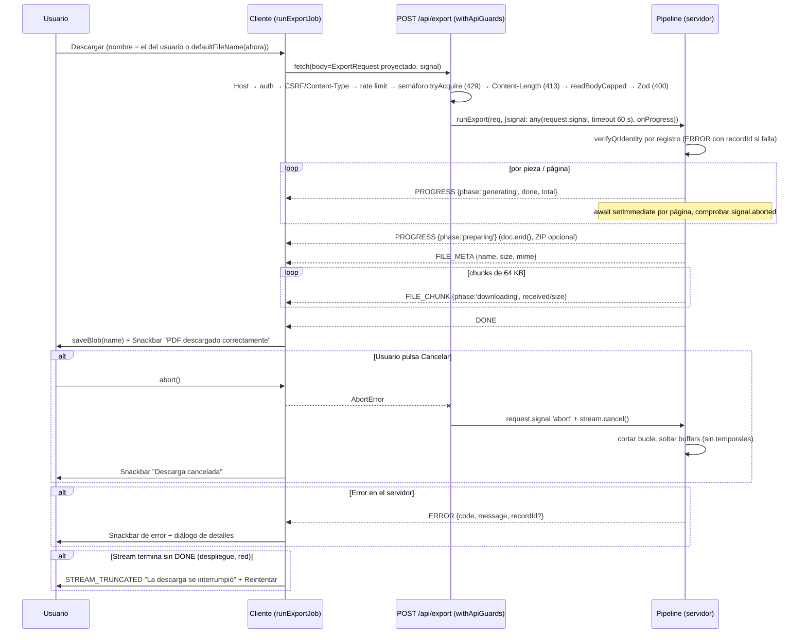
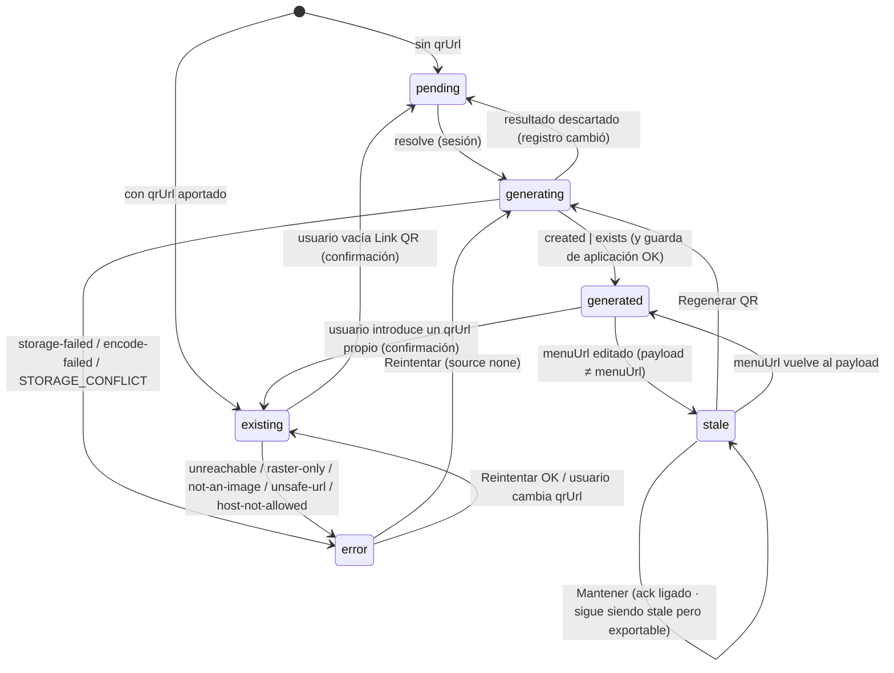

# QR Production Generator — Documento de Arquitectura (Fase 1)

> Estado: **APROBADO 2026-10-06** con los cambios del "Registro de decisiones" (al final), que prevalecen sobre el resto del documento. Versión previa: **VERSIÓN FINAL PARA APROBACIÓN** (borrador revisado tras tres revisiones adversariales: completitud, técnica y seguridad/operación). Fecha: 2026-10-05. Destino final: `docs/ARCHITECTURE.md`.
> Repo: `ic-qr` (Next.js 16.3.8, React 19.2.8, TypeScript strict, Tailwind 4, Bun 1.4 / npm).
> Este documento es **normativo**: las fases 2–12 deben implementarse según lo que aquí se decide. Cualquier desviación se registra como ADR en `docs/adr/`.
> Convención: **VERIFICADO** = comprobado en laboratorio (scripts ejecutados, `npm view`, lectura de código fuente o de la documentación oficial de Next 16.3.8). **NO VERIFICADO** = inferencia o conocimiento general pendiente de confirmar. Cuando una revisión no se acepta, la sección afectada lo indica con **"Revisión no aplicada:"** y su justificación.

---

## 0. Resumen ejecutivo

**Decisiones clave**

1. **PDF vectorial: un modelo intermedio único (`TileScene`, en mm) → dos renderizadores.**
   - `renderSvg(scene)` para vista previa, `.svg` por pieza y ZIP.
   - `renderPdf(scene)` con **pdfkit 0.20.2**, dibujando primitivas directamente. No se parsea SVG en el servidor.
   - El SVG y el PDF salen de la misma geometría. Se cumple el espíritu de "datos → SVG → PDF vectorial" sin una conversión SVG→PDF con pérdidas.
   - **Evidencia empírica** (lab `pdf/`, verificación por script con pdf-lib y pdfjs-dist; re-escaneada de forma independiente en la revisión técnica):

     | Comprobación | Resultado |
     |---|---|
     | Imágenes / XObjects / `paintImage*` / clips / SMask / OCG | 0 / 0 / 0 / 0 / 0 / 0 |
     | MediaBox | Se pasa **siempre en pt calculados desde mm** (`[w·72/25.4, h·72/25.4]`): A4 = `595.275591 841.889764` (exacta a 1e-6 pt). El nombre `'A4'` de pdfkit es `[595.28 841.89]` = 210.0016 × 297.0001 mm y **no se usa** (VERIFICADO en el código fuente de pdfkit) |
     | Transformación de pieza | `2.834646` pt/mm; origen (25 mm, 13.5 mm) = `70.866142 38.267717`; error de tamaño ≈ 6e-6 mm |
     | Fuentes (modo texto vivo) | subconjunto TTF embebido (`FontFile2`) con **ToUnicode** en todas |
     | Extracción de texto | se extraen "MENÚ", "LÍNEA" y "–" |
     | Operadores de texto | 1 `TJ` por línea (75 en vez de 1341 con svg-to-pdfkit) |
     | Modo contornos | 0 fuentes, 0 operadores de texto |
     | QR | **1 path compuesto**; 0 discrepancias con la matriz en *nonzero* y en *even-odd*; decodificado desde el PDF rasterizado |
     | CMYK y tinta plana | `/DeviceCMYK` y `/Separation /CutContour` verificados (nivel 2, ver decisión pendiente 11) |
     | Rendimiento | 1000 piezas en 3.85 s (Node 26) / 2.53 s (Bun 1.4.2); memoria plana (~270 MB) |
     | Next 16.3.8 | 500 piezas (34 páginas) en streaming desde un Route Handler: TTFB 35 ms, 1.24 s en total |

   - Alternativas medidas y descartadas: svg-to-pdfkit 0.1.8 (sin release desde 2019, un `Tj` por glifo, clips por pieza, sin CMYK); jsPDF 4.2.1 + svg2pdf.js 2.8.1 (ambos pesos con el mismo `/FontName` y TTF completo); Chrome `page.pdf()` (MediaBox inexacta 594.96×841.92 y origen desplazado 0.13 mm); Inkscape/rsvg (motor externo: ver implicaciones de despliegue en §E.1).
   - **La apertura en Illustrator no se pudo automatizar (NO VERIFICADO).** Hay un script de comprobación (`illustrator-check.jsx`), y su ejecución es una **puerta de aceptación de la Fase 4**.
2. **Texto:** por defecto **contornos** (`textMode: 'outlined'`) en el PDF y el SVG de fabricación, y también en la vista previa (WYSIWYG exacto). `live` queda como opción. Medición con **fontkit 2.0.4**, el mismo motor que usa pdfkit (diferencia 0 frente a `widthOfString`). Un único `SUPPORTED_CHARSET` gobierna el subconjunto de fuentes del cliente y la validación de glifos en ambos lados.
3. **QR:** librería `qr` 0.7.2 (versión exacta) solo para obtener la matriz. El SVG lo generamos nosotros: **un único `<path>` relleno trazado por contornos**. Determinista entre Node y Bun, byte a byte. Corrección de errores **H** (única en el MVP).
4. **Regla crítica (§9), reforzada en cuatro capas:**
   - Un `qrUrl` aportado por el usuario **nunca** provoca una generación; si es inválido o inaccesible, es un error visible, **nunca** un fallback a generar (desviación D9).
   - `/api/qr/resolve` **rechaza en el servidor** cualquier ítem con `qrUrl` o `qr.source ≠ 'none'` (defensa en profundidad).
   - El cliente aplica un resultado de resolución **solo si el registro no cambió** desde que se pidió (guarda de aplicación + `AbortController` por registro).
   - Un QR generado conserva su `payload`. Si se edita `menuUrl`, el registro pasa a **`stale`** y bloquea la exportación hasta elegir Regenerar o Mantener. "Mantener" crea un **ack ligado** a `(menuUrl, payload)`: otra edición lo invalida. Lo mismo para un QR existente que decodifica a otra URL o no se puede decodificar. **Nunca hay nada silencioso.**
5. **Storage:** interfaz `StorageProvider` con un adaptador S3-compatible (`@aws-sdk/client-s3` 3.1146.0, para AWS/R2/Supabase/MinIO) y un adaptador local.
   - **Claves direccionadas por contenido: `qr/v1/{sha256}.svg`**, subidas con `If-None-Match: *` (desviación D1). Idempotencia gratis: reintentos, pestañas duplicadas, estado perdido o reimportaciones no crean archivos nuevos.
   - El `qrUrl` de un QR generado **se deriva** de `storageKey` (`getPublicUrl`) y el servidor comprueba la identidad completa (`payload → hash → storageKey → qrUrl`) antes de imprimir.
   - Los QR existentes de terceros se verifican una vez y su geometría saneada se guarda como **instantánea** propia (`qr/ext/v1/{sha256}.json`): la exportación no sale a la red.
6. **Excel:**
   - Se parsea **en el servidor**, con SheetJS CE **0.20.3 desde el tarball del CDN** (la 0.18.5 de npm tiene 2 CVE altas).
   - Un guard propio valida el contenedor ZIP de forma **estricta**, mide cada entrada y **reconstruye un ZIP limpio**: SheetJS nunca ve los bytes subidos (cierra un bypass VERIFICADO por la revisión de seguridad).
   - El parseo corre en un **`worker_threads` con límite de memoria y tiempo**; se cuentan celdas antes de parsear.
   - Límites: solo `.xlsx`, 10 MB, 5000 filas, 300 000 celdas. Por encima del límite de filas se **rechaza** (con opción explícita "Importar solo las primeras 5000").
7. **API:** **solo Route Handlers, ningún Server Action.** Motivos: la descarga necesita streaming binario, progreso y cancelación, y la doc de Next 16.3.8 dice que las Server Actions se despachan "one at a time per client". Seis endpoints (§A.5; siete desde la Fase 6: se añadió `/api/preview/tiles`; el de importación es el de la Fase 7). Todos pasan por **`withApiGuards`**, en este orden: lista de `Host` (anti DNS-rebinding), autenticación *fail-closed*, CSRF (`Sec-Fetch-Site`/`Origin` + `Content-Type` exacto), rate limit, semáforo sin cola y, solo entonces, lectura del cuerpo con límite.
8. **Descarga:** un único `POST /api/export` que devuelve un **stream binario con frames** (progreso → metadatos → chunks → fin); progreso real en "Generando PDF…", "Preparando descarga…" y "Descargando…"; cancelación con `AbortController` (VERIFICADO en Node 24/26 y Bun 1.4.2); sin ficheros temporales.
9. **Estado:** Zustand 5.0.15 con un store de proyecto (IndexedDB vía idb-keyval, undo vía zundo) y uno de sesión, más archivo de proyecto `.qrproj.json`. La persistencia usa un **schema tolerante** y pone en **cuarentena por registro** lo ilegible: nunca se borra un proyecto entero. Un único escritor entre pestañas (Web Locks). **Sin base de datos en el MVP**; puertos preparados para PostgreSQL.
10. **Plantillas:** la estructura de cada plantilla es código versionado (`templates/*`), pero el usuario puede ajustar desde la UI un **subconjunto validado** (`TemplateOverrides`: textos, tamaños, alineación, color, peso, márgenes, zona de silencio y color del QR, fondo) además del layout (cajas del QR y del bloque de texto). Hay selector de plantilla y `templates/custom-template/` como esqueleto.
11. **UI:** MUI 9.4.0 (Emotion) con `@mui/material-nextjs/v16-appRouter` (`enableCssLayer`) y Tailwind 4 por capas CSS (VERIFICADO en build), con reglas de estilo explícitas (§S13). El editor visual es SVG propio con eventos de puntero y geometría pura en mm, **sin librería de canvas**. Matriz responsive explícita (§S12).
12. **Estructura:** se **migra a `src/`** en la Fase 2. Código isomórfico en `src/lib`, código solo de servidor en `src/server` (`import 'server-only'`).
13. **Deployment:** `output: 'standalone'`; **Bun solo como gestor de paquetes; Node 24 para build y runtime** (imágenes `node:24-trixie-slim` fijadas por digest). HTTPS obligatorio (contexto seguro). **MVP = 1 réplica.** Hay que corregir el Dockerfile actual (§S11).
14. **Orden de fases:** el **núcleo vectorial (QR + texto + escena + SVG + PDF)** se adelanta a la Fase 4, justo después del modelo de datos. Es la pieza de mayor riesgo y su validación en Illustrator condiciona todo lo demás.

**Desviaciones respecto al spec (requieren aprobación explícita)**

| # | Spec | Propuesta | Motivo |
|---|---|---|---|
| D1 | `/qr/{recordId}.svg` | `qr/v1/{sha256(payload+opciones+renderer)}.svg` | Idempotencia y deduplicación; el mismo QR = el mismo archivo (§S3) |
| D2 | `qrStatus: 'existing'\|'generated'\|'error'` | + `pending`, `generating`, `stale` | El spec ya exige "QR pendiente"; `stale` evita QR erróneos en metal |
| D3 | Endpoints `/qr/generate`, `/qr/reuse`, `/storage/upload`, `/pdf/generate` | `/api/qr/resolve` (lote), `/api/export` (stream) | Menos superficie y ningún endpoint público de subida (§A.5) |
| D4 | "Datos → SVG → PDF" | Datos → `TileScene` → {SVG, PDF} | Misma geometría y sin conversión con pérdidas |
| D5 | Texto (implícito: vivo) | Contornos por defecto, vivo opcional | Fabricación, independencia de fuentes y WYSIWYG |
| D6 | Estructura sin `src/` (repo actual) | Migrar a `src/` | Coincide con la estructura sugerida en el spec (§25) |
| D7 | Docker `bun run start` (runtime Bun) | Build y runtime Node 24; Bun como gestor de paquetes | Next 16 documenta solo Node ≥ 20.9 como runtime (§S11) |
| D8 | §4/§9 literal: "si [qrUrl] no existe *y es válido* → generar" | Un `qrUrl` **presente** pero inválido, inaccesible o raster **nunca** cae a generación: es un error con acciones explícitas | Lectura más segura de la regla "EXTREMADAMENTE IMPORTANTE": imprimir un QR distinto del que el cliente aportó es peor que bloquear |
| D9 | Nombres de §25/§39 | `src/templates/tropical` → `tropical-table`; `components/pdf` → `components/export`; `lib/pdf` → `server/pdf`; `TemplatePreview` se implementa como `TilePreview` y se exporta **también** con el nombre `TemplatePreview` | `tropical-table` es el nombre de §16; el PDF solo se genera en servidor; la pieza es más que la plantilla |
| D10 | Orden de fases de §52 | Núcleo vectorial (spec 7+9) en Fase 4; formulario manual (spec 5) antes que Excel (spec 4) | Riesgo primero; Excel necesita el store y las tarjetas (§G) |

---

## 1. Análisis de requisitos y ambigüedades técnicas

### 1.1 Requisitos que gobiernan el diseño (por prioridad del spec §54)

1. **Correctitud:** QR correcto en cada pieza, la regla de no regenerar, ninguna fila perdida y 50×50 mm exactos.
2. **Arquitectura:** capas separadas, una sola lógica de render y plantillas como datos.
3. **Datos:** Zod en todos los límites; nada inválido llega al generador.
4. **QR, SVG y PDF vectoriales, compatibles con Illustrator.**
5. **UX:** nada silencioso; contadores visibles; confirmación antes de perder datos.
6. **Performance:** 1000 o más registros sin bloquear la UI.
7. **Seguridad y operación:** cerrado por defecto (autenticación, CSRF, límites antes de leer cuerpos) y sin pérdida de datos ni de exportaciones en despliegues.

### 1.2 Ambigüedades (cada una con recomendación por defecto)

Formato: **Ambigüedad** · *Por qué importa* · Opciones · **Recomendación** · ¿Decide el usuario?

1. **Significado de "Link del QR".**
   - *Si se interpreta mal, se imprimiría un QR distinto del que el cliente espera, en metal.*
   - Opciones:
     - (a) URL de un **archivo de imagen de QR** ya existente.
     - (b) URL de **destino** distinta de `menuUrl` (p. ej. un acortador), que deberíamos codificar.
   - **Recomendación: (a).** Es lo que implica "usar ese recurso" (§9, §30). El sistema lo descarga de forma segura y examina su contenido:
     - si es `text/html`, devuelve el error `not-an-image` con el texto "¿Es un enlace de destino?";
     - no adivina en silencio.
   - Si el usuario necesita (b), se añadirá un campo `qrPayloadUrl` en el futuro.
   - **Sí, decide el usuario.**
2. **Formatos aceptados en `qrUrl`.**
   - *Un PNG o JPG no puede ser vectorial (§18, §44).*
   - **Recomendación:**
     - **SVG:** se acepta. Se sanea con una lista blanca, se reemite solo la geometría y se inserta tal cual, escalado a la caja. Se verifica decodificándolo y se avisa si el QR está hecho con trazos (*stroke*).
     - **PNG/JPG/WebP:** estado `error` con código `raster-only`. Bloquea la exportación y ofrece estas acciones explícitas:
       1. Subir el SVG original.
       2. "Reemplazar por QR generado por la app", con confirmación.
       3. *(post-MVP)* "Vectorización exacta": reconstruye la matriz original bit a bit, algo VERIFICADO en el lab con JPEG q40. Se etiqueta como "QR existente vectorizado".
       4. *(opcional, desactivado por defecto)* "Usar el raster tal cual": se incrusta la imagen con el aviso permanente "No vectorial" en la tarjeta, el resumen y el diálogo de exportación. El spec admite raster "salvo necesidad", pero rompe §18/§44, así que exige activación explícita por proyecto.
     - **PDF:** no se admite en el MVP.
   - **Sí** (sobre todo si las opciones 3 o 4 entran en el MVP).
3. **`qrUrl` inaccesible, no permitido o inválido.**
   - *Si se genera un QR "de respaldo", se viola la regla crítica.*
   - **Recomendación:** **nunca hay fallback a generación** (desviación **D8**: el spec literal diría "si no es válido → generar").
     - Un `qrUrl` sintácticamente inválido (p. ej. "hola") es un **error de validación** del registro.
     - Un host privado, una IP o `localhost` dan `unsafe-url`; con `QR_HOST_POLICY=allowlist`, un host fuera de la lista da `host-not-allowed`.
     - En la **importación** estos casos son **avisos** (la fila se importa como `existing` con `qrError`, bloqueada para exportar), nunca errores que excluyan la fila: así no se pierde el dato. El resumen los agrega por host ("37 QR existentes en `ejemplo.com` no permitidos").
     - Un timeout o un 4xx/5xx da `unreachable` y el botón [Reintentar].
     - Solo si el usuario **vacía** el campo de forma explícita (con confirmación), el registro pasa a `pending` y se genera.
   - **Sí** (aprobar D8).
4. **Edición de `menuUrl` en un registro con QR ya generado (QR *stale*) o con QR existente que no coincide.**
   - *El QR seguiría apuntando a la URL antigua: es el error más caro posible.*
   - **Recomendación:**
     - Si `qr.source==='generated'` y `payload !== menuUrl`, el estado es `stale` (derivado, no editable).
     - El badge muestra "QR desactualizado" con las acciones [Regenerar QR] (nueva clave; el archivo anterior se conserva) y [Mantener QR anterior].
     - "Mantener" guarda un **ack ligado** `qrAck = {kind:'stale', menuUrl, qrFingerprint: payload, at}`. Es válido **solo** mientras `menuUrl` y `payload` sigan siendo esos; cualquier nueva edición de `menuUrl` lo invalida y vuelve a bloquear. Al abrir un `.qrproj.json` se **borran todos los acks** y se listan los registros afectados.
     - Si `qr.source==='existing'`, editar `menuUrl` **no toca** el QR. La discrepancia se **deriva** en cada render y exportación (`decodedPayload !== menuUrl`), no se guarda. Un existente que no coincide (`mismatch`) o que no se puede decodificar (`undecodable`) **bloquea la exportación** igual que `stale`, salvo ack ligado (`kind:'mismatch'|'undecodable'`, huella = `assetSha256`).
     - La exportación se bloquea mientras haya algún bloqueo sin resolver; el diálogo de §1.2-22 los lista.
   - Confirmar.
5. **Mitigación de fondo de lo anterior: URL corta de redirección.**
   - *Una placa de metal es permanente. Codificar `https://m.dominio.com/t/AB12` (≤30 caracteres, versión v4, módulos de 0.65 mm) permite cambiar el menú sin volver a fabricar.*
   - Queda fuera del MVP, pero conviene decidirlo ya.
   - **Sí.**
6. **Layout global o por pieza.**
   - **Recomendación:** layout **base de la plantilla** más **overrides por pieza** (`Partial<Layout>`), guardados fuera de `QRRecord`, en `ProjectLayout.overrides[recordId]`.
   - El editor tiene un selector "Aplicar a: Todas | Solo esta pieza", con "Todas" por defecto. Las piezas con override muestran el chip "Personalizada" y la acción [Restablecer].
   - Confirmar.
7. **Texto vivo o contornos para la fabricación en metal.**
   - *Si la fuente no está instalada, Illustrator la sustituye y el texto se recoloca (centrado roto).*
   - **Recomendación:** `outlined` por defecto en el PDF, el SVG y el ZIP; `live` es una opción con advertencia.
   - En la vista previa se usan siempre contornos, porque `<text>` mostró una deriva de 0.1–0.2 mm (VERIFICADO en el lab).
   - **Sí** (confirmar con el taller).
8. **Qué campos se imprimen.**
   - *La referencia muestra área, "MESA – TABLE", mesa y dos textos fijos. Estación, subgrupo y concepto no aparecen.*
   - **Recomendación:** la **plantilla decide** qué campos enlaza (`{{area}}`, `{{mesa}}`). En TropicalTable, estación, subgrupo y concepto son metadatos: sirven para ordenar, detectar duplicados y nombrar archivos. Una plantilla `restaurant-default` puede mostrarlos.
   - **Sí.**
9. **http frente a https, y hosts de "Link del QR".**
   - **Recomendación:**
     - `menuUrl` admite `http` con aviso "La URL usa http", porque la app nunca la descarga.
     - `qrUrl` aportado por el usuario **solo admite https**. Política de hosts `QR_HOST_POLICY`:
       - **`public` (por defecto):** cualquier host https cuyas IP DNS sean **todas públicas**, descargado con `safeFetch` (§S8). Es lo que exige §30 ("usar ese recurso") y es seguro porque `safeFetch` fija la IP, revalida redirecciones y limita tiempo y tamaño.
       - `allowlist`: endurecimiento opcional, solo los hosts de `QR_ALLOWED_HOSTS` (más nuestro storage).
     - El `qrUrl` **generado por nosotros** no pasa por esta regla: se deriva de `storageKey` y admite el `http://localhost`/IP del provider local (§C.2).
     - En URLs de usuario siempre se bloquean `javascript:`, `data:`, `file:`, `blob:`, IPs, `localhost`, credenciales en la URL y caracteres invisibles (VERIFICADO con 29 casos). `z.httpUrl` rechaza también TLD IDN (`https://пример.рф`) y FQDN con punto final, y acepta `https://qr.internal` (la resolución DNS de `safeFetch` bloquea este último si apunta a una IP privada). Documentado como política.
   - Confirmar.
10. **Duplicados: dentro del Excel o contra registros existentes.**
    - **Recomendación:** detectar ambos.
    - La clave por defecto es Área+Estación+Mesa+Subgrupo+Concepto+`menuUrl`, con texto normalizado (`NFC`, `trim`, sin distinguir mayúsculas en `es`) y la URL canónica WHATWG sin `#fragment`. No se toca ni el path ni la query.
    - La primera aparición cuenta como válida y las siguientes como duplicadas. Invariante: `totalRows = válidos + conErrores + duplicados` (240 + 5 + 3 = 248), contando los duplicados de archivo **y** de proyecto (§S1.8).
    - Estrategias Mantener / Eliminar duplicados / Revisar manualmente, definidas como funciones sobre `DuplicateGroup[]` (§S1.8). **Nunca se borra nada en silencio.**
    - La clave se configura por proyecto en el diálogo `DuplicateKeySettings`. La acción **Duplicar** del builder crea registros con `origin:'duplicate'` y queda exenta del aviso.
    - Confirmar.
11. **Persistencia sin base de datos y significado de "cambios sin guardar".**
    - **Recomendación:**
      - (a) **Autoguardado local** en IndexedDB, con indicador "Guardado en este navegador · hace 3 s".
      - (b) **"Sin guardar"** = `revision !== savedRevision`. `savedRevision` avanza al **exportar el proyecto** (`.qrproj.json`) y, configurable, al **descargar el PDF con éxito** (activado por defecto).
      - El diálogo "Tienes cambios sin guardar." con [Cancelar] y la acción destructiva aparece al reemplazar con otro Excel, crear un proyecto nuevo, abrir otro proyecto, eliminar piezas y reiniciar. La tabla de textos por contexto está en §S6.
      - **Salir de la app** (cerrar pestaña o recargar) solo puede mostrar el diálogo **nativo** del navegador vía `beforeunload`: los navegadores no permiten texto ni botones personalizados. Es una limitación de la plataforma, documentada.
    - **Sí** (sobre todo el punto b).
12. **Tamaño mínimo de módulo, longitud de URL y corrección de errores.**
    - *En metal, el contraste y el reflejo limitan la lectura antes que el láser.*
    - **Recomendación:** EC **H** (única en el MVP: Q obligaría a llevar `ecc` en la clave, en `QrSourceInfo` y en la materialización; queda post-MVP). La zona de silencio de la plantilla es de 2 módulos (el metal liso alrededor amplía el margen) y el asset almacenado lleva 4 (ISO).
    - Política por tamaño de módulo efectivo:
      - **≥0.60 mm:** OK.
      - **0.45–0.60 mm:** aviso.
      - **<0.45 mm:** bloqueo, salvo override explícito.
    - Con una caja de 24 mm y zona de silencio de 2 módulos (VERIFICADO con `qr` 0.7.2):
      - ≤34 caracteres: v4, 0.649 mm, OK.
      - 35–84 caracteres: v5–v8, 0.585–0.453 mm, aviso (la mayoría de URLs reales de menú caen aquí).
      - ≥85 caracteres: v9+, ≤0.421 mm, bloqueo.
    - Antes de producir, una **placa de calibración** física por material (umbrales NO VERIFICADOS en metal).
    - **Sí** (validar con el taller).
13. **Color: RGB, CMYK o tinta plana; línea de corte; fondo blanco del QR.**
    - **Recomendación:**
      - Las plantillas guardan el color sRGB (pantalla y SVG) y, de forma opcional, `pdfColor` en CMYK o tinta plana.
      - La línea de corte (*dieline*) es opcional, de 0.1 mm, en la tinta plana `CutContour` y sobre el límite exacto de la pieza.
      - El fondo blanco del QR es un objeto separado (`includeQrBackground`, activado por defecto). Si se desactiva o se usa `invert`, aparece el aviso `QR_NO_WHITE_BACKGROUND` (el spec pide fondo blanco).
      - Opción `invert` para aluminio anodizado.
      - CMYK, `CutContour`, `invert` y sangrado son **nivel 2**: el modelo y los tests existen, pero la UI solo los muestra si la decisión pendiente 11 los pide.
    - **Sí** (proceso: grabado láser, UV o serigrafía).
14. **Una pieza por página o hoja A4.**
    - *Illustrator abre cada página como una mesa de trabajo (artboard).*
    - **Recomendación:** `mode: 'sheet'` (A4, por defecto) y `mode: 'single'` (MediaBox del tamaño de la pieza, una mesa de trabajo por pieza).
    - Confirmar.
15. **`.xls` legado, `.xlsm` o archivos protegidos.**
    - **Recomendación:** **solo `.xlsx`**. Se rechazan con un mensaje claro:
      - OLE/BIFF ("Formato .xls antiguo o archivo protegido con contraseña");
      - `.xlsm` y `.xltx` (por el *content type* del workbook en `[Content_Types].xml`, no solo por `vbaProject.bin`);
      - `.xlsb`;
      - CSV o HTML renombrados.
    - No.
16. **Límite de filas y tamaño.**
    - **Recomendación:** 10 MB subidos, 20 MB inflados por entrada y 40 MB en total, 300 000 celdas, 5000 filas de datos, 50 columnas y 2048 caracteres por celda.
    - Por encima de 5000 filas, el archivo se **rechaza** (`TOO_MANY_ROWS`) con la acción explícita [Importar solo las primeras 5000], que queda registrada en el resumen. Una importación parcial de producción nunca ocurre por defecto.
    - Confirmar.
17. **Fuentes y licencias.**
    - **DECIDIDO (2026-10-06): Gotham** (Hoefler & Co., v3.301, comercial). Ver "Registro de decisiones", R2. *Recomendación original: Montserrat v9.000 (OFL).*
    - Hay que confirmar si la marca usa otra tipografía. Si es comercial, hay que revisar su licencia de embebido y de uso web; el motor puede rechazar fuentes con `fsType` restrictivo.
    - **Sí.**
18. **Idempotencia del storage: `recordId` o hash de contenido.**
    - Ver D1 y §S3.
    - **Recomendación:** hash de contenido.
    - **Sí.**
19. **Visibilidad del bucket.**
    - **Recomendación:** bucket de **lectura pública** para `qr/` (generados) y `qr/ext/` (instantáneas). El `qrUrl` debe ser un enlace estable y utilizable fuera de la app, con `Cache-Control: immutable` y sin listado.
    - Con un bucket privado haría falta un proxy (`/api/storage/...`), y los enlaces dejarían de ser portables.
    - **Sí.**
20. **Autenticación.**
    - *`/api/qr/resolve` escribe en un bucket de pago, `/api/export` consume CPU y `/api/qr/asset` sale a la red. Además, al no usar Server Actions se pierde la única comprobación CSRF integrada de Next (la doc de 16.3.8 la describe solo para Server Actions).*
    - **Recomendación:** SSO/VPN o proxy **más** una guarda en la app que **falla cerrada**:
      - `AUTH_MODE=basic|proxy|none`. `basic`: usuario y hash SHA-256 de la contraseña, comparados con `timingSafeEqual`. `proxy`: se confía en `X-Forwarded-User` solo si llega `X-Proxy-Auth` con el secreto compartido. `none` está **prohibido en producción** salvo `ALLOW_UNAUTHENTICATED=true`: la app no arranca.
      - CSRF, lista de `Host` (anti DNS-rebinding), rate limit por principal y cuotas de escritura (§A.5, §S8).
    - **Sí.**
21. **Borrar un registro: ¿se borra su QR del storage?**
    - **Recomendación:** **no.** Con claves por contenido, un archivo puede estar compartido. La limpieza (GC) se hará con el catálogo futuro mediante conteo de referencias.
    - No.
22. **"Generar PDF" con registros que tienen errores o QR pendiente.**
    - **Recomendación:**
      - Si hay QR pendientes o existentes sin verificar, primero se resuelven en lote, con progreso.
      - Los registros con error, `stale`, `mismatch` o `undecodable` sin ack **bloquean**. Un diálogo los lista y ofrece [Ir a corregir] o [Excluir N piezas de esta exportación].
      - La exclusión es explícita y de sesión (`session.exportExclusions`): el cliente envía solo las piezas incluidas, el resumen dice "248 piezas · 3 excluidas", y la numeración del PDF y del ZIP (`001.svg`…) es 1..n **sobre la lista exportada**, en su orden.
    - Confirmar.
23. **Tamaño de pieza configurable o "exactamente 50 mm".**
    - **Recomendación:** la plantilla define `tile.width/height` (50×50 por defecto); todo el sistema es paramétrico, incluido el `viewBox` del SVG (`0 0 (ancho·10) (alto·10)`).
    - No.
24. **Formato de "Mesa".**
    - Excel convierte "1-2" en fecha y 1 en "1.0".
    - **Recomendación:** coerción documentada:
      - los enteros se convierten a `"1"`;
      - las fechas, a ISO, con el aviso `DATE_CELL`;
      - la mesa se imprime tal cual, con transformación `uppercase` según la plantilla.
    - No.
25. **Filas ocultas u hojas múltiples.**
    - **Recomendación:** se elige la hoja visible con mejor puntuación de cabeceras (las hojas de instrucciones se ignoran) y se informa de cuál se usó.
    - Las filas ocultas se importan con un aviso informativo (NO VERIFICADO con SheetJS sin `cellStyles`).
    - Confirmar.
26. **Idiomas.**
    - La referencia muestra ES y EN a la vez.
    - **Recomendación:** dos elementos de texto literales en la plantilla, editables por el usuario mediante `TemplateOverrides` (#27). Si en el futuro hiciera falta, se añadiría `text: {es, en}` con un `locale` por proyecto.
    - No.
27. **Quién edita las propiedades de la plantilla (tipografía, tamaños, textos, colores, alineación, QR).**
    - *§2 y §11 piden que sean modificables; si solo se editan en código, el usuario final no puede cumplirlo.*
    - Opciones: (a) solo en código; (b) un subconjunto editable desde la UI; (c) editor completo de plantillas.
    - **Recomendación: (b).** `ProjectState.templateOverrides` (`TemplateOverrides`, Zod): por elemento de texto `text`, `sizePt`, `align`, `color`, `weight`, `marginTopMm`, `hidden`; en el QR `quietZoneModules` y `foreground`; en la pieza `background`. Se fusiona con `resolveTemplate(base, overrides)` y el resultado se **re-valida** con `TemplateSchema` (pesos disponibles, fuentes declaradas). Se edita en el panel **"Plantilla"** de `/preview` (Fase 8) y viaja en `ExportRequest`.
    - Lo que sigue siendo código: añadir elementos nuevos, fuentes nuevas, formas y el tamaño de la pieza (la plantilla `custom-template/` es el punto de partida documentado). La posición de líneas de texto individuales se ajusta con `marginTopMm`; no se arrastran una a una (limitación, §E.10).
    - **Sí.**
28. **Campos obligatorios.**
    - *El spec dice "todos validados" pero no cuáles son obligatorios; la referencia solo imprime área y mesa.*
    - **Recomendación:**

      | Campo | Formulario | Columna en Excel | Celda vacía |
      |---|---|---|---|
      | Área | obligatorio | obligatoria: sin ella se abre `ColumnMappingDialog` y no se puede confirmar | error "Área vacía" (fila excluida) |
      | Estación | opcional | opcional (`MISSING_COLUMN` como aviso) | permitido |
      | Mesa | obligatorio | obligatoria | error "Mesa vacía" |
      | Sub-grupo | opcional | opcional | permitido |
      | Concepto | opcional | opcional | permitido |
      | Link del menú | obligatorio, URL segura | obligatoria | error "Falta Link del menú"; inválido: "Link del menú inválido" |
      | Link del QR | opcional, https | opcional | vacío → QR pendiente |

      Todos los campos se validan siempre (longitud, normalización de texto y caracteres invisibles), también los opcionales.
    - **Sí.**
29. **Cambiar de plantilla en un proyecto con posiciones personalizadas.**
    - **Recomendación:** `switchTemplate(id)`: `layout.base` pasa al `defaultLayout` de la nueva plantilla, se vacían `layout.overrides` y los `templateOverrides` que no existan en ella, tras un `ConfirmDialog` ("Se perderán N posiciones personalizadas"). Es una única entrada de deshacer.
    - Confirmar.
30. **Alcance en móvil.**
    - **Recomendación:** matriz de §S12: en móvil se puede ver, editar datos, revisar, importar con selector de archivo y reordenar con "Mover a…"; el editor visual queda en solo lectura (sin edición de coordenadas).
    - Confirmar.
31. **Contexto seguro (HTTPS).**
    - *`crypto.randomUUID`, Web Locks y WebCrypto solo existen en contextos seguros; un despliegue en `http://<IP-LAN>` rompería la creación de registros.*
    - **Recomendación:** HTTPS obligatorio en cualquier despliegue que no sea `localhost`. Por robustez, los IDs usan un *fallback* UUID v4 con `crypto.getRandomValues` (disponible fuera de contextos seguros) y el cliente no calcula hashes (todo SHA-256 se hace en el servidor).
    - **Sí.**

### 1.3 Los nueve análisis pedidos en §54

1. **Cómo generar un PDF vectorial compatible con Illustrator.**
   - La `TileScene` en mm se dibuja con pdfkit.
   - El QR es 1 path compuesto relleno.
   - El texto va en contornos (o en vivo con un subconjunto TTF y ToUnicode).
   - Sin clips, sin imágenes y con MediaBox exacta (tamaño de página siempre en pt calculados desde mm).
   - Hay modos de hoja o de pieza por página. CMYK y la tinta plana `CutContour` son opcionales (nivel 2).
   - Evidencia en §0 y §E. Pendiente: abrir en Illustrator (puerta de la Fase 4).
2. **Cómo manejar SVG externos.**
   - Nunca se pasan tal cual, ni al PDF ni al rasterizador de verificación.
   - Si están en nuestro propio storage, se leen con `StorageProvider.get` (sin HTTP).
   - Si están en un host externo (política `public` por defecto, o `allowlist`), se descargan con `safeFetch`:
     - https y puerto 443;
     - comprobación DNS de que todas las IP son públicas, con la IP fijada en el socket;
     - redirecciones manuales (máx. 3), revalidadas;
     - 5 s de timeout, 512 KiB como máximo y `identity` como única codificación.
   - Después se parsean con xmldom 0.9.12, con DTD prohibida, una lista blanca de elementos y atributos y límites numéricos (dimensiones, cantidad de números por `d`), y **se reemite solo la geometría** como `ExternalNode[]`.
   - Se verifican decodificando **nuestro SVG reemitido** rasterizado con tamaño fijo y `limitInputPixels` (§S2.4), y se marca si están hechos con trazos.
   - La geometría saneada se guarda como **instantánea** `qr/ext/v1/{assetSha256}.json` en nuestro storage. La exportación lee solo la instantánea: sin red, sin SSRF y sin TOCTOU (lo impreso es exactamente lo verificado).
3. **Cómo almacenar los QR.**
   - SVG canónico (negro sobre blanco, zona de silencio de 4 módulos) en `qr/v1/{sha256}.svg`.
   - `PutObject` directo con `If-None-Match: *` (412 = ya existe); en Supabase, HEAD seguido de PUT.
   - Cabeceras `Cache-Control: public, max-age=31536000, immutable` y metadato `x-amz-meta-svg-sha256`.
   - En el registro se guardan `storageKey`, `payload`, `contentHash` y `svgSha256`; `qrUrl` se deriva de `storageKey`.
4. **Cómo evitar la regeneración.**
   - (a) `resolveQrDecision` es una decisión pura: si hay `qrUrl`, nunca se genera.
   - (b) El servidor **rechaza** generar para un ítem con `qrUrl` o `qr.source ≠ 'none'`.
   - (c) El cliente descarta resultados obsoletos (guarda de aplicación, §S2.1).
   - (d) El estado persiste en IndexedDB y en `.qrproj.json`.
   - (e) Aunque se pierda el estado, el mismo payload produce la misma clave y el resultado es `exists`, es decir, "QR reutilizado".
   - (f) La exportación **nunca escribe en el storage ni crea QR nuevos**. Para los generados hace una *materialización*: re-codificación determinista del `payload` guardado, cuyo SVG debe ser **byte a byte** igual al almacenado (`svgSha256`), tras verificar la identidad `payload → hash → storageKey → qrUrl` (§S2.5).
   - (g) Tests: `upload` = 0 en toda exportación; `encode` = 0 para registros `existing` siempre.
5. **Cómo calcular las piezas de 5×5.**
   - Todo en mm con coma flotante.
   - Las conversiones solo ocurren en los serializadores:
     - PDF: `mm × 72/25.4` (50 mm = 141.732283 pt), también para el tamaño de página.
     - SVG: `width="{w}mm" height="{h}mm" viewBox="0 0 {w·10} {h·10}"` (1 unidad = 0.1 mm; 500×500 para 50 mm).
   - Redondeo de coordenadas a 0.001 unidades; factores de transformación con 6 decimales.
   - Las posiciones se calculan con `origen + i·paso`, nunca por acumulación.
6. **Cómo empaquetarlas en A4.**
   - `n = floor((disponible + gap) / (pieza + 2·sangrado + gap) + 1e-9)`, limitado por `maxCols`/`maxRows` si se indican, con la rejilla centrada.
   - Con márgenes de 10 mm y gap de 5 mm salen **3×5 = 15 por página**, con el origen en (25, 13.5) mm; 248 piezas ocupan 17 páginas.
   - Detalle en §E.7.
7. **Grandes volúmenes.**
   - Cliente:
     - paginación de la tira (≤50);
     - rejilla virtualizada (`@tanstack/react-virtual`, `lanes`);
     - lista de hojas de `PDFPreview` también virtualizada, con miniaturas de **bajo detalle** (cajas, sin módulos ni glifos);
     - miniaturas SVG memoizadas por (id, `updatedAt`, `layoutHash`, `qrKey`);
     - `IntersectionObserver`;
     - caché LRU de matrices y contornos;
     - selectores por id.
   - Servidor:
     - pdfkit en streaming con `setImmediate` por página;
     - caché de líneas estáticas por plantilla y de QR por payload;
     - parseo de Excel en un worker.
   - Medido: 1000 piezas en 3.9 s; 5000 en 14.3 s.
8. **Importar Excel de forma segura.**
   - Guardas HTTP (auth, CSRF, `Content-Type`, rate limit, semáforo sin cola) **antes** de leer el cuerpo; cuerpo con límite (10 MB); magic bytes.
   - Contenedor ZIP **estricto**: EOCD como última firma y al final exacto del archivo, sin ZIP64, ≤2000 entradas, sin cifrado, cabeceras locales iguales a las del directorio central, entradas contiguas sin huecos ni bytes sobrantes; `[Content_Types].xml` con el *content type* de un workbook `.xlsx`.
   - Inflado en streaming de todas las entradas (20 MB por entrada, 40 MB en total, ratio 200) contando `<c ` (≤300 000 celdas).
   - **SheetJS recibe un ZIP reconstruido** (`fflate.zipSync(entradas, {level: 0})`) con solo los bytes medidos, dentro de un **worker** con `maxOldGenerationSizeMb: 512` y 10 s de límite.
   - Medido: una zip bomb de 312 KB se rechaza en ~200 ms; el bypass por EOCD falso (VERIFICADO por la revisión: 711 MB de RSS) queda rechazado por la reconstrucción (VERIFICADO en `lab/review-secops/rebuild-fix.mjs`).
9. **Edición visual.**
   - El SVG propio usa el **mismo `renderSvg(scene)`** que la exportación, con una capa de manejadores no exportable.
   - El puntero se convierte a mm con `getScreenCTM().inverse()`.
   - Funciones puras `clamp/snap/resize/preset/nudge` en mm, probadas sin DOM.
   - El arrastre es transitorio y genera un único *commit* (una entrada de deshacer).

---

## A. Arquitectura

### A.1 Principios

- **Una sola fuente de verdad por concepto:**
  - plantilla = datos (Zod) + `TemplateOverrides` del proyecto, fusionados por `resolveTemplate`;
  - layout = mm;
  - render = `TileScene`;
  - reglas de QR = `lib/records/qr-state.ts`.
- **Núcleo puro e isomórfico** (`src/lib/**`): sin `fs`, sin `server-only` y sin React. Corre en el navegador (vista previa), en el servidor (exportación) y en Vitest.
- **Adaptadores de infraestructura** (`src/server/**`) con `import 'server-only'`: storage, red, SheetJS, pdfkit, fuentes en disco, hashing (`node:crypto`) y guardas HTTP.
- **Validación en cada frontera, con dos niveles:**
  - **estricto** (reglas de negocio): entrada HTTP (Zod `safeParse` → 400 con issues), formulario, filas de Excel y exportación;
  - **tolerante** (forma): hidratación de IndexedDB y apertura de un archivo de proyecto. Lo que no cumple las reglas de negocio se conserva y se marca con `validationErrors`; lo que ni siquiera tiene forma se pone en **cuarentena por registro**. Nunca se descarta un proyecto entero.
- **El servidor no confía en el cliente:** recalcula la exportabilidad y la identidad de cada QR, y nunca genera para un registro con `qrUrl`.
- **Nada silencioso:** cada transformación o descarte produce un `Issue` o un `Warning` visible.

### A.2 Capas

```
┌────────────────────────────────────────────────────────────────────────────┐
│ UI (src/app, src/components) — React 19, MUI 9, Tailwind 4                 │
│  Server Components: shells de página, layout raíz, textos estáticos        │
│  Client Components: formularios, uploader, lista/tira, preview, editor,    │
│                     progreso, notificaciones (islas 'use client')          │
├────────────────────────────────────────────────────────────────────────────┤
│ Aplicación / casos de uso (src/lib/app/*, hooks en src/components/**)      │
│  addRecord, importExcel, confirmImport, resolveQrs, exportDocument,         │
│  saveProject, openProject — orquestan dominio + clientes API + stores      │
├────────────────────────────────────────────────────────────────────────────┤
│ Dominio (src/lib/{records,layout,document,qr,validation,excel,template},    │
│          src/schemas, src/types, src/templates) — PURO, isomórfico         │
│  reglas QR/stale/acks, duplicados, geometría mm, motor de texto,           │
│  buildScene, renderSvg, packGrid, matriz→path, mapeo de cabeceras          │
├────────────────────────────────────────────────────────────────────────────┤
│ Infraestructura (src/server/**, solo Node) + Route Handlers (src/app/api)  │
│  withApiGuards (auth, CSRF, Host, rate limit, semáforos, cuerpo limitado), │
│  StorageProvider (S3/local), safeFetch, sanitizeExternalSvg, SheetJS en    │
│  worker, pdfkit writer, FontRegistry(fs), env (Zod), logger                │
│ src/proxy.ts: autenticación de páginas (excluye /api/*, que usa guardas)   │
└────────────────────────────────────────────────────────────────────────────┘
```

Reglas de dependencia (impuestas con ESLint `no-restricted-imports` en la Fase 2):
- `components` → `lib`, `schemas`, `types`, `templates`. **Nunca** → `server`.
- `lib` → `schemas`, `types`, `templates`. Nunca → `server`, React ni `next/*`.
- `server` → `lib`, `schemas`, `types`, `templates`.
- `app/api/**/route.ts` → `server`, `lib`, `schemas`. Son finos: `export const POST = withApiGuards(handler, opts)`; parsean, llaman a un caso de uso de servidor y serializan. En `src/app/api/**` se prohíben `request.json()`, `request.formData()` y `request.arrayBuffer()` (ESLint `no-restricted-syntax`): el cuerpo solo se lee con `readBodyCapped`.

### A.3 Módulos

| Módulo | Responsabilidad | Entorno |
|---|---|---|
| `lib/units` | Constantes y conversiones mm/cm/pt/unidades SVG; redondeo | iso |
| `lib/text` | `normalizeText` (NFC, controles, bidi/zero-width, espacios) | iso |
| `lib/ids` | `newRecordId()`: `crypto.randomUUID` o *fallback* v4 con `getRandomValues` | iso |
| `lib/validation` | URL segura, `urlDedupKey`, avisos de URL (http, IDN, longitud QR), `validateRecord` (reglas estrictas → `validationErrors`), catálogo de mensajes | iso |
| `lib/records` | Fábrica, `deriveQrStatus`, `isExportable`, `ackValid`, duplicados y estrategias, orden natural, `moveTo`/`sortBy` | iso |
| `lib/template` | `resolveTemplate(base, overrides)`, `switchTemplate` | iso |
| `lib/excel` (puro) | `normalizeHeader`, `matchHeader`, coerción de celdas, pipeline filas→ImportResult, informe CSV de errores | iso |
| `lib/qr` | `encodeMatrix` (lib `qr`), `matrixToContourPath`, `renderQrSvg` canónico, `hashInput` (string), `modulePolicy` | iso |
| `lib/layout` | `clampBox`, `moveBox`, `resizeBox`, `snapBox`, presets, `resolveLayout`, avisos | iso |
| `lib/document` | `FontMetrics` (puerto), motor de texto (fit/wrap), `SUPPORTED_CHARSET`, `buildScene`, `outlineScene`, `packGrid`, `paginate` | iso |
| `lib/svg` | `renderSceneSvg` (preview, export, ZIP) y modo de bajo detalle para miniaturas | iso |
| `lib/export` | Protocolo de frames (encode/decode), cliente `runExportJob`, nombre de archivo | iso (cliente usa decode) |
| `lib/state` | Stores Zustand, persistencia IDB tolerante, cuarentena, Web Locks, selectores, guards de salida, *in-flight* de QR | cliente |
| `server/http` | `withApiGuards`, `readBodyCapped`, auth, CSRF/Host, `RateLimiter`, `Semaphore` (sin cola), `jsonError`, `contentDisposition` | Node |
| `server/storage` | `StorageProvider`, `S3StorageProvider`, `LocalStorageProvider`, factory desde env, semáforo global | Node |
| `server/net` | `safeFetch`, `isPublicAddress` | Node |
| `server/qr` | `sha256`, `resolveQrBatch`, `verifyQrIdentity`, `materializeQrGeometry`, `sanitizeExternalSvg`, `verifyExistingQr` + instantánea, `QrCatalog` | Node |
| `server/excel` | `guardXlsxUpload` (estricto + reconstrucción), `parse-worker` (SheetJS en `worker_threads`) | Node |
| `server/pdf` | `createPdfWriter`, `drawScene` (pdfkit), registro de fuentes | Node |
| `server/export` | `runExport` (pipeline completo con señal y progreso), ZIP (fflate) | Node |
| `server/lifecycle` | Estado `draining` en `SIGTERM` (503 a exportaciones nuevas, health no-ready) | Node |
| `templates/*` | Definiciones de plantilla (datos) y registro | iso |

### A.4 Límite servidor/cliente

- Las **páginas** (`page.tsx`) son Server Components que renderizan el armazón y un único componente cliente raíz por pantalla (`<EditorScreen/>`, `<PreviewScreen/>`, …). Los datos viven en el cliente (store), así que no hay *fetch* en RSC.
- `app/layout.tsx` (servidor) incluye `InitColorSchemeScript` y `<AppProviders>` (cliente: `AppRouterCacheProvider`, `ThemeProvider`, `CssBaseline`, `StoreProvider` y `NotificationsProvider`).
- Lo que corre **en el cliente**:
  - motor de texto con fontkit (cargado con `import()` diferido, ~150 KB gz);
  - fuentes WOFF2 subconjunto de `SUPPORTED_CHARSET` (`/fonts/*.woff2`);
  - lib `qr` (6.6 KB gz) para la vista previa de los QR **pendientes**;
  - `buildScene` y `renderSceneSvg`.
  - El cliente **nunca sube** nada al storage, **nunca genera** el QR "oficial" y **no calcula hashes** (no necesita WebCrypto).
- Lo que corre **en el servidor**: parseo de Excel, generación y subida de QR, descarga y verificación de QR externos, SHA-256, PDF, ZIP y cualquier acceso a secretos.
- Las props que cruzan la frontera son serializables (las fechas van como strings ISO).

### A.5 Route Handlers frente a Server Actions: lista final de endpoints

**Decisión: solo Route Handlers.** Server Actions queda descartado porque:
- la descarga necesita **streaming binario, progreso real y cancelación**, que un Route Handler da directamente con `ReadableStream` y `request.signal`;
- la doc de Next 16.3.8 indica que las Server Actions se despachan **"one at a time per client"** (VERIFICADO en `02-guides/server-actions.md`), lo que serializaría la resolución de QR por lotes con la exportación;
- su límite de cuerpo es 1 MB **por defecto** (configurable con `serverActions.bodySizeLimit`; VERIFICADO en la doc), y su CSRF integrado (Origin frente a Host) solo cubre Server Actions: con Route Handlers lo implementamos nosotros (abajo).

Ningún endpoint exporta `runtime`: el valor por defecto es Node, y `edge` está deprecado en la versión 16.

**Guardas comunes (`server/http/guards.ts`).** Todo `app/api/**/route.ts` se declara como `withApiGuards(handler, {auth, csrf, contentTypes, rateLimit, semaphore, maxBody})`, que ejecuta en este orden y corta en el primer fallo:

1. **Host**: `Host`/`X-Forwarded-Host` ∈ `APP_ALLOWED_HOSTS`, si no 421 (anti DNS-rebinding).
2. **Autenticación** (`AUTH_MODE`): 401 con `WWW-Authenticate: Basic realm="QR"` en modo `basic`.
3. **CSRF** (rutas no-GET y `GET /api/qr/asset`): `Sec-Fetch-Site ∈ {same-origin, none}` o `Origin ∈ APP_ORIGINS`; y `Content-Type` exacto (`application/json`, o el MIME xlsx / `application/octet-stream` en importación), que fuerza *preflight* CORS. Se rechazan `text/plain`, `multipart/*` y `application/x-www-form-urlencoded` (415).
4. **Rate limit** por principal (usuario autenticado, o IP del salto de confianza `TRUST_PROXY_HOPS`): 429 con `Retry-After`.
5. **Semáforo** `tryAcquire()`: si no hay hueco, 429 con `Retry-After`. **Nunca se encola** con el cuerpo en memoria.
6. **`Content-Length` > límite**: 413 sin leer.
7. **`readBodyCapped`** (corta también en modo chunked), `JSON.parse` y Zod.

Exentos: `GET /api/health` (devuelve solo `{ok}`) y `GET /api/storage/**` (solo con el provider local; público, inmutable y direccionado por contenido, para que los enlaces sean portables). Las páginas se protegen con `src/proxy.ts` (Node runtime por defecto en Next 16, VERIFICADO en la doc; *matcher* que excluye `/api/*` y `/_next/static/*`, así que su truncado de cuerpos >10 MB no afecta a las APIs).

| # | Método y ruta | Entrada | Salida | Límites | Sustituye (spec §40) |
|---|---|---|---|---|---|
| 1 | `POST /api/import/excel` | Cuerpo binario `.xlsx` (≤10 MB). Cabeceras `X-File-Name: encodeURIComponent(nombre)`, opcional `X-Column-Mapping: base64url(JSON)` (≤8 KB, Zod), opcional `X-Import-Truncate: 5000` | `ImportResponse` JSON (§C) | 10/min por principal; 2 concurrentes | `/api/import/excel` |
| 2 | `POST /api/qr/resolve` | `{ items: [{recordId, menuUrl, expectedRevision}] }` (≤100 por llamada, `QR_RESOLVE_MAX_BATCH`) para generar, o `{ verify: [{recordId, qrUrl, menuUrl}] }` para comprobar existentes | `{ results: QrResolution[], created, reused, failed }` | 30/min; cuota global `QR_MAX_NEW_OBJECTS_PER_HOUR` | `/qr/generate`, `/qr/reuse`, `/storage/upload` |
| 3 | `GET /api/qr/asset?key=<snapshotKey>` | Clave de instantánea propia (regex) | `ExternalQrGeometry` JSON saneado (`Cache-Control: private, max-age=3600`) | 300/min | (nuevo: vista previa de QR existentes) |
| 4 | `POST /api/export` | `ExportRequest` JSON (≤5000 registros, `EXPORT_MAX_BODY_BYTES` 8 MB) con registros **proyectados** (`ExportRecordSchema`) | Stream `application/octet-stream` con frames (§S5) | 6/min; 2 concurrentes | `/api/pdf/generate` |
| 5 | `GET /api/storage/[...key]` | Clave validada por regex | SVG/JSON con `ETag`, `nosniff`, `CSP sandbox`. **Solo con `STORAGE_PROVIDER=local`**; 404 en otro caso | — | `/api/storage/[id]` |
| 6 | `GET /api/health` | — | `{ ok }` (200, o 503 si `draining`) | — | (operación / Docker HEALTHCHECK) |
| 7 | `POST /api/preview/tiles` | `{ templateId, templateOverrides, layout, detail, tiles[≤48] }` con los campos mínimos de cada pieza | `{ tiles: { [key]: { svg, warnings } } }`: piezas ya dibujadas con el texto en contornos | 600/min (`RATE_LIMIT_PREVIEW_PER_MIN`); cuerpo ≤1 MB | (nuevo en la Fase 6, ver «Notas de la Fase 6») |

**Defensa en profundidad de la regla crítica:** el schema de `items` de `/api/qr/resolve` no admite `qrUrl` ni `qr`; si un ítem llega con ellos, la respuesta para ese ítem es `failed`/`unsafe-url` y nunca se genera. Hay un test a nivel de ruta.

**Por qué no hay `/api/storage/upload`:** un endpoint genérico de subida sería una superficie de abuso. Los únicos productores de archivos son `resolveQr` (bytes deterministas) y la verificación de existentes (instantánea JSON saneada), ambos en el servidor.

**Por qué `/api/qr/resolve` es por lotes:** el cliente lo invoca en trozos de 50 a 100 con su propio bucle, lo que da progreso real ("Generando QR 120/240") y permite cancelar entre lotes. En el servidor, la concurrencia hacia el storage está limitada a 16 por llamada **y** a `STORAGE_MAX_CONCURRENCY=16` global.

**Topología:** el MVP es **una réplica**. Los limitadores, semáforos y cachés son en memoria; varias réplicas requieren un limitador compartido (p. ej. `rate-limiter-flexible` 11.2.1 con Redis), storage S3 (no local) y cachés compartidas.

### A.6 Pipeline de documento

```
records ─► validate ─► resolveQR ─► materializeQR ─► buildScene ─► (outlineText?) ─┬─► renderSvg ──► zip (fflate)
 (store)   (Zod estricto (cliente→    (server: identidad  (template +   (fontkit glyphs)│
           + isExportable /api/qr/     payload→key→url;    overrides +                  └─► composePages ─► renderPdf ─► frames ─► client
           + acks)        resolve)     re-encode = sha;    layout +                         (packGrid,        (pdfkit,
                                       instantánea ext.)   record + fonts)                  paginate)         streaming)
```

| Etapa | Función (pura salvo que se indique) | Entrada → salida | Test |
|---|---|---|---|
| validate | `ExportRequestSchema.safeParse` (registros proyectados y estrictos, acks ligados) | JSON → `ExportRequest` o 400 con issues | unit |
| resolveQR | `resolveQrDecision(record)` (pura) + `resolveQrBatch` (servidor; antes de exportar, nunca durante) | registro → `reuse \| generate \| check-existing \| blocked` | unit + integración |
| materializeQR | `verifyQrIdentity` + `materializeQrGeometry(record, deps)` (servidor; sin escrituras ni red externa) | registro resuelto → `QrGeometry` (matriz verificada o instantánea externa) o frame ERROR | integración |
| buildScene | `buildScene({template: resolveTemplate(base, overrides), layout, record, qr, fonts})` | → `TileScene` (mm) + `RenderWarning[]` | unit (golden JSON) |
| outlineText | `outlineScene(scene, fonts)` | `TileScene` → `TileScene` sin nodos `text` | unit |
| renderSvg | `renderSceneSvg(scene, opts)` | → `string` SVG | unit (snapshot + estructura) |
| composePages | `packGrid(sheetInput)`, `paginate(n, grid)` | → `SheetLayout`, `PageSlot[]` | unit (números trabajados) |
| renderPdf | `createPdfWriter(opts)`, `drawScene(doc, scene, slot)` (servidor) | → stream de bytes PDF | integración (aserciones vectoriales) |
| frames | `encodeFrame`/`readFrames` | bytes ↔ frames | unit |

Cada etapa recibe sus dependencias como parámetros (fuentes, storage, fetch, reloj), así que se puede probar de forma aislada.

### A.7 Representación intermedia: una escena, tres salidas

`TileScene` es la **única** descripción geométrica de una pieza. El orden de nodos es el orden de pintado, y cada nodo lleva `layer` para agrupar en SVG.

```
           Template (datos) + Layout resuelto (mm) + QRRecord + QrGeometry + FontRegistry
                                         │
                                  buildScene()   ← lib/document (iso)
                                         │
                                     TileScene (mm, y hacia abajo, origen en la esquina superior izquierda de la pieza)
                      ┌──────────────────┼──────────────────────┐
             renderSceneSvg()      renderSceneSvg()        drawScene(pdfkit)
           (preview/editor/thumbs)  (export .svg / ZIP)     (PDF hoja o pieza)
                cliente                 servidor                servidor
```

- La vista previa y el editor usan exactamente la misma función que el SVG exportado. El editor solo superpone una capa `<g data-overlay>`, que nunca se exporta.
- El PDF no parsea SVG. Recorre los mismos nodos e invoca `rect`, `path`, `text` y `stroke` de pdfkit dentro de `translate(slot)·scale(MM_TO_PT)`.
- Un test de paridad (Fase 4) comprueba que, para un conjunto de fixtures, la escena generada en "modo navegador" (fuentes WOFF2 subconjunto) es idéntica, con épsilon de 1e-4 mm, a la escena del servidor (TTF).

---

## B. Diagramas de flujo

### B.1 Flujo de usuario completo



### B.2 Resolución de QR (regla crítica, stale y existentes)



### B.3 Descarga con cancelación



### B.4 Máquina de estados de `qrStatus`



- `generating` es un estado transitorio de sesión. Si se hidrata desde IndexedDB, vuelve a `pending` (no se persiste).
- `stale` con ack válido se muestra como "QR anterior mantenido" y es exportable; sin ack, bloquea. Los existentes no coincidentes o ilegibles siguen en `existing` y su bloqueo se **deriva** (`decodedPayload !== menuUrl`), no es un estado guardado.

---

## C. Modelo de datos

### C.1 Tipos TypeScript (contrato de dominio, sin `any`)

> Regla: para los datos que cruzan una frontera (HTTP, IndexedDB, archivo de proyecto, plantillas), el **schema Zod es la fuente de verdad** y los tipos se obtienen con `z.output<…>`. Las interfaces de abajo son la forma resultante y documentan el contrato. En código, `src/types/*.ts` re-exporta los `z.output` y añade tests de tipos `expectTypeOf<z.output<typeof StoredRecordSchema>>().toEqualTypeOf<QRRecord>()` (posible porque `ColorSchema` usa `z.templateLiteral` y su salida es `` `#${string}` ``, VERIFICADO con tsc). Los tipos internos que no se validan (escena, geometría, estado de sesión) son interfaces puras.

```ts
// src/types/common.ts
export type RecordId = string;            // UUID v4: newRecordId() = crypto.randomUUID() o fallback con getRandomValues
export type IsoDateTime = string;         // ISO-8601 con offset
export type Mm = number;                  // milímetros (fuente de verdad geométrica)
export type Pt = number;                  // puntos tipográficos / PDF (1/72 in)
export type HexColor = `#${string}`;      // #RRGGBB (z.templateLiteral)
export type Severity = 'error' | 'warning' | 'info';
export type FieldKey = 'area' | 'estacion' | 'mesa' | 'subgrupo' | 'concepto' | 'menuUrl' | 'qrUrl';
export type BindableField = Exclude<FieldKey, 'qrUrl'>;

// src/types/record.ts
export type QrStatus = 'pending' | 'generating' | 'existing' | 'generated' | 'stale' | 'error';
export type QrErrorCode =
  | 'unreachable' | 'timeout' | 'not-an-image' | 'too-large' | 'unsafe-url' | 'host-not-allowed'
  | 'unsupported-type' | 'raster-only' | 'invalid-svg' | 'undecodable' | 'storage-failed' | 'encode-failed'
  | 'asset-changed' | 'identity-mismatch';

export type QrSourceInfo =
  | { source: 'none' }
  | {
      source: 'generated';
      storageKey: string;          // [prefijo/]qr/v1/{sha256}.svg — FUENTE DE VERDAD; qrUrl = getPublicUrl(storageKey)
      payload: string;             // string EXACTO codificado (= menuUrl canónico al generar)
      contentHash: string;         // sha256(hashInput) — debe coincidir con la clave
      svgSha256: string;           // sha256 de los bytes SVG almacenados (verificación de materialización)
      rendererVersion: string;     // p. ej. 'qrsvg-1+qr@0.7.2'
      generatedAt: IsoDateTime;
    }
  | {
      source: 'existing';
      assetKind: 'unknown' | 'svg' | 'raster';
      verification: 'unchecked' | 'decoded' | 'undecodable';   // "mismatch" NO se guarda: se deriva (decodedPayload !== menuUrl)
      assetSha256?: string;        // sha256 de los bytes descargados al verificar
      snapshotKey?: string;        // [prefijo/]qr/ext/v1/{assetSha256}.json — geometría saneada que se imprime
      decodedPayload?: string;
      strokeBased?: boolean;       // QR dibujado con trazos (aviso para CAM)
      checkedAt?: IsoDateTime;
    };

/** Confirmación explícita ligada: válida solo mientras menuUrl y la huella del QR no cambien. */
export interface QrAck {
  kind: 'stale' | 'mismatch' | 'undecodable';
  menuUrl: string;
  qrFingerprint: string;           // generated → payload · existing → assetSha256
  at: IsoDateTime;
}

export interface ValidationIssue {
  field: FieldKey | 'record';
  code: string;                    // p. ej. 'REQUIRED_EMPTY', 'INVALID_URL', 'HTTP_URL', 'QR_DENSE', 'INVARIANT'
  message: string;                 // español, listo para UI (catálogo lib/validation/messages.es.ts)
  severity: Severity;
}

export interface RecordMetadata {
  origin: 'manual' | 'excel' | 'duplicate' | 'project-file';
  sourceFile?: string;
  sourceRow?: number;              // fila real de Excel (1-based)
  extra?: Record<string, string>;  // columnas no mapeadas, clave "H:Notas internas"
  duplicateOf?: RecordId;          // duplicado conservado (chip "Duplicado")
}

export interface QRRecord {
  id: RecordId;
  area: string;
  estacion: string;
  mesa: string;
  subgrupo: string;
  concepto: string;
  menuUrl: string;                 // canónico WHATWG (lo que se codifica)
  qrUrl?: string;                  // existing: URL aportada · generated: derivada de storageKey
  qrStatus: QrStatus;              // derivado por deriveQrStatus(); persistido para la UI
  qr: QrSourceInfo;
  qrError?: { code: QrErrorCode; message: string };
  qrAck?: QrAck;
  order: number;                   // materializado desde ProjectState.order en las fronteras
  validationErrors: ValidationIssue[];   // recalculado con validateRecord() tras cada mutación y al hidratar
  metadata: RecordMetadata;
  createdAt: IsoDateTime;
  updatedAt: IsoDateTime;
}

/** Datos editables del formulario / fila de Excel validada. */
export type RecordDraft = Pick<QRRecord, BindableField> & { qrUrl?: string };

// src/types/import.ts
export type ImportIssueCode =
  // archivo
  | 'FILE_TOO_LARGE' | 'UNSUPPORTED_MEDIA_TYPE' | 'NOT_A_ZIP' | 'ZIP_CORRUPT' | 'LEGACY_XLS_OR_ENCRYPTED' | 'MACRO_ENABLED'
  | 'TEMPLATE_FILE' | 'NOT_XLSX' | 'XLSB_UNSUPPORTED' | 'ZIP_BOMB' | 'ZIP_SIZE_MISMATCH' | 'ZIP_TOO_MANY_ENTRIES'
  | 'TOO_MANY_CELLS' | 'PARSE_TIMEOUT' | 'NO_SHEET_WITH_HEADERS'
  // columnas
  | 'MISSING_COLUMN' | 'AMBIGUOUS_COLUMN' | 'FUZZY_HEADER' | 'DUPLICATE_COLUMN' | 'UNMAPPED_COLUMN' | 'TOO_MANY_COLUMNS'
  // filas y celdas
  | 'TOO_MANY_ROWS' | 'ROWS_TRUNCATED_BY_USER' | 'EMPTY_ROW' | 'MERGED_CELLS_FILLED' | 'REQUIRED_EMPTY' | 'INVALID_URL'
  | 'HTTP_URL' | 'IDN_URL' | 'QR_DENSE' | 'QR_TOO_DENSE' | 'CELL_ERROR' | 'CELL_TOO_LONG' | 'DATE_CELL' | 'BOOLEAN_CELL'
  | 'FORMULA_NO_CACHED_VALUE' | 'HYPERLINK_TEXT_MISMATCH' | 'HYPERLINK_FORMULA_UNRESOLVED'
  | 'QR_URL_UNSAFE' | 'QR_URL_HOST_NOT_ALLOWED'    // avisos: la fila se importa con qrError
  // duplicados (severidad 'warning', nunca 'error')
  | 'DUPLICATE_IN_FILE' | 'DUPLICATE_IN_PROJECT';

export interface ImportIssue {
  row: number | null;              // fila real de Excel; null = a nivel de archivo/columna
  column?: string;                 // letra de columna ('F')
  field: FieldKey | 'file' | 'column' | 'record';
  value: string | null;            // valor original (truncado a 200 caracteres)
  label: string;                   // forma corta de §6, SIN número de fila: "Link del menú inválido"
  message: string;                 // forma larga de §29: "El link del menú no es una URL válida"
  severity: Severity;
  code: ImportIssueCode;
  relatedRow?: number;             // duplicados: "igual a fila 12"
}
// ErrorList muestra `Fila ${row}: ${label}` → "Fila 18: Falta Link del menú", "Fila 32: Mesa vacía",
// "Fila 56: Link del menú inválido", "Fila 80: Registro duplicado (igual a fila 12)" (test con los 4 ejemplos del spec).

export interface ColumnMapping {
  column: string;                  // 'A'..'AX'
  header: string;                  // texto original
  field: FieldKey | null;
  match: 'exact' | 'fuzzy' | 'manual' | 'ambiguous' | 'none';
  candidates?: FieldKey[];         // si es ambiguous
}

export interface ImportedRow {
  row: number;
  draft: RecordDraft;              // ya validado por RecordDraftSchema
  extra: Record<string, string>;
  issues: ImportIssue[];           // solo warnings/info
  duplicateKey: string;
}

/** Fila con errores conservada para el informe y para "Importar como piezas a corregir". */
export interface RejectedRow {
  row: number;
  raw: Partial<Record<FieldKey, string>>;
  extra: Record<string, string>;
  issues: ImportIssue[];           // al menos uno con severity 'error'
}

export interface DuplicateGroup {
  key: string;                     // clave normalizada
  scope: 'file' | 'project';
  rows: number[];                  // filas de Excel; con scope 'file', rows[0] es la original
  existingRecordIds: RecordId[];   // si scope='project'
}

export type DuplicateStrategy = 'keep' | 'remove' | 'review';
export type DuplicateDecision = 'keep' | 'discard';            // por fila, solo en 'review'
export interface DuplicateKeyConfig {
  fields: Array<BindableField>;    // por defecto los 6
  caseInsensitive: boolean;        // true
  canonicalUrl: boolean;           // true
}

export interface ImportResult {
  fileName: string;
  sheetName: string;
  headerRow: number;
  mapping: ColumnMapping[];
  missingColumns: FieldKey[];
  totalRows: number;               // filas de datos no vacías encontradas
  successful: ImportedRow[];       // válidas, NO duplicadas de archivo (incluye la primera de cada grupo)
  rejected: RejectedRow[];         // filas con errores (excluidas por defecto, nunca perdidas)
  errors: ImportIssue[];           // severity 'error'
  warnings: ImportIssue[];         // severity 'warning' | 'info' (incluye DUPLICATE_IN_FILE)
  duplicates: DuplicateGroup[];    // scope 'file' (servidor)
  duplicateRows: ImportedRow[];    // filas válidas marcadas como duplicadas de archivo
  stats: { valid: number; withErrors: number; duplicates: number; emptyRowsSkipped: number; truncatedTo?: number };
}
/** Lo que muestra ImportSummary: fusiona el resultado del servidor con los duplicados contra el proyecto (cliente). */
export interface ImportDisplayStats {
  totalRows: number; valid: number; withErrors: number;
  duplicates: number;              // archivo ∪ proyecto; una fila cuenta una sola vez
}  // invariante (test): totalRows === valid + withErrors + duplicates
export type ImportResponse =
  | { ok: true; result: ImportResult }
  | { ok: false; issues: ImportIssue[] };   // rechazo del archivo entero

// src/types/layout.ts
export interface Box { x: Mm; y: Mm; width: Mm; height: Mm }
export interface Layout { qr: Box; content: Box }                 // spec §15
export type LayoutOverride = Partial<Layout>;
export interface ProjectLayout {
  templateId: string;
  base: Layout;
  overrides: Record<RecordId, LayoutOverride>;
}
export type QrPreset = 'bottom-center' | 'bottom-left' | 'bottom-right' | 'center' | 'custom';
export interface TileSpec { width: Mm; height: Mm; safeMargin: Mm }
export type LayoutWarning =
  | { code: 'OVERLAP'; between: ['qr', 'content'] }
  | { code: 'OUTSIDE_SAFE_MARGIN'; box: 'qr' | 'content' }
  | { code: 'QR_MODULE_SMALL'; moduleMm: number; level: 'warn' | 'block' }
  | { code: 'QR_NO_WHITE_BACKGROUND' }
  | { code: 'TEXT_OVERFLOW'; elementId: string; axis: 'x' | 'y' }
  | { code: 'MISSING_GLYPH'; elementId: string; char: string };

// src/types/template.ts  (forma de z.output<typeof TemplateSchema>)
export interface FontRef { family: string; weight: number; style: 'normal' | 'italic' }
export interface FontFile extends FontRef { file: string }        // nombre en assets/fonts/
export type TextFit =
  | { mode: 'none' }
  | { mode: 'shrink'; minSizePt: Pt }
  | { mode: 'wrap'; maxLines: number; minSizePt?: Pt; prefer: 'shrink' | 'wrap' };
export type PdfPaint = { cmyk: [number, number, number, number] } | { spot: string; cmyk: [number, number, number, number] };
export interface TextElement {
  type: 'text'; id: string;
  text: string;                    // literal + {{campo}} (lista blanca)
  font: FontRef; sizePt: Pt; trackingEm1000: number; lineHeight: number;
  align: 'start' | 'center' | 'end'; transform: 'none' | 'uppercase';
  color: HexColor; pdfColor?: PdfPaint; fit: TextFit; marginTopMm: Mm; hideWhenEmpty: boolean;
}
export type ShapeElement =
  | { type: 'rect'; id: string; box: Box; radiusMm: Mm; fill?: HexColor; stroke?: HexColor; strokeWidthPt: Pt; role: 'artwork' | 'dieline' }
  | { type: 'line'; id: string; x1: Mm; y1: Mm; x2: Mm; y2: Mm; stroke: HexColor; strokeWidthPt: Pt };
export interface Template {
  schemaVersion: 1; id: string; name: string; version: string;   // semver del diseño
  tile: { width: Mm; height: Mm; safeMarginMm: Mm; background?: HexColor; cornerRadiusMm: Mm };
  fonts: FontFile[];
  defaultLayout: Layout;
  content: { verticalAlign: 'start' | 'center' | 'end'; vMetric: 'cap' | 'line'; items: TextElement[] };
  qr: { quietZoneModules: number; foreground: HexColor; background: HexColor; invert: boolean; minModuleMm: number; warnModuleMm: number };
  shapes: ShapeElement[];
}
/** Subconjunto editable por el usuario (§1.2-27). resolveTemplate() fusiona y re-valida con TemplateSchema. */
export interface TemplateOverrides {
  items: Record<string, Partial<Pick<TextElement, 'text' | 'sizePt' | 'align' | 'color' | 'marginTopMm'>> & { weight?: number; hidden?: boolean }>;
  qr: Partial<Pick<Template['qr'], 'quietZoneModules' | 'foreground'>>;
  tile: Partial<Pick<Template['tile'], 'background'>>;
}

// src/types/pdf.ts
export type PageSize = { kind: 'A4' } | { kind: 'Letter' } | { kind: 'custom'; widthMm: Mm; heightMm: Mm };  // UI: "A4" / "Carta (Letter)" / "Personalizado"
export interface PDFOptions {
  mode: 'sheet' | 'single';
  pageSize: PageSize;
  orientation: 'portrait' | 'landscape' | 'auto';
  margins: { top: Mm; right: Mm; bottom: Mm; left: Mm };
  gapMm: Mm;
  bleedMm: Mm;                     // 0 por defecto (nivel 2): extiende el fondo; TrimBox/BleedBox en 'single'
  maxCols?: number;                // tope opcional (p. ej. para una plantilla de sujeción del taller)
  maxRows?: number;
  center: boolean;
  textMode: 'outlined' | 'live';
  cutLine: 'none' | 'rgb' | 'spot';
  colorSpace: 'rgb' | 'cmyk';
  includeQrBackground: boolean;
}
export interface ExportOptions {
  fileName: string;                // sin extensión, saneado; el cliente lo rellena con defaultFileName() si el usuario no lo tocó
  formats: Array<'pdf' | 'svgZip'>;
  pdf: PDFOptions;
  svg: { textMode: 'outlined' | 'live'; cutLine: boolean };
  zipNaming: 'index' | 'index-area-mesa';   // 001.svg | 001-tropical-m1.svg (1..n sobre la lista exportada)
}
/** Proyección mínima que viaja a /api/export (sin metadata.extra ni validationErrors: el servidor recalcula). */
export type ExportRecord = Pick<QRRecord, 'id' | BindableField | 'qr' | 'qrAck'> & { qrUrl: string };
export interface ExportRequest {
  records: ExportRecord[];         // solo las incluidas, en orden
  templateId: string;
  templateOverrides: TemplateOverrides;
  layout: ProjectLayout;           // layout.templateId === templateId (refine)
  options: ExportOptions;
}
export interface SheetLayout {
  pageMm: { width: Mm; height: Mm }; cols: number; rows: number; perPage: number;
  originMm: { x: Mm; y: Mm }; pitchMm: { x: Mm; y: Mm }; orientation: 'portrait' | 'landscape';
}
export interface PageSlot { page: number; index: number; xMm: Mm; yMm: Mm }

// src/types/qr.ts
export interface QRRenderOptions {
  ecc: 'high';                     // único valor en el MVP (Q post-MVP: exigiría ecc en hashInput y en QrSourceInfo)
  marginModules: number;           // asset canónico: 4
  darkColor: HexColor;             // canónico '#000000'
  lightColor: HexColor;            // canónico '#FFFFFF'
  invert: boolean;
}
export type QrMatrix = boolean[][];
export type QrGeometry =
  | { kind: 'matrix'; matrix: QrMatrix; modules: number }                         // generado (re-encode verificado)
  | { kind: 'external'; viewBox: [number, number, number, number]; nodes: ExternalNode[]; strokeBased: boolean };
export type ExternalNode =
  | { type: 'path'; d: string; fill: HexColor | 'none'; fillRule: 'nonzero' | 'evenodd'; stroke?: HexColor; strokeWidth?: number; transform?: Matrix2D }
  | { type: 'rect'; x: number; y: number; w: number; h: number; fill: HexColor; transform?: Matrix2D };
export type Matrix2D = [number, number, number, number, number, number];
export type QrResolution =
  | { recordId: RecordId; outcome: 'generated' | 'reused'; qrUrl: string; qr: Extract<QrSourceInfo, { source: 'generated' }> }
  | { recordId: RecordId; outcome: 'existing-ok'; qr: Extract<QrSourceInfo, { source: 'existing' }> }
  | { recordId: RecordId; outcome: 'failed'; error: { code: QrErrorCode; message: string } };

// src/types/scene.ts
export type Paint = { rgb: HexColor; pdf?: PdfPaint };
export type SceneLayer = 'background' | 'artwork' | 'text' | 'qr' | 'cutline';
export type SceneNode =
  | { type: 'rect'; layer: SceneLayer; id: string; x: Mm; y: Mm; w: Mm; h: Mm; r?: Mm; fill?: Paint; stroke?: { paint: Paint; widthMm: Mm } }
  | { type: 'path'; layer: SceneLayer; id: string; d: string; fill: Paint; fillRule: 'nonzero' | 'evenodd'; title?: string }
  | { type: 'text'; layer: 'text'; id: string; text: string; font: FontRef; sizePt: Pt; trackingPt: Pt; xMm: Mm; baselineMm: Mm; widthMm: Mm; fill: Paint }
  | { type: 'qrExternal'; layer: 'qr'; id: string; box: Box; geometry: Extract<QrGeometry, { kind: 'external' }> };
export interface TileScene { widthMm: Mm; heightMm: Mm; nodes: SceneNode[]; warnings: LayoutWarning[]; meta: { recordId: RecordId; templateId: string; templateVersion: string } }

// src/types/storage.ts
export interface PutOptions {
  contentType: 'image/svg+xml' | 'application/json';
  cacheControl?: string;
  contentDisposition?: string;
  ifNoneMatch?: boolean;           // create-only
  metadata?: Record<string, string>;   // svg-sha256, renderer
}
export interface StoredObjectRef { key: string; publicUrl: string; etag?: string }
export type PutResult = { status: 'created'; object: StoredObjectRef } | { status: 'exists'; object: StoredObjectRef };
export interface StorageCapabilities { conditionalPut: boolean; publicRead: boolean }
export interface StorageProvider {
  readonly id: 'local' | 's3';
  readonly capabilities: StorageCapabilities;
  upload(key: string, body: Uint8Array | string, opts: PutOptions): Promise<PutResult>;
  get(key: string, signal?: AbortSignal): Promise<{ body: Uint8Array; contentType?: string; etag?: string } | null>;
  head(key: string): Promise<{ metadata: Record<string, string>; etag?: string } | null>;
  exists(key: string): Promise<boolean>;
  delete(key: string): Promise<void>;
  getPublicUrl(key: string): string;               // pura, sin red
  keyFromPublicUrl(url: string): string | null;    // decodifica y aplica la regex de clave; evita HTTP/SSRF
}
export type StorageErrorCode = 'unavailable' | 'forbidden' | 'conflict' | 'invalid-key' | 'quota' | 'unknown';

// src/types/catalog.ts (futuro PostgreSQL; MVP = StorageBackedCatalog)
export interface QrCatalogEntry {
  id: string;                      // uuid
  source: 'generated' | 'external';
  payload: string | null;
  menuUrl: string;
  qrUrl: string;
  contentHash: string | null;      // UNIQUE para generated
  storageKey: string | null;
  rendererVersion: string | null;
  verification: 'decoded' | 'undecodable' | 'unchecked' | null;
  createdAt: IsoDateTime;
  updatedAt: IsoDateTime;
}
export interface QrCatalog {
  findByHash(contentHash: string): Promise<QrCatalogEntry | null>;
  upsertGenerated(e: Omit<QrCatalogEntry, 'id' | 'createdAt' | 'updatedAt'>): Promise<QrCatalogEntry>;
  registerExternal(e: Omit<QrCatalogEntry, 'id' | 'createdAt' | 'updatedAt'>): Promise<QrCatalogEntry>;
}

// src/types/errors.ts
export type AppErrorCode =
  | 'VALIDATION' | 'UNAUTHORIZED' | 'FORBIDDEN_ORIGIN' | 'MISDIRECTED_HOST' | 'UNSUPPORTED_MEDIA_TYPE' | 'PAYLOAD_TOO_LARGE'
  | 'IMPORT_REJECTED' | 'QR_UNRESOLVED' | 'QR_FETCH_FAILED' | 'QR_GENERATION_FAILED' | 'QR_IDENTITY_MISMATCH' | 'QR_ASSET_CHANGED'
  | 'STORAGE_FAILED' | 'STORAGE_CONFLICT' | 'EXPORT_FAILED' | 'EXPORT_TOO_LARGE' | 'STREAM_TRUNCATED' | 'ABORTED'
  | 'RATE_LIMITED' | 'SERVER_DRAINING' | 'INTERNAL';
export interface AppErrorPayload { code: AppErrorCode; message: string; details?: Array<{ path: string; message: string }>; recordId?: RecordId; requestId: string }
```

**Estado del cliente** (interfaces; el estado persistido se valida con el schema **tolerante** al hidratar):

```ts
// src/lib/state/types.ts
export interface ProjectState {
  schemaVersion: 2;
  projectId: string;
  name: string;
  recordsById: Record<RecordId, QRRecord>;
  order: RecordId[];                       // FUENTE DE VERDAD del orden (record.order se materializa al exportar)
  quarantine: Array<{ raw: unknown; reason: string; at: IsoDateTime }>;   // ilegibles al hidratar/abrir: visibles y descargables
  templateId: string;
  templateOverrides: TemplateOverrides;
  layout: ProjectLayout;
  exportOptions: ExportOptions;
  fileNameTouched: boolean;                // false → fileName = defaultFileName(ahora) al pulsar Descargar
  duplicateKey: DuplicateKeyConfig;
  revision: number;                        // ++ en cada mutación de usuario
  savedRevision: number;                   // al exportar proyecto o descargar PDF OK
  lastLocalSaveAt?: IsoDateTime;
}
export interface SessionState {
  hydrated: boolean;
  writer: 'owner' | 'read-only';           // Web Locks: solo una pestaña escribe
  selection: { currentId: RecordId | null; selectedIds: RecordId[]; page: number; pageSize: number; view: 'pages' | 'grid' };
  import: { status: 'idle' | 'uploading' | 'parsing' | 'review' | 'confirming' | 'error'; result?: ImportResult; strategy: DuplicateStrategy; decisions: Record<number, DuplicateDecision> };
  qrJobs: { running: boolean; done: number; total: number; failed: number; inFlight: Record<RecordId, { revision: number }> };  // AbortController en un Map aparte (no serializable)
  exportExclusions: RecordId[];
  generation: { phase: 'idle' | 'generating' | 'preparing' | 'downloading' | 'done' | 'cancelled' | 'error'; done?: number; total?: number; bytes?: number; size?: number; error?: AppErrorPayload };
  editor: { scope: 'all' | 'single'; zoom: number; showGrid: boolean; snap: boolean; showRulers: boolean };
  confirmDeletes: boolean;                 // "No volver a preguntar en esta sesión"
  persistence: { status: 'ok' | 'saving' | 'error' | 'unavailable' };
}
// Persistido aparte (clave IDB 'last-import'): el último ImportResult, hasta que el usuario lo descarte.
```

### C.2 Schemas Zod (Zod 4.6.5, API VERIFICADA)

Hechos sobre Zod 4 comprobados en el lab:
- `z.string().url()` está deprecado. `z.url()` acepta `javascript:` salvo que se restrinja `protocol`, así que **las URL de usuario usan `z.httpUrl()`**, que además rechaza IPs y `localhost`.
- Por eso el `qrUrl` **generado** (que con el provider local es `http://localhost:3000/...` o `http://192.168.x.x:3000/...`) **no** se valida con el schema de usuario: usa `z.url({protocol: /^https?$/})`, que los acepta y sigue rechazando `javascript:`, `data:` y `file:` (VERIFICADO), y el servidor comprueba además `keyFromPublicUrl(qrUrl) === storageKey`.
- Los refinements encadenados tras `.pipe()` se ejecutan aunque el pipe falle, por eso se usa `URL.parse` (nunca `new URL`) o `abort: true`.
- **`.default(v)` no valida `v`** (VERIFICADO: un default `{top:-5}` pasa). Los defaults son literales centralizados (`PDF_DEFAULTS`) y un test los parsea; `.prefault(v)` sí valida y se usa donde el default es calculado.
- `.finite()` sobra: `z.number()` ya rechaza `Infinity`.
- `z.record` exige 2 argumentos; están disponibles `z.strictObject`, `z.iso.datetime({offset:true})`, `z.uuid()` y `z.templateLiteral`.

**Dos niveles de validación de registros** (resuelve la contradicción entre "registros con error visibles" y un schema que no los admite):

| Schema | Dónde | Comportamiento |
|---|---|---|
| `RecordDraftSchema` / `FIELD_RULES` | formulario, filas de Excel, `validateRecord()` | **estricto**: produce `ValidationIssue` por campo con el catálogo de mensajes |
| `StoredRecordSchema` | hidratación de IndexedDB, `.qrproj.json` | **tolerante**: solo forma y longitudes máximas. Un registro con `menuUrl: "hola"` o `area: ""` carga, y `validateRecord()` le pone `validationErrors` de severidad `error` (visibles, editables, bloquean la exportación). Lo que no tiene ni la forma va a `quarantine` (por registro) |
| `ExportRecordSchema` | `POST /api/export` | **estricto** + exportabilidad (QR resuelto, acks ligados, identidad); proyección sin `extra` |

El código siguiente se compiló con `tsc --strict --noUncheckedIndexedAccess` y pasó 11 tests en Vitest 5.0.3 (lab `final/`: `qrUrl` local en `localhost` y en IP LAN aceptado; ack de stale que caduca al editar de nuevo; mismatch bloqueante salvo ack; schema tolerante; texto normalizado; defaults; nombres de archivo; política de hosts; tipo `HexColor`; `templateId` coherente; plantilla TropicalTable y overrides re-validados).

```ts
import { z } from 'zod';

// ---------- src/lib/text/normalize.ts ----------
const ZWJ = '‍';
/** NFC, control chars -> espacio, formato (bidi, zero-width, BOM) fuera salvo ZWJ, espacios colapsados. */
export const normalizeText = (s: string): string =>
  s.normalize('NFC').replace(/\p{Cc}/gu, ' ').replace(/\p{Cf}/gu, (c) => (c === ZWJ ? c : '')).replace(/\s+/gu, ' ').trim();
const emptyIfMissing = (v: unknown) => (v === undefined || v === null ? '' : v);

// ---------- src/schemas/url.ts ----------
const FORBIDDEN_CHARS = /[\p{Cc}\p{Cf}\p{Z}]/u;
export const SafeHttpUrlSchema = z.string().trim()
  .min(1, { error: 'La URL está vacía' })
  .max(2048, { error: 'La URL supera 2048 caracteres' })
  .refine((s) => !FORBIDDEN_CHARS.test(s), { error: 'La URL contiene espacios o caracteres invisibles', abort: true })
  .pipe(z.httpUrl({ error: 'Debe ser una URL http(s) válida con dominio' }))
  .superRefine((s, ctx) => {
    const u = URL.parse(s);
    if (u && (u.username || u.password)) ctx.addIssue({ code: 'custom', message: 'La URL no puede incluir usuario o contraseña' });
  });
export const MenuUrlSchema = SafeHttpUrlSchema.transform((s) => new URL(s).href);
/** qrUrl GENERADO por nosotros: derivado de storageKey; admite localhost/IP del provider local. */
export const GeneratedQrUrlSchema = z.url({ protocol: /^https?$/ }).max(2048);
export type QrHostPolicy = { mode: 'public' } | { mode: 'allowlist'; hosts: readonly string[] };
/** qrUrl APORTADO por el usuario: https + política de hosts. La comprobación de IP pública real la hace safeFetch (DNS). */
export const makeExistingQrUrlSchema = (policy: QrHostPolicy) =>
  SafeHttpUrlSchema.superRefine((s, ctx) => {
    const u = URL.parse(s);
    if (!u) return;
    if (u.protocol !== 'https:') ctx.addIssue({ code: 'custom', message: 'El link del QR debe usar https' });
    const host = u.hostname.toLowerCase();
    if (policy.mode === 'allowlist' && !policy.hosts.some((h) => (h.startsWith('.') ? host.endsWith(h) : host === h)))
      ctx.addIssue({ code: 'custom', message: `Host no permitido para QR existentes: ${host}` });
  });

// ---------- src/schemas/geometry.ts ----------
export const MmSchema = z.number().min(-1000).max(2000);
export const PtSchema = z.number().positive().max(500);
export const ColorSchema = z.templateLiteral(['#', z.string().regex(/^[0-9A-Fa-f]{6}$/)]);
export type HexColor = z.output<typeof ColorSchema>;
export const BoxSchema = z.strictObject({ x: MmSchema, y: MmSchema, width: MmSchema.positive(), height: MmSchema.positive() });
const isSquare = (b: { width: number; height: number }) => Math.abs(b.width - b.height) < 1e-6;
export const LayoutSchema = z.strictObject({ qr: BoxSchema, content: BoxSchema })
  .refine((l) => isSquare(l.qr), { error: 'El área del QR debe ser cuadrada', path: ['qr'] });
export const LayoutOverrideSchema = z.strictObject({
  qr: BoxSchema.refine(isSquare, { error: 'El área del QR debe ser cuadrada' }).optional(),
  content: BoxSchema.optional(),
});
export const ProjectLayoutSchema = z.strictObject({
  templateId: z.string().regex(/^[a-z0-9-]+$/),
  base: LayoutSchema,
  overrides: z.record(z.string().min(1).max(64), LayoutOverrideSchema),
});

// ---------- src/schemas/record.ts ----------
const IsoDate = z.iso.datetime({ offset: true });
const Sha256 = z.string().regex(/^[0-9a-f]{64}$/);
export const QrStatusSchema = z.enum(['pending', 'generating', 'existing', 'generated', 'stale', 'error']);
export const QrErrorCodeSchema = z.enum(['unreachable', 'timeout', 'not-an-image', 'too-large', 'unsafe-url', 'host-not-allowed',
  'unsupported-type', 'raster-only', 'invalid-svg', 'undecodable', 'storage-failed', 'encode-failed', 'asset-changed', 'identity-mismatch']);
export const QrSourceInfoSchema = z.discriminatedUnion('source', [
  z.strictObject({ source: z.literal('none') }),
  z.strictObject({
    source: z.literal('generated'),
    storageKey: z.string().regex(/^(?:[a-z0-9-]+\/)?qr\/v\d+\/[0-9a-f]{64}\.svg$/),
    payload: z.string().min(1).max(2048),
    contentHash: Sha256,
    svgSha256: Sha256,
    rendererVersion: z.string().min(1),
    generatedAt: IsoDate,
  }),
  z.strictObject({
    source: z.literal('existing'),
    assetKind: z.enum(['unknown', 'svg', 'raster']),
    verification: z.enum(['unchecked', 'decoded', 'undecodable']),
    assetSha256: Sha256.optional(),
    snapshotKey: z.string().regex(/^(?:[a-z0-9-]+\/)?qr\/ext\/v\d+\/[0-9a-f]{64}\.json$/).optional(),
    decodedPayload: z.string().max(4096).optional(),
    strokeBased: z.boolean().optional(),
    checkedAt: IsoDate.optional(),
  }),
]);
/** Ack ligado: válido SOLO mientras menuUrl y la huella del QR sigan siendo los mismos. */
export const QrAckSchema = z.strictObject({
  kind: z.enum(['stale', 'mismatch', 'undecodable']),
  menuUrl: z.string(),
  qrFingerprint: z.string(), // generated: payload · existing: assetSha256
  at: IsoDate,
});
export type QrSourceInfo = z.output<typeof QrSourceInfoSchema>;
export type QrAck = z.output<typeof QrAckSchema>;

export const ValidationIssueSchema = z.strictObject({
  field: z.enum(['area', 'estacion', 'mesa', 'subgrupo', 'concepto', 'menuUrl', 'qrUrl', 'record']),
  code: z.string().min(1), message: z.string().min(1), severity: z.enum(['error', 'warning', 'info']),
});

/** Persistencia (IndexedDB, .qrproj.json): TOLERANTE. Nunca falla por reglas de negocio. */
const Loose = (max = 2048) => z.string().max(max);
export const StoredRecordSchema = z.strictObject({
  id: z.string().min(1).max(64),
  area: Loose(), estacion: Loose(), mesa: Loose(), subgrupo: Loose(), concepto: Loose(),
  menuUrl: Loose(4096),
  qrUrl: Loose(4096).optional(),
  qrStatus: QrStatusSchema,
  qr: QrSourceInfoSchema,
  qrError: z.strictObject({ code: QrErrorCodeSchema, message: z.string() }).optional(),
  qrAck: QrAckSchema.optional(),
  order: z.number().int().nonnegative(),
  validationErrors: z.array(ValidationIssueSchema),
  metadata: z.strictObject({
    origin: z.enum(['manual', 'excel', 'duplicate', 'project-file']),
    sourceFile: z.string().max(255).optional(),
    sourceRow: z.number().int().positive().optional(),
    extra: z.record(z.string(), z.string().max(2048)).optional(),
    duplicateOf: z.string().max(64).optional(),
  }),
  createdAt: IsoDate,
  updatedAt: IsoDate,
});
export type QRRecord = z.output<typeof StoredRecordSchema>;

/** Reglas ESTRICTAS por campo (formulario, Excel, re-validación tras hidratar y exportación). */
const text = (max: number) => z.preprocess(emptyIfMissing, z.string().transform(normalizeText).pipe(z.string().max(max)));
const required = (max: number) => text(max).pipe(z.string().min(1));
export const FIELD_RULES = {
  area: required(120), estacion: text(120), mesa: required(40), subgrupo: text(120), concepto: text(120),
  menuUrl: z.preprocess(emptyIfMissing, MenuUrlSchema),
} as const;
export const RecordDraftSchema = z.strictObject({ ...FIELD_RULES,
  qrUrl: z.preprocess((v) => (typeof v === 'string' && v.trim() === '' ? undefined : v), SafeHttpUrlSchema.optional()) });

/** Ack válido (función pura compartida por cliente y servidor). */
export const ackValid = (r: Pick<QRRecord, 'menuUrl' | 'qr' | 'qrAck'>, kind: QrAck['kind']): boolean => {
  const a = r.qrAck;
  if (!a || a.kind !== kind || a.menuUrl !== r.menuUrl) return false;
  if (r.qr.source === 'generated') return a.qrFingerprint === r.qr.payload;
  if (r.qr.source === 'existing') return a.qrFingerprint === r.qr.assetSha256;
  return false;
};

/** Frontera /api/export: proyección mínima y estricta (sin extra, sin validationErrors). */
export const ExportRecordSchema = z.strictObject({
  id: z.string().min(1).max(64),
  ...FIELD_RULES,
  qrUrl: z.string().max(2048),
  qr: QrSourceInfoSchema,
  qrAck: QrAckSchema.optional(),
}).superRefine((r, ctx) => {
  const q = r.qr;
  if (q.source === 'none') { ctx.addIssue({ code: 'custom', path: ['qr'], message: 'QR no resuelto' }); return; }
  if (q.source === 'generated') {
    if (!GeneratedQrUrlSchema.safeParse(r.qrUrl).success) ctx.addIssue({ code: 'custom', path: ['qrUrl'], message: 'qrUrl generado inválido' });
    if (q.payload !== r.menuUrl && !ackValid(r, 'stale')) ctx.addIssue({ code: 'custom', path: ['qr'], message: 'QR desactualizado (stale) sin confirmar' });
  } else {
    if (!SafeHttpUrlSchema.safeParse(r.qrUrl).success) ctx.addIssue({ code: 'custom', path: ['qrUrl'], message: 'Link del QR inválido' });
    if (!q.snapshotKey || !q.assetSha256) ctx.addIssue({ code: 'custom', path: ['qr'], message: 'QR existente sin verificar' });
    else if (q.verification === 'undecodable' && !ackValid(r, 'undecodable')) ctx.addIssue({ code: 'custom', path: ['qr'], message: 'QR existente ilegible sin confirmar' });
    else if (q.verification === 'decoded' && q.decodedPayload !== r.menuUrl && !ackValid(r, 'mismatch')) ctx.addIssue({ code: 'custom', path: ['qr'], message: 'El QR existente apunta a otra URL' });
    else if (q.verification === 'unchecked') ctx.addIssue({ code: 'custom', path: ['qr'], message: 'QR existente sin verificar' });
  }
});

// ---------- src/schemas/template-overrides.ts ----------
export const TemplateOverridesSchema = z.strictObject({
  items: z.record(z.string().regex(/^[a-zA-Z][\w-]*$/), z.strictObject({
    text: z.string().min(1).max(500).optional(),
    sizePt: PtSchema.optional(),
    align: z.enum(['start', 'center', 'end']).optional(),
    color: ColorSchema.optional(),
    weight: z.number().int().min(100).max(900).optional(),
    marginTopMm: MmSchema.min(0).optional(),
    hidden: z.boolean().optional(),
  })).default({}),
  qr: z.strictObject({ quietZoneModules: z.number().int().min(1).max(8).optional(), foreground: ColorSchema.optional() }).default({}),
  tile: z.strictObject({ background: ColorSchema.optional() }).default({}),
});

// ---------- src/schemas/pdf.ts ----------
export const PageSizeSchema = z.discriminatedUnion('kind', [
  z.strictObject({ kind: z.literal('A4') }),
  z.strictObject({ kind: z.literal('Letter') }),
  z.strictObject({ kind: z.literal('custom'), widthMm: z.number().min(10).max(1500), heightMm: z.number().min(10).max(1500) }),
]);
const MarginMm = z.number().min(0).max(100);
export const PDF_DEFAULTS = {
  mode: 'sheet', pageSize: { kind: 'A4' }, orientation: 'portrait', margins: { top: 10, right: 10, bottom: 10, left: 10 },
  gapMm: 5, bleedMm: 0, center: true, textMode: 'outlined', cutLine: 'none', colorSpace: 'rgb', includeQrBackground: true,
} as const;
export const PDFOptionsSchema = z.strictObject({
  mode: z.enum(['sheet', 'single']).default(PDF_DEFAULTS.mode),
  pageSize: PageSizeSchema.default(PDF_DEFAULTS.pageSize),
  orientation: z.enum(['portrait', 'landscape', 'auto']).default(PDF_DEFAULTS.orientation),
  margins: z.strictObject({ top: MarginMm, right: MarginMm, bottom: MarginMm, left: MarginMm }).default(PDF_DEFAULTS.margins),
  gapMm: z.number().min(0).max(50).default(PDF_DEFAULTS.gapMm),
  bleedMm: z.number().min(0).max(5).default(PDF_DEFAULTS.bleedMm),
  maxCols: z.number().int().min(1).max(50).optional(),
  maxRows: z.number().int().min(1).max(50).optional(),
  center: z.boolean().default(PDF_DEFAULTS.center),
  textMode: z.enum(['outlined', 'live']).default(PDF_DEFAULTS.textMode),
  cutLine: z.enum(['none', 'rgb', 'spot']).default(PDF_DEFAULTS.cutLine),
  colorSpace: z.enum(['rgb', 'cmyk']).default(PDF_DEFAULTS.colorSpace),
  includeQrBackground: z.boolean().default(PDF_DEFAULTS.includeQrBackground),
});

// ---------- src/lib/export/file-name.ts ----------
const WIN_RESERVED = /^(con|prn|aux|nul|com[1-9]|lpt[1-9])$/i;
export const sanitizeFileName = (raw: string): string => {
  const s = normalizeText(raw).replace(/\.pdf$/i, '').replace(/[\p{Cc}/\\:*?"<>|]/gu, '_').replace(/^[.\s]+|[.\s]+$/g, '').slice(0, 120);
  return WIN_RESERVED.test(s) ? `${s}_` : s;
};
const pad = (n: number) => String(n).padStart(2, '0');
/** Hora LOCAL del navegador, calculada al pulsar Descargar. */
export const defaultFileName = (now: Date): string =>
  `qr-production-${now.getFullYear()}-${pad(now.getMonth() + 1)}-${pad(now.getDate())}-${pad(now.getHours())}${pad(now.getMinutes())}`;
export const FileNameSchema = z.string().max(200).transform(sanitizeFileName).pipe(z.string().min(1, { error: 'Nombre de archivo vacío' }));

export const ExportOptionsSchema = z.strictObject({
  fileName: FileNameSchema,
  formats: z.array(z.enum(['pdf', 'svgZip'])).min(1).default(['pdf']),
  pdf: PDFOptionsSchema,
  svg: z.strictObject({ textMode: z.enum(['outlined', 'live']), cutLine: z.boolean() }).default({ textMode: 'outlined', cutLine: false }),
  zipNaming: z.enum(['index', 'index-area-mesa']).default('index'),
});
export const ExportRequestSchema = z.strictObject({
  records: z.array(ExportRecordSchema).min(1).max(5000),
  templateId: z.string().regex(/^[a-z0-9-]+$/),
  templateOverrides: TemplateOverridesSchema,
  layout: ProjectLayoutSchema,
  options: ExportOptionsSchema,
}).refine((r) => r.layout.templateId === r.templateId, { error: 'templateId y layout.templateId no coinciden', path: ['layout', 'templateId'] });
```

```ts
// src/schemas/template.ts (+ src/lib/template/resolve.ts)
import { z } from 'zod';
import { ColorSchema, MmSchema, PtSchema, BoxSchema, LayoutSchema, TemplateOverridesSchema } from './geometry'; // (+ template-overrides)
export const BindableFieldSchema = z.enum(['area', 'estacion', 'mesa', 'subgrupo', 'concepto', 'menuUrl']);
const PLACEHOLDER = /\{\{\s*([a-zA-Z]+)\s*\}\}/g;
export const TextSourceSchema = z.string().min(1).max(500).superRefine((s, ctx) => {
  for (const m of s.matchAll(PLACEHOLDER))
    if (!BindableFieldSchema.safeParse(m[1]).success) ctx.addIssue({ code: 'custom', message: `Campo desconocido {{${m[1]}}}` });
});
export const FontRefSchema = z.strictObject({ family: z.string().min(1), weight: z.number().int().min(100).max(900),
  style: z.enum(['normal', 'italic']).default('normal') });
export const FitSchema = z.discriminatedUnion('mode', [
  z.strictObject({ mode: z.literal('none') }),
  z.strictObject({ mode: z.literal('shrink'), minSizePt: PtSchema }),
  z.strictObject({ mode: z.literal('wrap'), maxLines: z.number().int().min(1).max(6), minSizePt: PtSchema.optional(),
    prefer: z.enum(['shrink', 'wrap']).default('shrink') }),
]);
const Pct = z.number().min(0).max(100);
export const PdfPaintSchema = z.union([
  z.strictObject({ cmyk: z.tuple([Pct, Pct, Pct, Pct]) }),
  z.strictObject({ spot: z.string().regex(/^[A-Za-z0-9_-]{1,32}$/), cmyk: z.tuple([Pct, Pct, Pct, Pct]) }),
]);
export const TextElementSchema = z.strictObject({
  type: z.literal('text'), id: z.string().regex(/^[a-zA-Z][\w-]*$/), text: TextSourceSchema, font: FontRefSchema, sizePt: PtSchema,
  trackingEm1000: z.number().min(-200).max(1000).default(0), lineHeight: z.number().min(0.5).max(3).default(1.15),
  align: z.enum(['start', 'center', 'end']).default('center'), transform: z.enum(['none', 'uppercase']).default('none'),
  color: ColorSchema.default('#000000'), pdfColor: PdfPaintSchema.optional(), fit: FitSchema.default({ mode: 'none' }),
  marginTopMm: MmSchema.min(0).default(0), hideWhenEmpty: z.boolean().default(true),
});
export const ShapeElementSchema = z.discriminatedUnion('type', [
  z.strictObject({ type: z.literal('rect'), id: z.string(), box: BoxSchema, radiusMm: MmSchema.min(0).default(0),
    fill: ColorSchema.optional(), stroke: ColorSchema.optional(), strokeWidthPt: z.number().min(0).max(10).default(0.25),
    role: z.enum(['artwork', 'dieline']).default('artwork') }),
  z.strictObject({ type: z.literal('line'), id: z.string(), x1: MmSchema, y1: MmSchema, x2: MmSchema, y2: MmSchema,
    stroke: ColorSchema, strokeWidthPt: z.number().positive().max(10) }),
]);
export const TemplateSchema = z.strictObject({
  schemaVersion: z.literal(1),
  id: z.string().regex(/^[a-z0-9-]+$/), name: z.string().min(1), version: z.string().regex(/^\d+\.\d+\.\d+$/),
  tile: z.strictObject({ width: MmSchema.positive(), height: MmSchema.positive(), safeMarginMm: MmSchema.min(0).default(2),
    background: ColorSchema.optional(), cornerRadiusMm: MmSchema.min(0).default(0) }),
  fonts: z.array(FontRefSchema.extend({ file: z.string().regex(/^[\w.-]+\.(ttf|otf)$/) })).min(1),
  defaultLayout: LayoutSchema,
  content: z.strictObject({ verticalAlign: z.enum(['start', 'center', 'end']).default('start'),
    vMetric: z.enum(['cap', 'line']).default('cap'), items: z.array(TextElementSchema).min(1).max(20) }),
  qr: z.strictObject({ quietZoneModules: z.number().int().min(1).max(8).default(2),
    foreground: ColorSchema.default('#000000'), background: ColorSchema.default('#FFFFFF'), invert: z.boolean().default(false),
    minModuleMm: z.number().positive().default(0.45), warnModuleMm: z.number().positive().default(0.6) }),
  shapes: z.array(ShapeElementSchema).default([]),
}).superRefine((t, ctx) => {
  const inside = (b: z.infer<typeof BoxSchema>) =>
    b.x >= 0 && b.y >= 0 && b.x + b.width <= t.tile.width + 1e-9 && b.y + b.height <= t.tile.height + 1e-9;
  if (!inside(t.defaultLayout.qr)) ctx.addIssue({ code: 'custom', path: ['defaultLayout', 'qr'], message: 'QR fuera de la pieza' });
  if (!inside(t.defaultLayout.content)) ctx.addIssue({ code: 'custom', path: ['defaultLayout', 'content'], message: 'Bloque de texto fuera de la pieza' });
  for (const it of t.content.items)
    if (!t.fonts.some((f) => f.family === it.font.family && f.weight === it.font.weight && f.style === it.font.style))
      ctx.addIssue({ code: 'custom', path: ['content', 'items'], message: `Fuente ${it.font.family} ${it.font.weight} no declarada` });
});
export type Template = z.output<typeof TemplateSchema>;
export type TemplateOverrides = z.output<typeof TemplateOverridesSchema>;
/** Fusiona y RE-VALIDA: un override con un peso no declarado falla aquí, no en el render. */
export function resolveTemplate(base: Template, o: TemplateOverrides) {
  const merged = {
    ...base,
    tile: { ...base.tile, ...o.tile },
    qr: { ...base.qr, ...o.qr },
    content: { ...base.content, items: base.content.items.flatMap((it) => {
      const ov = o.items[it.id];
      if (!ov) return [it];
      if (ov.hidden) return [];
      const { weight, hidden: _h, ...rest } = ov;
      return [{ ...it, ...rest, font: weight ? { ...it.font, weight } : it.font }];
    }) },
  };
  return TemplateSchema.safeParse(merged);
}
```

**Catálogo de mensajes** (`src/lib/validation/messages.es.ts`): `validateRecord()` y el pipeline de importación evalúan `FIELD_RULES` **campo a campo** y traducen el fallo a `(campo, código)`: vacío → `REQUIRED_EMPTY`, URL → `INVALID_URL`, longitud → `CELL_TOO_LONG`. El mensaje sale de un mapa, no de Zod:

| `campo.código` | `label` (§6, lista) | `message` (§29, detalle) |
|---|---|---|
| `menuUrl.REQUIRED_EMPTY` | Falta Link del menú | El link del menú es obligatorio |
| `menuUrl.INVALID_URL` | Link del menú inválido | El link del menú no es una URL válida |
| `mesa.REQUIRED_EMPTY` | Mesa vacía | La mesa es obligatoria |
| `area.REQUIRED_EMPTY` | Área vacía | El área es obligatoria |
| `qrUrl.INVALID_URL` | Link del QR inválido | El link del QR no es una URL https válida |
| `record.DUPLICATE_IN_FILE` | Registro duplicado (igual a fila N) | Coincide con la fila N en Área, Estación, Mesa, Sub-grupo, Concepto y Link del menú |

Una celda ausente (`undefined`) se convierte en `''` antes de validar, de modo que da `REQUIRED_EMPTY` y no el "expected string" de Zod. Un test reproduce los cuatro ejemplos del spec.

Otros schemas que se crean en la Fase 3:
- `ProjectFileSchema` (`.qrproj.json`: `{format:'qr-production-project', schemaVersion, exportedAt, project}`, ≤20 MB, migraciones por `schemaVersion`; al abrir se borran los `qrAck`);
- `PersistedProjectSchema` (tolerante, con `quarantine`);
- `QrResolveRequestSchema` (sin `qrUrl` ni `qr` en `items`) / `QrResolveResponseSchema`;
- `ImportResponseSchema`, `ColumnMappingHeaderSchema` (base64url → JSON ≤8 KB);
- `EnvSchema` (servidor, con las reglas de arranque de §S11).

### C.3 Invariantes (cubiertas por tests)

1. `qr.source==='none'` ⇔ `qrUrl===undefined`.
2. `qr.source==='generated'` ⇒ `storageKey` = `[prefijo/]qr/v1/${sha256(hashInput(payload))}.svg`, `contentHash` = ese sha y `keyFromPublicUrl(qrUrl) === storageKey` (comprobado en el servidor antes de imprimir).
3. `qr.source==='generated'` ∧ `payload≠menuUrl` ⇒ `qrStatus==='stale'`; es exportable solo con `qrAck` válido (`kind:'stale'`, `menuUrl` actual, `qrFingerprint === payload`).
4. `qr.source==='existing'` es exportable solo si tiene `snapshotKey` y `assetSha256` y además (`decodedPayload === menuUrl`) o un `qrAck` válido de tipo `mismatch`/`undecodable` ligado a `assetSha256`.
5. Exportable ⇔ 3/4 ∧ no hay `validationErrors` con severidad `error` ∧ no hay `qrError`. El servidor lo **recalcula**; no confía en el cliente.
6. `/api/qr/resolve` nunca genera para un ítem con `qrUrl` o `qr.source ≠ 'none'`.
7. `ProjectState.order` es una permutación de `keys(recordsById)`.
8. Toda caja del layout resuelto está dentro de la pieza (con `clamp` en el editor y error en el servidor).
9. `generating` no se persiste nunca; los `qrAck` no sobreviven a abrir un `.qrproj.json`.
10. Importación: `totalRows === valid + withErrors + duplicates` (duplicados de archivo ∪ proyecto, sin doble conteo) y ninguna fila desaparece: toda fila está en `successful`, `rejected` o `duplicateRows`.

---

## D. Stack y dependencias

Versiones comprobadas con `npm view` el 2026-10-05. Se fijan **versiones exactas** (sin `^`) para todo lo que afecta a la salida de los documentos (`qr`, `pdfkit`, `fontkit`, `xlsx`), y `^` para el resto.

### D.1 `dependencies`

| Paquete | Versión | Propósito | Entorno | Justificación | Descartadas |
|---|---|---|---|---|---|
| `next` | 16.3.8 | Framework | ambos | Ya en el repo | — |
| `react`, `react-dom` | 19.2.8 | UI | ambos | Ya en el repo (19.3.0 existe; no se actualiza ahora) | — |
| `@mui/material` | 9.4.0 | Componentes MD | cliente | Exigido por el spec; compatible con React 19 | Pigment CSS 0.0.31 (inmaduro) |
| `@mui/icons-material` | 9.4.0 | Iconos SVG | cliente | Tree-shaking; incluido por defecto en `optimizePackageImports` | Material Symbols (fuente) |
| `@mui/material-nextjs` | 9.4.0 | `AppRouterCacheProvider` (`/v16-appRouter`) | cliente | SSR de Emotion y `enableCssLayer` | — |
| `@emotion/react` / `@emotion/styled` / `@emotion/cache` | 11.14.0 / 11.14.1 / 11.14.0 | Motor de MUI | cliente | Peer de MUI | — |
| `zod` | 4.6.5 | Validación | ambos | `z.httpUrl`, `strictObject` | — |
| `zustand` | 5.0.15 | Estado | cliente | Ligero y con slices | Redux (innecesario) |
| `zundo` | 2.3.0 | Undo/redo | cliente | Se combina con `persist` (VERIFICADO). Revisión no aplicada (diferirlo): el deshacer del editor, de los borrados y de los reordenamientos es parte de la UX pedida (§14, §38) y cuesta 1 dependencia pequeña | — |
| `idb-keyval` | 6.3.0 | Persistencia IndexedDB | cliente | Mínimo | localStorage (5 MB, síncrono) |
| `@tanstack/react-virtual` | 3.14.13 | Virtualización | cliente | `lanes` para rejilla | react-window |
| `@dnd-kit/core` / `@dnd-kit/sortable` / `@dnd-kit/utilities` | 6.3.1 / 10.0.0 / 3.2.2 | Reordenar en la tira | cliente | Estables, detrás de un wrapper `SortableStrip` | `@dnd-kit/react` 0.5.0 (pre-1.0) |
| `qr` | **0.7.2** (exacta) | Matriz QR | ambos | 0 dependencias, ESM, tipos propios, incluye decodificador; mismo resultado en Node y Bun | `qrcode` 1.5.4 (SVG con trazos, `yargs`), `uqr`, `lean-qr` |
| `fontkit` | **2.0.4** (exacta) | Medición, shaping y contornos | ambos | Mismo motor que pdfkit, con diferencia 0 | opentype.js 2.0.0 (ignora el kerning GPOS de Montserrat) |
| `pdfkit` | **0.20.2** (exacta) | Escritura de PDF | servidor | Streaming, CMYK, tinta plana, subconjunto + ToUnicode | svg-to-pdfkit, jsPDF, Chrome, pdf-lib |
| `xlsx` (SheetJS CE) | **0.20.3** vía `https://cdn.sheetjs.com/xlsx-0.20.3/xlsx-0.20.3.tgz` | Lectura de .xlsx | servidor | CVE corregidas; hipervínculos, fórmulas, celdas combinadas | npm `xlsx@0.18.5` (2 CVE altas), exceljs 4.4.0 (sin release desde 2023, 854 MB con la bomb), read-excel-file (pierde hipervínculos) |
| `fflate` | 0.8.3 | Guard ZIP (inflado real) y ZIP de SVG | servidor | 0 dependencias; 1000 SVG en 312 ms | jszip, archiver, client-zip (sin compresión) |
| `@xmldom/xmldom` | 0.9.12 | Parseo de SVG externo | servidor | No expande entidades; recorrido DOM con namespaces | DOMPurify (sanitizador HTML, no garantiza geometría) |
| `ipaddr.js` | 2.5.0 | Clasificación de IP (SSRF) | servidor | `process()` + `range()` | request-filtering-agent (no funciona con `fetch` nativo) |
| `@aws-sdk/client-s3` | 3.1146.0 | Adaptador S3/R2/Supabase/MinIO | servidor | Errores tipados; `IfNoneMatch` VERIFICADO | aws4fetch 1.0.20 (alternativa ligera tras la misma interfaz) |
| `server-only` | 0.0.1 | Bloquea importaciones de servidor desde el cliente | servidor | Error de build | — |
| `sharp` | 0.35.5 | Rasterizar **nuestro SVG reemitido** de un QR externo para **verificarlo** (decodificar), con `limitInputPixels: 4_194_304`, tamaño fijo ≤1024², `sharp.concurrency(1)` y 3 s de límite | servidor | Ya está en `trustedDependencies`; librsvg; incluido en la lista externa por defecto de Next | Rasterizador propio (más trabajo) |

**Sin dependencias nuevas para las guardas:** el rate limit (token bucket en memoria, ~40 líneas), el semáforo y el worker de Excel (`node:worker_threads` con `resourceLimits`) son código propio. Alternativas evaluadas para más adelante: `rate-limiter-flexible` 11.2.1 (con Redis si hay varias réplicas) y `piscina` 5.3.2 (pool de workers). El hashing es `node:crypto` en el servidor; el cliente no hashea, así que no hace falta `@noble/hashes` (2.4.0 en npm; pdfkit depende de `^1.8.0`).

### D.2 `devDependencies`

| Paquete | Versión | Propósito |
|---|---|---|
| `typescript` | 5.9.3 (se mantiene `^5`; TS 7.0.2 existe y Next lo admite: evaluar en la Fase 12) | Tipos |
| `@types/node` | **^24** (24.19.1). El repo tiene `^20` y hay que subirlo, porque Vitest 5 declara el peer `@types/node ^22 \|\| >=24` | Tipos de Node |
| `@types/react`, `@types/react-dom` | ^19 | — |
| `@types/pdfkit` | 0.17.6 (va por detrás de 0.20; se envuelve en `server/pdf/pdfkit.d.ts` o en un wrapper tipado) | — |
| `@types/fontkit` | 2.0.9 | — |
| `eslint` ^9, `eslint-config-next` 16.3.8 | ya en el repo | Lint (`next lint` se eliminó; se usa `eslint`) |
| `tailwindcss` / `@tailwindcss/postcss` | ^4 (4.3.3) | ya en el repo |
| `vitest` | 5.0.3 | Tests (engines: Node ^22.12 \|\| ^24 \|\| >=26) |
| `vite` | 8.3.2 | **Peer obligatorio** de Vitest 5 (VERIFICADO: `peerDependenciesMeta.vite.optional=false`) |
| `@vitest/coverage-v8` | 5.0.3 | Cobertura |
| `vite-tsconfig-paths` | 6.1.1 | Alias `@/*` en tests |
| `@vitejs/plugin-react` | 6.1.2 (peer vite ^8) | Tests de componentes |
| `jsdom` | 30.1.2 | Entorno DOM de los tests |
| `@testing-library/react` / `@testing-library/dom` / `@testing-library/user-event` | 16.3.3 / 10.4.2 / 14.6.7 | Tests de componentes |
| `@playwright/test` | 1.63.0 | E2E |
| `pdfjs-dist` | 6.4.299 | Aserciones sobre el PDF (operadores, texto) |
| `pdf-lib` | 1.17.1 | Inspección de objetos y MediaBox en tests (sin mantenimiento, pero solo lectura en tests) |
| `jsqr` | 1.4.0 | Segundo decodificador en tests |
| `subset-font` | 2.9.0 | Script de build de fuentes WOFF2 para el cliente |
| `tsx` | 4.23.15 | Ejecutar scripts TS con npm (con Bun no hace falta) |

### D.3 Notas sobre Bun y npm, y política de lockfile

- **SheetJS desde URL:**
  - `npm i <url>` y `bun add <url>` escriben la misma especificación.
  - `package-lock.json` y `bun.lock` guardan el mismo `sha512-oLDq3jw7…AJA==`, y la instalación congelada verifica la integridad (VERIFICADO).
  - El build necesita salida a `cdn.sheetjs.com`. Si un entorno no tiene internet, se vendoriza en `vendor/xlsx-0.20.3.tgz`, lo que exige añadir `COPY vendor` en el Dockerfile.
  - Dependabot no propone actualizaciones de dependencias por URL (NO VERIFICADO). Se añade el script `scripts/check-sheetjs.ts`, que compara con `https://cdn.sheetjs.com/xlsx.lst` en CI.
- **Política de lockfile (recomendada):**
  - **`bun.lock` es el único lockfile versionado** y canónico: lo usan el Dockerfile y el CI principal.
  - `package-lock.json` va en `.gitignore`. Quien use npm ejecuta `npm install` (no congelado).
  - El CI tiene un segundo job `npm install && npm run lint && npm run typecheck && npm test && npm run build` para garantizar la compatibilidad con npm.
  - Alternativa descartada: versionar los dos lockfiles, que acaban divergiendo.
- **Scripts que funcionan igual en Bun y en npm:** `dev`, `build`, `start`, `lint`, `typecheck` (`next typegen && tsc --noEmit`), `test` (`vitest run`), `test:watch`, `test:e2e` (`playwright test`), `fonts:build`.
  - **Atención: `bun test` es el runner de Bun, no Vitest. Hay que usar `bun run test`.**
  - VERIFICADO: Vitest 5.0.3 corre con `bun run vitest` y con `bun --bun vitest` (Bun 1.4.2).
- **Bun como gestor de paquetes, Node como runtime.** En `oven/bun:1.4.2`, `node` es un enlace a `bun` (VERIFICADO por la revisión: `process.versions.bun` existe en `node -e`), así que `bun run build` en esa imagen ejecutaría `next build` sobre Bun. Por eso el Dockerfile instala con el binario de Bun copiado a una imagen de Node (§S11), y en local `bun run build` ejecuta el binario `next` con el `node` real del PATH (Bun respeta el *shebang* `#!/usr/bin/env node` salvo con `--bun`; NO VERIFICADO aquí porque Bun no está instalado en esta máquina).
- **`package.json`:**
  - `packageManager: "bun@1.4.2"` (ahora pone 1.4.0 y la imagen es la 1.4.2).
  - Eliminar el campo `ignoreScripts`, que ni npm ni Bun reconocen (NO VERIFICADO). Mantener `trustedDependencies: ["sharp", "unrs-resolver"]`.
  - Añadir `"engines": { "node": ">=22.12" }`.

---

## E. Estrategia SVG/PDF

### E.1 Decisión y evidencia

- **Decisión:** `TileScene` → `renderSceneSvg` (SVG estándar) y `TileScene` → `drawScene` con pdfkit 0.20.2. No se usa svg-to-pdfkit, porque el SVG externo saneado se convierte en nodos `ExternalNode` que ambos renderizadores dibujan de forma nativa (path, rect, transform, fill-rule, stroke).
- svg-to-pdfkit queda solo como **plan B documentado** por si la Fase 5 encuentra generadores de QR de terceros cuyo SVG no reducimos a ese subconjunto.
- **Motor externo (Inkscape/rsvg-convert/Ghostscript) en servidor: descartado.** Implicaciones de despliegue que lo explican aunque no se haya medido (no están instalados en esta máquina): paquetes apt en la imagen (Inkscape arrastra GTK y cientos de MB; rsvg-convert, decenas), arranque en frío y un subproceso por petición o por pieza, *sandbox* obligatorio porque procesaría SVG no confiable, fuentes instaladas a nivel de sistema (fontconfig) para que el texto coincida, y un segundo motor de render con su propia geometría (rompería la paridad con la vista previa).
- **Evidencia del lab** (`lab/pdf/out/c-direct*.pdf`, verificada con `verify.mjs` y `qr-verify.mjs`):

| Comprobación | Resultado |
|---|---|
| Sin imágenes | `/Subtype /Image` = 0; XObjects de formulario = 0; operadores `paintImage*` = 0 (pdfjs) |
| Fuentes embebidas (modo vivo) | `/CZZZZZ+Montserrat-Bold`, `/DZZZZZ+Montserrat-Regular`, `FontFile2` subconjunto |
| ToUnicode | 2/2 fuentes; pdfjs extrae "MENÚ", "LÍNEA" y "–" (U+2013) |
| Modo contornos | 0 fuentes, 0 operadores de texto; glifos con kerning |
| MediaBox | Lab: `595.28 841.89` con el nombre `'A4'` de pdfkit = 210.0016 × 297.0001 mm (VERIFICADO en `pdfkit.js`: `A4: [595.28, 841.89]`). **Decisión:** pasar siempre `size: [wMm·72/25.4, hMm·72/25.4]`, que da `595.275591 841.889764`. Letter `612 792` y personalizado 300×200 mm (`850.393701 566.929134`) ya eran exactos. Test: MediaBox = mm×72/25.4 ± 1e-6 pt |
| Tamaño exacto de la pieza | `1 0 0 1 70.866142 38.267717 cm` + `2.834646 0 0 2.834646 0 0 cm` → 50 mm = 141.7323 pt; error ≈ 6e-6 mm por el redondeo de `2.834646` (irrelevante para fabricación) |
| Clips | 0 (`W n`); svg-to-pdfkit, svg2pdf y Chrome generan 15 por página, que en Illustrator son Clip Groups |
| QR | 1 path y 126 subpaths (v6); 0 discrepancias con *nonzero* y *even-odd*; se decodifica (jsQR) desde el PDF rasterizado |
| Línea de corte | `0 0 50 50 re`, 0.1 mm, en el límite exacto; tinta plana `/Separation /CutContour` VERIFICADA |
| Rendimiento | 1000 piezas en 3.85 s (Node) / 2.53 s (Bun); con contornos, 6.2 s y 9.7 MB; 5000 piezas en 14.3 s; RSS máx. ~270–311 MB |
| Next 16.3.8 | Route Handler en streaming; fuentes TTF trazadas automáticamente en `.nft.json`; la imagen del lab llevaba pdfkit **empaquetado** (sin `serverExternalPackages`). La configuración final (`serverExternalPackages: ['pdfkit','fontkit']`) se vuelve a probar en Docker en la Fase 2. pdfkit 0.20.2 trae sus fuentes estándar como módulos JS (no lee `.afm` del disco), así que el trazado *standalone* no necesita archivos extra |

**NO VERIFICADO:** apertura en Illustrator 2026. Illustrator está instalado, pero se evitó la automatización por los permisos. Para comprobarlo hay un script: `lab/pdf/illustrator-check.jsx` (File › Scripts › Other Script…). Informa de:
- tamaño de la mesa de trabajo en mm;
- `rasterItems` y `placedItems` (deben ser 0);
- marcos de texto;
- compound paths;
- clip groups;
- fuentes;
- que **una pieza se puede seleccionar y mover** como unidad (ver §E.6: en el PDF de hoja los paths de cada pieza no van agrupados).

Pasa a `scripts/illustrator-check.jsx` en la Fase 4 y su resultado es **criterio de aceptación**.

### E.2 Unidades (`src/lib/units/index.ts`)

```ts
export const MM_PER_IN = 25.4;
export const MM_PER_CM = 10;
export const cm = (v: number) => v * MM_PER_CM;    // entrada en cm (CoordinatesPanel, página personalizada) → mm
export const PT_PER_IN = 72;
export const MM_TO_PT = PT_PER_IN / MM_PER_IN;     // 2.834645669…
export const PT_TO_MM = MM_PER_IN / PT_PER_IN;     // 0.352777…
export const SVG_UNITS_PER_MM = 10;                // viewBox = 0 0 (ancho·10) (alto·10): 500×500 para 50 mm
export const CSS_PX_PER_MM = 96 / 25.4;            // solo UI en pantalla; NUNCA se persiste
export const PAGE_SIZES_MM = { A4: { width: 210, height: 297 }, Letter: { width: 215.9, height: 279.4 } } as const;
export const pageSizePt = (wMm: number, hMm: number): [number, number] => [wMm * MM_TO_PT, hMm * MM_TO_PT]; // SIEMPRE así a pdfkit; nunca 'A4'
export const round = (n: number, step = 0.001) => { const inv = Math.round(1 / step); return Math.round(n * inv) / inv; };
```

| Magnitud | Unidad en el modelo | Serialización |
|---|---|---|
| Geometría (x, y, w, h, márgenes, gap, sangrado) | mm (float) | PDF: ×2.834646 (dentro de `scale`); SVG: ×10 |
| Tamaño de fuente | pt | mm = pt × 0.352778 |
| Tracking | 1/1000 em (como en Illustrator) | pt = t/1000 × tamaño |
| Grosor de trazo | pt | ídem |
| Color | `#RRGGBB` + `pdfColor` opcional (CMYK o tinta plana) | — |

Hechos fijos: 1 cm = 10 mm = 28.346457 pt; 50 mm = 141.732283 pt; A4 = 595.2756×841.8898 pt; Letter = 612×792 pt; 1 px CSS = 0.2645833 mm.

### E.3 Estructura del SVG por pieza

```xml
<svg xmlns="http://www.w3.org/2000/svg" version="1.1"
     width="50mm" height="50mm" viewBox="0 0 500 500">          <!-- 1 unidad = 0.1 mm; en general width="{w}mm" viewBox="0 0 {w·10} {h·10}" -->
  <title>Pieza 001 — TROPICAL M1</title>
  <g id="background"><rect width="500" height="500" fill="#FFFFFF"/></g>
  <g id="artwork">…shapes de plantilla…</g>
  <g id="text">                                                  <!-- outlined: un path por línea -->
    <path id="text-area" d="…" fill="#000000"><title>TROPICAL</title></path>
    …
  </g>
  <g id="qr" transform="translate(130 240) scale(5.853659)">      <!-- 1 unidad interna = 1 módulo; 240/41 con 6 decimales -->
    <rect id="qr-background" width="41" height="41" fill="#FFFFFF"/>
    <path id="qr-modules" fill="#000000" fill-rule="nonzero" d="M2 2h7v7h-7z…"/>
  </g>
  <g id="cutline"><rect width="500" height="500" fill="none" stroke="#EC008C" stroke-width="1"/></g>  <!-- opcional -->
</svg>
```

Reglas:
- Siempre `width/height` en **mm** con `viewBox` coherente. Con unidades sin dimensión, Illustrator asume 72 ppp y la pieza saldría a una escala incorrecta (NO VERIFICADO en la versión 2026; usar mm lo evita).
- Sin CSS, `<style>`, `class`, `<use>`, `<image>`, filtros ni máscaras. Solo `rect`, `path` y `g` con `transform` simple.
- Grupos de primer nivel con `id` descriptivo (`background`, `artwork`, `text`, `qr`, `cutline`). Illustrator los importa como grupos con nombre (NO VERIFICADO si los convierte en capas). Un SVG por pieza, así que no hay colisiones de `id`.
- El texto en contornos lleva `<title>` con el string original (accesibilidad y trazabilidad). En modo `live` se emite `<text font-family="Montserrat" font-weight="700" x=… y=…>` con la `x` de inicio calculada por el motor (nunca `text-anchor`).
- Precisión: 3 decimales en coordenadas de usuario (0.0001 mm) y **6 decimales en factores de transformación** (con 4, `scale(5.8537)` desplazaba el borde del QR 0.00017 mm).
- El tamaño viene de la plantilla: `width/height` = `tile.width/height` en mm y `viewBox` = `0 0 (ancho·10) (alto·10)`; el ejemplo es el de 50×50.
- La vista previa usa este mismo SVG en línea. Las miniaturas también van en línea, nunca con ``.

### E.4 QR como path único

- `encodeMatrix(payload, 'high')` usa `qr` 0.7.2 con `border: 1` y recorta. `border: 0` lanza un error (VERIFICADO).
- **Solo EC H en el MVP.** Q daría módulos algo mayores en URLs de 35–84 caracteres (hoy en la banda de aviso, 0.45–0.59 mm), pero exige llevar `ecc` en `hashInput`, en `QrSourceInfo.generated` y en la materialización para que el asset almacenado y lo impreso no diverjan. Se evaluará con la placa de calibración (decisión pendiente 12).
- `matrixToContourPath(matrix, offset)` traza aristas dirigidas entre celdas oscuras y claras, las encadena en bucles (gira a la derecha en los vértices de pinza), elimina puntos colineales y emite `h`/`v` relativos.
  - Contornos exteriores CW y huecos CCW, de modo que funciona igual con `nonzero` y con `evenodd`.
  - Para una URL de 60 caracteres con EC H: v7 (45×45), path de 4124 caracteres, 153 subpaths, SVG de 4333 B.
  - Fuzz: 300/300 casos exactos. Determinista: mismo SHA en Node 26 y Bun 1.4.2.
- **Asset canónico almacenado:** `viewBox 0 0 (n+8) (n+8)`, un `rect` blanco y un `path` negro, con 4 módulos de zona de silencio. Es independiente de la plantilla.
- **En la pieza:** la plantilla aplica su zona de silencio (por defecto 2), los colores y la caja en mm. La matriz y el path de los módulos oscuros son **idénticos** al asset; solo cambian la extensión del `rect` de fondo y la transformación.
- `invert: true` (anodizado) invierte la matriz con relleno incluido y graba los claros.
- Limitación: los módulos que se tocan en diagonal comparten un vértice de ancho cero. No afecta al grabado, pero en un *esténcil* recortado las islas se caerían (fuera de alcance).

### E.5 Texto vivo o contornos

- El motor (`lib/document/text`) usa fontkit para el shaping, con kerning GPOS y GSUB.
- Fit:
  - `shrink`, en forma cerrada: el ancho es lineal respecto al tamaño, que se cuantiza a 0.1 pt;
  - `wrap`, voraz, con `maxLines`.
- Métrica vertical de *cap height*.
- Avisos `shrunk`, `wrapped`, `overflow-x`, `overflow-y` y `missing-glyph`, que se muestran en la UI y **bloquean o piden confirmación** antes de exportar.
- `outlineScene` convierte cada `text` en un `path` (`glyph.path` → coordenadas mm → `d`). Los contornos de la vista previa y del PDF salen de la misma función.
- Revisión no aplicada (diferir el modo `live`): ya está implementado y verificado en el lab (fuentes embebidas con ToUnicode, contornos y texto vivo coinciden), cuesta una rama en `drawScene` y es la única forma de que Illustrator abra texto editable; queda como opción, no como valor por defecto.
- `live` (opción) usa pdfkit `doc.font(id).fontSize().text(str, x, y, {lineBreak:false, baseline:'alphabetic', characterSpacing})`, que da 1 `TJ` por línea con kerning. Se superpuso a los contornos y **coinciden** (VERIFICADO).
- Fuentes:
  - servidor: TTF desde `assets/fonts/` (registradas por **Buffer**);
  - cliente: subconjunto WOFF2 (`subset-font`), de 455 KB a 30 KB, con avances y kerning idénticos (VERIFICADO), en `public/fonts/`, con un `manifest.json` de hashes.
- **`SUPPORTED_CHARSET`** (`lib/document/charset.ts`): una sola constante = Latin-1 imprimible + `– — ‘ ’ “ ” • … € №` (lo que ya contenía el subconjunto del lab, que incluye el `–` de "MESA – TABLE"). La usan `scripts/build-fonts.ts` para generar el subconjunto **y** el motor de texto en cliente y servidor: un carácter fuera de ella es `missing-glyph` (error) **en ambos lados**, aunque la TTF completa del servidor lo tenga. Así la vista previa y el PDF nunca divergen. Ampliarla es regenerar el subconjunto.

### E.6 Colores, capas y dieline

- **Nivel 2 (activable):** CMYK, tinta plana `CutContour`, `invert` y sangrado están implementados en el modelo y cubiertos por tests (el lab ya los verificó), pero la UI solo los muestra si la decisión pendiente 11 los pide. Revisión no aplicada (eliminarlos del MVP): cuestan poco, no cambian la arquitectura y evitan una reapertura si el taller los exige.
- **RGB** por defecto (pantalla, SVG y PDF). Con `colorSpace:'cmyk'`, cada `Paint` usa su `pdf.cmyk` (o una conversión por defecto definida en la plantilla, nunca automática y oculta). pdfkit emite `/DeviceCMYK` (VERIFICADO).
- **Línea de corte:**
  - `cutLine:'spot'` usa `doc.addSpotColor('CutContour', 0,100,0,0)`, que crea `/Separation`;
  - `cutLine:'rgb'` usa un trazo magenta;
  - `cutLine:'none'` la omite.
  - Siempre rectángulo exacto (o con el radio de la plantilla) a 0.1 mm.
  - En el SVG va en el grupo `cutline`. SVG no admite tintas planas, y en Illustrator se reasigna (documentado).
- **Fondo del QR:** objeto separado (`qr-background`), activado por defecto (`includeQrBackground`). Desactivarlo o usar `invert` produce el aviso `QR_NO_WHITE_BACKGROUND`.
- **PDF:** cada pieza es un bloque `q … Q`. pdfkit no expone OCG (capas PDF), y que Illustrator las importe como capas es NO VERIFICADO, así que en el PDF **no hay capas**. Para tener capas con nombre en Illustrator, el camino es el ZIP de SVG.
- **Ergonomía en Illustrator:** sin Form XObjects ni OCG, en el PDF de hoja los paths de todas las piezas quedan sueltos en una sola capa; seleccionar o mover una pieza exige seleccionar por área. Para preparar la fabricación pieza a pieza se recomienda `mode:'single'` (una mesa de trabajo por pieza) o el ZIP de SVG (grupos con nombre). La puerta de la Fase 4 incluye "seleccionar una pieza". Evaluar *marked content* para agrupar queda post-MVP.

### E.7 Empaquetado en A4: algoritmo y números trabajados

```ts
// lib/document/sheet.ts
// F = pieza + 2·bleed ; P = F + gap ; A = página − margen_a − margen_b
// n = floor((A + gap) / P + 1e-9)   (1e-9 protege encajes exactos)
// G = n·F + (n−1)·gap ; origen = margen + (A − G)/2 (si center) + bleed
// slot i: col = i % cols, row = floor(i / cols); x = origenX + col·Px ; y = origenY + row·Py   (multiplicación, nunca acumulación)
// orientation 'auto': max(perPage), empate → portrait.  perPage = 0 → SheetLayoutError('TILE_DOES_NOT_FIT', área imprimible)
// maxCols/maxRows (opcionales) limitan n después del cálculo.
// mode 'single': página = pieza (+2·bleed); 1 por página; con bleed > 0 se emiten TrimBox (pieza) y BleedBox.
// bleed > 0: el fondo de la pieza se extiende bleed mm por cada lado; texto y QR no se mueven.
```

| Caso | Columnas × filas | Por página | Origen del slot 0 (mm) | Páginas para 248 |
|---|---|---|---|---|
| **A4 210×297, margen 10, gap 5 (por defecto)** | floor(195/55)=**3** × floor(282/55)=**5** | **15** | (25, 13.5) = (70.866, 38.268) pt | **17** |
| A4, margen 10, gap 0 | 3 × 5 | 15 | (30, 23.5) | 17 |
| A4, margen 5, gap 0 | 4 × 5 | 20 | (5, 23.5) | 13 |
| A4, margen 10, gap 5, sangrado 2 | 3 × 4 | 12 | (21, 35) | 21 |
| A4 apaisado, margen 10, gap 5 | 5 × 3 | 15 | (13.5, 25) | 17 |
| Letter 215.9×279.4, margen 10, gap 5 | 3 × 4 | 12 | (27.95, 32.2) | 21 |
| Letter, margen 6.35, gap 0 | 4 × 5 | 20 | (7.95, 14.7) | 13 |
| Personalizado 60×60, margen 10, gap 5 (área útil 40 < 50) | error `TILE_DOES_NOT_FIT` | — | — | — |
| A4, margen 10, gap 5, `maxCols` 2 | 2 × 5 | 10 | (52.5, 13.5) | 25 |
| `single` | 1 × 1, MediaBox 141.732×141.732 pt | 1 | (0, 0) | 248 |

A mano, para A4 por defecto:
- Ancho útil 190 → `floor((190+5)/55)=3` → rejilla de 160 mm → (190−160)/2 = 15 → x0 = 25.
- Alto útil 277 → `floor(282/55)=5` → rejilla de 270 → 3.5 → y0 = 13.5.

- Con `maxCols` 2: rejilla de 2·50 + 5 = 105 mm → (190−105)/2 = 42.5 → x0 = 10 + 42.5 = 52.5.

Las marcas de corte en el margen exterior son opcionales (post-MVP) y están validadas por `computeSheetLayout`. El tamaño personalizado admite desde 10 mm por lado; si la pieza (de la plantilla) no cabe, `packGrid` da `TILE_DOES_NOT_FIT`. En la UI los tamaños se llaman "A4", "Carta (Letter)" y "Personalizado", y `PdfOptionsPanel` muestra en vivo "15 por página · 17 páginas".

### E.8 Compatibilidad

| Herramienta | SVG | PDF | Notas |
|---|---|---|---|
| Illustrator | mm + viewBox → tamaño real (NO VERIFICADO en la versión 2026). Grupos con nombre. Contornos = compound paths | Una página = una mesa de trabajo. Al abrir un PDF de varias páginas, Illustrator pregunta cuáles abrir (NO VERIFICADO). Texto vivo: editable si la fuente está instalada; si no, la sustituye | Por eso `outlined` es el valor por defecto y existe `single` |
| Figma | Importa SVG con `<path>`/`<rect>`/`<g>` (NO VERIFICADO); el texto vivo depende de la fuente | No es su formato | — |
| Inkscape | SVG estándar en mm (NO VERIFICADO; Inkscape no está instalado) | Importación con poppler | — |
| Navegadores | Previsualización en línea | Visor PDF | — |

### E.9 ZIP de SVG

- Se genera en el **servidor**, en el mismo `POST /api/export` (`formats: ['pdf','svgZip']`), con `fflate.Zip` + `ZipDeflate` en streaming.
- Nombres:
  - `001.svg`, `002.svg`… (el relleno es `max(3, dígitos(total))`);
  - opción `001-tropical-m1.svg` con *slug* saneado.
- Nombre del ZIP: `{fileName}_SVG.zip`.
- El PDF se descarga automáticamente. El ZIP aparece como botón "Descargar ZIP de SVG" en el panel de éxito, porque una segunda descarga automática puede bloquearse (NO VERIFICADO según el navegador).
- 1000 SVG (con contornos, ~24 KB cada uno) → ZIP de unos 3–8 MB (estimado).
- La numeración es 1..n sobre la **lista exportada** (sin las piezas excluidas), en su orden.
- **SVG de una pieza** (§1: "representación SVG de cada pieza"): la acción "Descargar SVG de esta pieza" del builder y de `/preview` lo genera **en el cliente** con el mismo `buildScene` + `outlineScene` + `renderSceneSvg`, cuya paridad con el servidor está probada (§A.7). No necesita endpoint nuevo.

### E.10 Limitaciones documentadas

- Solo se renderiza lo que la escena admite: `rect`, `path`, `text`, `cutline` y `qrExternal`. Es deliberado, porque las plantillas son nuestras.
- Envoltura de texto voraz, solo para escritura latina. Sin guionado, bidi ni scripts complejos.
- La vista previa en el navegador con contornos es exacta. La pantalla "a tamaño real" depende de los ppp y es aproximada.
- QR raster existente: no puede ser vectorial (§1.2-2).
- SVG de terceros hecho con trazos: se dibuja tal cual y se avisa. Para CAM puede requerir "Contornear trazo".
- PDF sin capas (OCG); las capas solo existen vía SVG.
- Fuentes variables no admitidas: solo TTF estáticos.
- Caracteres fuera de `SUPPORTED_CHARSET`: error `missing-glyph` en vista previa y exportación.
- Las líneas de texto no se arrastran una a una: el editor mueve el **bloque** de contenido y el QR (§15); la posición relativa de cada línea se ajusta con `marginTopMm`, tamaño y alineación en el panel "Plantilla".
- En el PDF de hoja las piezas no están agrupadas (§E.6).
- Un QR existente se imprime tal como se verificó (instantánea); si el archivo remoto cambia después, hay que pulsar [Re-verificar].
- Illustrator, Figma e Inkscape: comportamiento NO VERIFICADO hasta la puerta de aceptación de la Fase 4.

### E.11 Plantilla TropicalTable: instancia y presupuesto vertical

Instancia de partida de `src/templates/tropical-table/template.ts` (compila contra `TemplateSchema` y pasa `TemplateSchema.parse`; VERIFICADO en lab `final/src/tropical-table.ts`):

```ts
const F = (w: number) => ({ family: 'Montserrat', weight: w, style: 'normal' as const });
export const tropicalTable = TemplateSchema.parse({
  schemaVersion: 1, id: 'tropical-table', name: 'Tropical · Mesa', version: '1.0.0',
  tile: { width: 50, height: 50, safeMarginMm: 2, background: '#FFFFFF' },
  fonts: [ { ...F(500), file: 'Montserrat-Medium.ttf' }, { ...F(600), file: 'Montserrat-SemiBold.ttf' },
           { ...F(700), file: 'Montserrat-Bold.ttf' },   { ...F(800), file: 'Montserrat-ExtraBold.ttf' } ],
  defaultLayout: { content: { x: 4, y: 3, width: 42, height: 20 }, qr: { x: 13, y: 24, width: 24, height: 24 } },
  content: { verticalAlign: 'start', vMetric: 'cap', items: [
    { type: 'text', id: 'area',  text: '{{area}}', font: F(800), sizePt: 13, trackingEm1000: 50, transform: 'uppercase', fit: { mode: 'shrink', minSizePt: 9 } },
    { type: 'text', id: 'label', text: 'MESA – TABLE', font: F(600), sizePt: 6, trackingEm1000: 100, marginTopMm: 1.6 },
    { type: 'text', id: 'mesa',  text: '{{mesa}}', font: F(800), sizePt: 20, transform: 'uppercase', marginTopMm: 1.2, fit: { mode: 'shrink', minSizePt: 12 } },
    { type: 'text', id: 'ctaEs', text: 'CONSULTA EL MENÚ Y ORDENA EN LÍNEA', font: F(600), sizePt: 5, marginTopMm: 1.8, fit: { mode: 'shrink', minSizePt: 4.5 } },
    { type: 'text', id: 'ctaEn', text: 'LOOK AT THE MENU AND ORDER ONLINE', font: F(500), sizePt: 5, marginTopMm: 0.9, fit: { mode: 'shrink', minSizePt: 4.5 } },
  ] },
  qr: { quietZoneModules: 2 },
});
```

Presupuesto medido con fontkit 2.0.4 sobre los TTF de Montserrat (cap height = 0.700 em; lab `final/budget.mjs`), con la caja de contenido de 42 × 20 mm:

| Elemento | Fuente | Tamaño | Ancho | Alto de mayúscula | Desde | Hasta |
|---|---|---|---|---|---|---|
| TROPICAL | ExtraBold 800, tracking 50 | 13 pt | 26.37 mm | 3.21 mm | 0.00 | 3.21 |
| MESA – TABLE | SemiBold 600, tracking 100 | 6 pt | 17.99 mm | 1.48 mm | 4.81 | 6.29 |
| M1 | ExtraBold 800 | 20 pt | 9.59 mm | 4.94 mm | 7.49 | 12.43 |
| CONSULTA EL MENÚ Y ORDENA EN LÍNEA | SemiBold 600 | 5 pt | 38.20 mm | 1.23 mm | 14.23 | 15.47 |
| LOOK AT THE MENU AND ORDER ONLINE | Medium 500 | 5 pt | 37.70 mm | 1.23 mm | 16.37 | 17.60 |

- Total 17.60 mm ≤ 20 mm de alto y ancho máximo 38.20 mm ≤ 42 mm: las cinco líneas caben con 2.4 mm de holgura vertical. Áreas largas ("RESTAURANTE TROPICAL") o mesas largas ("M120") se resuelven con `fit: shrink` hasta el mínimo; por debajo, aviso `overflow-x` que bloquea o pide confirmación.
- Los textos de 5 pt están en el límite que la placa de calibración debe validar en metal (Fase 4). Todos los valores son editables por el usuario vía `TemplateOverrides` (§1.2-27).
- El QR (24 × 24 mm desde y = 24) deja 1 mm entre la caja de texto y el QR y 2 mm de margen inferior.

---

## Estrategias transversales

### S1. Estrategia Excel

1. **Transporte.** `POST /api/import/excel` con el archivo como **cuerpo binario**, no multipart: así se evita `formData()` sin límite.
   - El cliente valida antes la extensión y el tamaño, solo por UX.
   - Cabeceras: `Content-Type` = MIME xlsx (`application/vnd.openxmlformats-officedocument.spreadsheetml.sheet`) o `application/octet-stream` (los navegadores varían; vacío se trata como octet-stream). Cualquier otro → **415** (validación de MIME de §31, que además fuerza el *preflight* CORS de §A.5).
   - `X-File-Name: encodeURIComponent(nombre)`: un nombre con `–`, emoji o CJK hace lanzar `TypeError` a `Headers`/`fetch` porque los valores deben ser ByteString (VERIFICADO en Node 26 con "Mesas – 2026.xlsx"; en navegador NO VERIFICADO, pero es la misma regla de Fetch). El servidor decodifica, normaliza NFC, quita `\p{Cc}\p{Cf}` y recorta a 255.
   - `X-Column-Mapping: base64url(JSON)` (≤8 KB, Zod).
   - Orden de guardas de §A.5: Host → auth → CSRF/`Content-Type` → rate limit (10/min) → semáforo `tryAcquire` (2; si no, 429) → `Content-Length` (413) → `readBodyCapped(req, 10 MB)`, que corta también en modo chunked (VERIFICADO).
   - Si hay un proxy delante, sus límites deben ser ≥ 10 MB.
2. **Guard del contenedor** (`server/excel/upload-guard.ts`, antes de SheetJS). La revisión de seguridad VERIFICÓ un bypass del guard del borrador: un EOCD falso en los últimos 20 bytes hace que SheetJS (que busca desde `len-4`) siga un directorio central oculto que el guard (que buscaba desde `len-22`) no midió; un archivo de 1 MB llevó a SheetJS a 711 MB de RSS. Reglas nuevas:
   - magic bytes `50 4B 03 04`; si es OLE `D0 CF 11 E0…`, error `LEGACY_XLS_OR_ENCRYPTED`;
   - **EOCD único y al final**: es la última firma del archivo y `eocd + 22 + commentLen === len`; sin bytes sobrantes; sin ZIP64 (ni registros ni campos extra);
   - ≤2000 entradas, sin cifrado, métodos 0/8; **cabecera local = entrada del directorio central** (nombre, método, tamaños, flags); entradas contiguas, sin solapes y cubriendo `[0, cdOffset)`;
   - `[Content_Types].xml` declara el workbook como `application/vnd.openxmlformats-officedocument.spreadsheetml.sheet.main+xml`; `sheet.macroEnabled.main+xml` → `MACRO_ENABLED`, `template.main+xml` → `TEMPLATE_FILE`; además se rechazan `xl/vbaProject.bin` y `xl/workbook.bin` (`XLSB_UNSUPPORTED`);
   - inflado en streaming de **todas** las entradas con salida de tamaño fijo, contando bytes reales: ≤20 MB por entrada, ≤40 MB en total, ratio >200 en entradas >1 MB, error si el tamaño real ≠ declarado; en las hojas se cuentan las apariciones de `<c ` y por encima de `IMPORT_MAX_CELLS` (300 000) → `TOO_MANY_CELLS`.
   - **Reconstrucción:** el guard devuelve las entradas que midió y se construye un ZIP limpio con `fflate.zipSync(entradas, {level: 0})`. **SheetJS solo recibe ese ZIP**, así que solo puede ver bytes contados. Coste: una copia de, como mucho, el límite inflado (40 MB). VERIFICADO en `lab/review-secops/rebuild-fix.mjs`: `sample-a.xlsx` se parsea y `diff-bomb.xlsx` / `hostile-bomb.xlsx` se rechazan.
   - Rechazar variantes con *data descriptor* o ZIP64 podría rechazar archivos legítimos de algún generador (NO VERIFICADO): la Fase 7 lo prueba con archivos reales y, si hace falta, se admite el *data descriptor* comprobándolo contra el directorio central.
3. **Parseo aislado** (`server/excel/parse-worker.ts`):
   - corre en un `worker_threads` con `resourceLimits: {maxOldGenerationSizeMb: 512}` y un temporizador de 10 s que hace `terminate()` (`PARSE_TIMEOUT`). Un archivo hostil mata el worker, no el servidor, y el hilo principal queda libre. La revisión midió un `.xlsx` legítimo de 5.69 MB con 1.9 M celdas que tomó 1.7 s de CPU síncrona y 538 MB de RSS en SheetJS; con el límite de celdas y el worker ese caso se rechaza antes o se aísla;
   - **dos pasadas:** (1) `XLSX.read(buf, {sheetRows: 26, …})` en todas las hojas, solo para detectar cabeceras y elegir hoja; (2) `XLSX.read(buf, {sheets: [elegida], sheetRows: cabecera + 5000 + 1, dense:true, cellDates:true, cellFormula:true, cellHTML:false, cellStyles:false, bookVBA:false})` (las opciones `sheets` y `sheetRows` existen en SheetJS 0.20.3, VERIFICADO en el código fuente);
   - más de 5000 filas → **rechazo** `TOO_MANY_ROWS` con la acción [Importar solo las primeras 5000], que reenvía con `X-Import-Truncate: 5000` y deja el aviso `ROWS_TRUNCATED_BY_USER` en el resumen;
   - nunca `readFile`, y sin `set_fs`. El archivo nunca se guarda.
4. **Cabeceras** (`lib/excel/headers.ts`, puro):
   - normalización (NFD, sin diacríticos, sin `(…)`, minúsculas, `[a-z0-9]`);
   - diccionario de alias por campo (AREA, ESTACION, MESA, SUBGRUPO, CONCEPTO, LINK_MENU, LINK_QR, "Link del menú (URL)", "No. Mesa", "Restaurante"…);
   - Levenshtein con presupuesto por longitud (0/1/2) y **veto cruzado**: si aparece `qr`, `menu` o `mesa` de otro campo, se marca como ambiguo;
   - detección de la fila de cabecera en las 25 primeras (≥3 campos);
   - elección de la mejor hoja visible.
   - Las coincidencias aproximadas siempre se muestran (`FUZZY_HEADER`).
5. **Columnas faltantes o ambiguas:** `ColumnMappingDialog` ("Columna para Concepto: [Select] / dejar vacío") y reenvío con `X-Column-Mapping`. Las columnas obligatorias de §1.2-28 (Área, Mesa, Link del menú) no se pueden dejar vacías; las opcionales sí, con aviso `MISSING_COLUMN`.
6. **Coerción de celdas:**
   - enteros a `"1"`;
   - decimales a 15 dígitos significativos;
   - texto: `normalizeText` (NFC, controles fuera, bidi y zero-width fuera salvo ZWJ, espacios colapsados), **la misma función** que aplica el schema a formulario y archivo de proyecto;
   - fechas a ISO, con aviso;
   - booleanos con aviso;
   - `#N/A` como error;
   - fórmula sin valor cacheado, con aviso;
   - hipervínculo: se usa `.l.Target`, con aviso si el texto visible es otra URL;
   - `=HYPERLINK("lit")`: se extrae el literal;
   - celdas combinadas: se rellenan con aviso.
   - Las columnas no mapeadas se conservan en `metadata.extra`. **No se pierde ningún dato.**
7. **Validación por fila:** `FIELD_RULES` campo a campo; cada fallo se convierte en un `ImportIssue {row, field, value, label, message, severity, code}` con el catálogo de §C.2. `label` y `message` no llevan el número de fila; `ErrorList` antepone "Fila N: ". Los avisos de URL (http, IDN, densidad del QR) y los `qrUrl` no seguros o no permitidos se añaden con severidad `warning` (la fila se importa; el QR queda con `qrError`).
8. **Duplicados** (`lib/records/duplicates.ts`, función pura compartida):
   - `duplicateKey(draft, config)`;
   - **dentro del archivo:** el servidor devuelve grupos `scope:'file'` y emite **un `ImportIssue` por fila duplicada** con `code:'DUPLICATE_IN_FILE'`, `severity:'warning'` (va en `warnings`, no en `errors`) y `relatedRow`. La pestaña Duplicados lo muestra como "Fila 80: Registro duplicado (igual a fila 12)";
   - **contra el proyecto:** el cliente calcula los grupos `scope:'project'` al mostrar el resumen (el proyecto vive en el cliente) y produce `ImportDisplayStats` con el invariante `totalRows = valid + withErrors + duplicates`, donde una fila válida que duplica al proyecto pasa de "válidos" a "duplicados" (nunca se cuenta dos veces);
   - **estrategias**, como funciones `apply(strategy, groups, decisions) → {toCreate, discarded}`:
     - **Mantener:** se crean todas; las copias llevan `metadata.duplicateOf` (la original del archivo o el registro existente) y el chip "Duplicado" en su tarjeta;
     - **Eliminar duplicados:** se crea solo la primera de cada grupo de archivo y ninguna que duplique al proyecto; las descartadas se listan en el resumen final ("3 duplicados no importados") y en el informe CSV;
     - **Revisar manualmente:** `DuplicateList` muestra cada grupo con un interruptor Conservar/Descartar por fila (por defecto se conserva la primera y se descartan las demás) y el botón de confirmar indica el recuento ("Importar 243 · descartar 5");
   - la clave se edita en `DuplicateKeySettings` (campos, mayúsculas, URL canónica) y al cambiarla se recalculan los grupos;
   - el alta manual avisa si la clave ya existe ("Ya hay una pieza igual: M1 · Tropical") sin bloquear; la acción **Duplicar** del builder crea `origin:'duplicate'` con `duplicateOf` y no avisa.
9. **Resumen:** `ImportSummary` (encontrados, válidos, con errores, duplicados, con ✓/⚠) con pestañas Errores/Duplicados/Avisos, filtrables y copiables; acciones Mantener, Eliminar duplicados o Revisar; modo **Añadir** (por defecto) o **Reemplazar** (con confirmación si hay cambios).
   - **[Descargar informe de errores (.csv)]**: todas las filas rechazadas y descartadas con sus valores originales, `Fila`, `Campo`, `Problema`. Se genera en el cliente; cada celda que empieza por `= + - @` (o tabulador / retorno) lleva el prefijo `'` contra inyección CSV; UTF-8 con BOM para Excel.
   - **[Importar también las filas con error como piezas a corregir]** (opcional): crea registros con `validationErrors` de severidad `error`. El schema tolerante lo permite (§C.2); se ven con el chip "Con errores", cuentan en "Con errores" y bloquean la exportación hasta corregirlos.
   - El último `ImportResult` se persiste en IndexedDB (`last-import`) hasta que el usuario lo descarta, así que cerrar el diálogo o recargar no pierde las 5 filas con error.
10. **Confirmación:**
    - se crean los `QRRecord` (`origin:'excel'`, `sourceRow`);
    - con `qrUrl` → `existing` (o `existing` + `qrError` si no es seguro/permitido);
    - sin `qrUrl` → `pending`;
    - se lanza automáticamente la resolución en lote, con progreso y botón para cancelar.
11. **Rendimiento:** 5000 filas se parsean en ~60 ms (sin contar el arranque del worker). Semáforo de 2 importaciones concurrentes por instancia, sin cola (429 + `Retry-After`).
12. **Pendiente para la Fase 7:** probar con archivos reales de Excel 365 (Windows y Mac), Google Sheets y LibreOffice, que pueden usar *data descriptors* o variantes ZIP. Hasta ahora solo se han probado muestras escritas con SheetJS y los fixtures hostiles (`hostile-*`, `diff-bomb`, `cells-bomb`).

### S2. Estrategia QR

1. **Decisión pura y guarda de aplicación** (`lib/records/qr-state.ts`):

```ts
export type QrDecision = 'reuse-generated' | 'check-existing' | 'generate' | 'blocked-stale' | 'blocked-existing' | 'none';
export function resolveQrDecision(r: QRRecord): QrDecision {
  switch (r.qr.source) {
    case 'existing': {
      if (r.qr.verification === 'unchecked' || r.qrStatus === 'error') return 'check-existing';
      const ok = r.qr.verification === 'decoded'
        ? r.qr.decodedPayload === r.menuUrl || ackValid(r, 'mismatch')   // mismatch DERIVADO, nunca guardado
        : ackValid(r, 'undecodable');
      return ok ? 'none' : 'blocked-existing';
    }
    case 'generated': return r.qr.payload === r.menuUrl || ackValid(r, 'stale') ? 'reuse-generated' : 'blocked-stale';
    case 'none':      return 'generate';
  }
}
export function deriveQrStatus(r: QRRecord, inFlight: boolean): QrStatus { /* mapa determinista; ver B.4 */ }

/** El cliente aplica una resolución SOLO si el registro sigue como cuando se pidió. */
export function canApplyResolution(current: QRRecord, sent: { revision: number; menuUrl: string }, res: QrResolution): boolean {
  if (res.outcome === 'failed') return current.qr.source === 'none' || current.qr.source === 'existing';
  if (res.outcome === 'existing-ok') return current.qr.source === 'existing' && current.qrUrl !== undefined && current.menuUrl === sent.menuUrl;
  return current.qr.source === 'none' && current.qrUrl === undefined && current.menuUrl === res.qr.payload;
}
```

   - **In-flight por registro** (`lib/state`): `Map<RecordId, {controller: AbortController, revision}>`. Editar `menuUrl` o `qrUrl` aborta la petición de ese registro; un segundo disparo (auto-resolución tras importar, guardar el formulario, [Reintentar]) para un registro ya en vuelo se ignora. Un resultado que no pasa `canApplyResolution` se descarta y el estado se re-deriva. Así no aparecen "stale" que el usuario no causó, ni un `qrUrl` tecleado se sobrescribe con uno generado. Test con un `fetch` falso diferido.
2. **Generación** (solo en el servidor, `server/qr/resolve.ts`):
   - el schema de `items` no admite `qrUrl` ni `qr`; un ítem que los traiga → `failed`/`unsafe-url` (nunca se genera);
   - `payload = MenuUrlSchema.parse(menuUrl)`;
   - `hashInput = JSON.stringify({v:1, payload, ecc:'high', margin:4, dark:'#000000', light:'#FFFFFF', renderer: QR_RENDERER_VERSION})`;
   - `key = ${STORAGE_KEY_PREFIX}qr/v1/${sha256(hashInput)}.svg`;
   - **siempre** se renderiza el SVG canónico en local (≈1 ms) y se calcula `svgSha256 = sha256(bytes)`, así que el valor existe también cuando el objeto ya estaba;
   - con `capabilities.conditionalPut` (S3, R2, MinIO): **PUT directo** `If-None-Match: *` (1 viaje); `412` → `HEAD` y se compara `x-amz-meta-svg-sha256` con el `svgSha256` local; igual → `exists` ("QR reutilizado"); distinto o ausente → `STORAGE_CONFLICT` (alerta en el log, no se reutiliza ni se sobrescribe);
   - sin `conditionalPut` (Supabase): `HEAD` → misma comparación → `PUT` si no existe;
   - deduplicación por hash dentro del lote; concurrencia 16 por llamada bajo el semáforo global `STORAGE_MAX_CONCURRENCY`;
   - cuota global `QR_MAX_NEW_OBJECTS_PER_HOUR` (2000 por defecto) sobre objetos **creados** (los reutilizados no cuentan); al superarla, 429 `RATE_LIMITED` y aviso en el log. Las claves por contenido evitan escrituras repetidas, pero no las distintas: sin cuota, cambiar `menuUrl` en bucle llenaría el bucket.
   - El resultado devuelve `qrUrl = storage.getPublicUrl(key)` (derivado, nunca aportado por el cliente).
   - Coste medido por la revisión (NO VERIFICADO contra un bucket real): con HEAD+PUT a ~100 ms de RTT y concurrencia 8, ~25 s por 1000 QR nuevos; con PUT directo y concurrencia 16, unas 4 veces menos.
3. **Política de densidad** (`lib/qr/policy.ts`):
   - `moduleMm = qrBox / (n + 2·quietZone)`;
   - estados OK, aviso o bloqueo según la plantilla (0.60/0.45 por defecto);
   - se muestra por registro, en el resumen de importación y en el editor (cambiar el tamaño de la caja recalcula).
4. **QR existentes** (`server/qr/verify-existing.ts`, vía `POST /api/qr/resolve` con `verify`):
   - `qrUrl` del storage propio (`keyFromPublicUrl`) → `get(key)`; otro host → `safeFetch` según `QR_HOST_POLICY`;
   - tipo por magic bytes: SVG → sanitizar (límites: `width/height` ≤ 2000 mm, ≤ 200 000 números en total por `d`, ≤ 5000 nodos) → `ExternalNode[]`; PNG/JPEG/WebP → `raster-only` (`safeFetch` acepta esos tipos para poder clasificarlos); HTML u otro → `not-an-image`;
   - **verificación por decodificación sobre nuestro SVG reemitido**, nunca sobre el original: `width/height` fijos (8 px por módulo, ≤1024²), `sharp(buf, {limitInputPixels: 4_194_304, density})`, `sharp.concurrency(1)` y 3 s de límite; `qr/decode` → `decodedPayload` o `undecodable`;
   - se guarda `assetSha256` (bytes descargados) y la **instantánea** `qr/ext/v1/{assetSha256}.json` (geometría saneada; `PUT` condicional, idempotente) en nuestro storage. No es un QR nuevo: el `qrUrl` del registro no cambia y la instantánea es la geometría exacta del recurso aportado;
   - caché LRU por `qrUrl` + `ETag` durante la vida del proceso;
   - la vista previa obtiene la geometría con `GET /api/qr/asset?key=<snapshotKey>` (caché en IDB `qr-assets` por clave);
   - [Re-verificar] repite el proceso; si `assetSha256` cambia, aparece "El QR existente cambió desde su verificación" (`QR_ASSET_CHANGED`) y los acks previos dejan de valer (huella distinta).
5. **Materialización en la exportación** (`server/qr/materialize.ts`). **La exportación no escribe en el storage, no crea QR y no sale a la red:**
   - `verifyQrIdentity(record)` antes de dibujar:
     - `generated`: recalcula `hashInput` desde `payload` y exige `storageKey === prefijo + qr/v1/${sha256}.svg`, `contentHash === sha256` y `keyFromPublicUrl(qrUrl) === storageKey`; opcionalmente un `exists()` por clave única por exportación (`EXPORT_VERIFY_EXISTS=true`);
     - `existing`: `snapshotKey === prefijo + qr/ext/v1/${assetSha256}.json`;
     - cualquier discrepancia → frame ERROR `QR_IDENTITY_MISMATCH` con `recordId`. Así un IndexedDB corrupto, un `.qrproj.json` editado a mano o un bug del cliente no pueden imprimir un QR distinto del archivo al que apunta el registro;
   - `generated`: **re-codificación determinista** del `payload` con el renderer fijado; su SVG canónico debe ser **byte a byte** igual (`sha256 === svgSha256`). Si coincide → geometría `matrix`. Si no (cambió el renderer) → `get(storageKey)`, se parsea el asset almacenado y se usa tal cual, con aviso en el log. Esto **no es regenerar**: no se crea ni se sube nada, y lo dibujado es demostrablemente el archivo guardado;
   - `existing`: `get(snapshotKey)` → `external`. Caché por clave durante la petición;
   - cualquier fallo provoca un frame ERROR con `recordId`. No hay fallback.
6. **Versionado:** `QR_RENDERER_VERSION = 'qrsvg-1+qr@0.7.2'`. Un **test con hash dorado** detecta cualquier cambio en `qr` o en el renderer. Subir la versión cambia las claves nuevas sin romper las antiguas.
7. **Vista previa de pendientes:** el cliente dibuja el QR desde `menuUrl` con la misma librería, con el badge "QR pendiente (vista previa)". Nunca lo sube.

### S3. Estrategia de storage

- **Interfaz** (§C.1) más una factory `server/storage/index.ts`: lee el env con Zod y devuelve un singleton. Las claves se validan con regex antes de cada llamada; `keyFromPublicUrl` decodifica primero y luego aplica `^(prefijo/)?qr/(v\d+|ext/v\d+)/[0-9a-f]{64}\.(svg|json)$`.
- **`S3StorageProvider`:**
  - `@aws-sdk/client-s3` con `requestChecksumCalculation/responseChecksumValidation: 'WHEN_REQUIRED'` (necesario para R2, Supabase y MinIO);
  - nunca se envía ACL;
  - un 412 cuenta como "ya existe" y se confirma con `HEAD` + `x-amz-meta-svg-sha256` (§S2.2);
  - un 409 se reintenta una vez;
  - los fallos se convierten en `StorageError`;
  - el *logger* del SDK queda desactivado (puede registrar parámetros de la petición).

| Proveedor | `STORAGE_ENDPOINT` | Región | `FORCE_PATH_STYLE` | PUT condicional |
|---|---|---|---|---|
| AWS S3 | (vacío) | región del bucket | false | Sí |
| Cloudflare R2 | `https://<account>.r2.cloudflarestorage.com` | `auto` | false | Sí |
| Supabase Storage (S3) | `https://<ref>.storage.supabase.co/storage/v1/s3` | región del proyecto | **true** | **No (hace upsert siempre; VERIFICADO en el código fuente)** → HEAD + PUT. Es seguro porque los bytes son idénticos |
| MinIO | `http(s)://host:9000` | `us-east-1` | true | Sí (≥ PR #19682). La edición community está en mantenimiento: no debe ser dependencia obligatoria |

- `STORAGE_CONDITIONAL_PUT=auto|true|false` (`auto` = false para `supabase.co`). Comportamiento real de PUT condicional en R2 y Supabase: NO VERIFICADO contra un bucket (pruebas opcionales en la Fase 11).
- `STORAGE_KEY_PREFIX` (p. ej. `prod/`, `staging/`): varios entornos en un bucket y GC futuro por prefijo.
- **Credenciales y mínimo privilegio:**
  - `STORAGE_ACCESS_KEY`/`STORAGE_SECRET_KEY` son **opcionales**: sin ellas se usa la cadena de credenciales por defecto del SDK (rol IAM, IRSA). Se admiten variantes `*_FILE` (secretos de Docker/Kubernetes). Nunca en `ARG` de build.
  - AWS: política con `s3:PutObject` y `s3:GetObject` solo sobre `arn:aws:s3:::BUCKET/PREFIJO/qr/*`; **sin** `DeleteObject` ni `ListBucket`. Lectura pública: política de bucket `s3:GetObject` solo sobre `qr/*`.
  - R2: token "Object Read & Write" limitado al bucket.
  - Supabase: las claves S3 son de **todo el proyecto** y saltan RLS (de memoria; NO VERIFICADO). Se documenta, y para producción se prefiere R2 o S3.
- **`LocalStorageProvider`** (desarrollo/MVP de una réplica):
  - `STORAGE_LOCAL_DIR=./.data/storage` (en `.gitignore` y como **volumen con nombre** de Docker, propiedad de `node`; un *bind mount* creado por root da `EACCES` con `USER node`; **nunca en `public/`**);
  - creación atómica `tmp` → `fs.link` → `EEXIST` (VERIFICADO: 20 puts concurrentes dan 1 `created` y 19 `exists`);
  - se sirve en `GET /api/storage/[...key]` (exento de autenticación, §A.5);
  - **en producción** (`NODE_ENV=production`) `EnvSchema` rechaza el arranque con `STORAGE_PROVIDER=local` y un `STORAGE_PUBLIC_BASE_URL` `http:` o `localhost`, salvo `ALLOW_LOCAL_STORAGE_IN_PROD=true`: esos `qrUrl` se persisten en registros y `.qrproj.json` y dejarían de ser portables. No se comparte entre réplicas.
- **Cabeceras:** `Content-Type: image/svg+xml` (o `application/json` para instantáneas), `Cache-Control: public, max-age=31536000, immutable`, `Content-Disposition: inline; filename="qr-<hash8>.svg"` y metadatos `x-amz-meta-svg-sha256` y `x-amz-meta-renderer`.
- **Idempotencia** (clave por contenido frente a `recordId`):
  - 50 mesas con el mismo menú comparten **1** archivo;
  - un reintento o doble clic no hace nada;
  - perder el estado da `exists`;
  - editar el menú produce una clave nueva, sin sobrescribir lo que estaba en caché como `immutable`;
  - un objeto ajeno en esa clave (otra herramienta, una subida manual, un renderer antiguo con bug) **no se reutiliza a ciegas**: la comparación de `x-amz-meta-svg-sha256` da `STORAGE_CONFLICT`. (El `ETag` como MD5 solo vale para PUT de una parte en S3/R2; en Supabase NO VERIFICADO, por eso se usa el metadato propio.)
  - Coste: no se puede borrar a ciegas (GC futuro).
- Se persiste `storageKey` como fuente de verdad y `qrUrl` derivado; si cambia el host público, las URL se reconstruyen con `getPublicUrl`.
- **Catálogo futuro (PostgreSQL):** tabla `qr_codes` (`id`, `source`, `payload`, `menu_url`, `content_hash UNIQUE`, `render_version`, `storage_key UNIQUE`, `public_url`, `verification`, `created_at`, `updated_at`) más `record_qr(record_id, qr_code_id)` para el conteo de referencias.
  - `INSERT … ON CONFLICT (content_hash) DO UPDATE SET updated_at=now() RETURNING *`.
  - En el MVP, `StorageBackedCatalog` (`head(key)` es la búsqueda).
  - Migración: se rellena la tabla a partir del listado del bucket y de `x-amz-meta-*`, y `resolveQr` no cambia.
- **Proyectos y registros en PostgreSQL (futuro):** `ProjectRepository` con `load`/`save`, cuyo esquema coincide 1:1 con `ProjectFileSchema`. **Hoy no hace falta una base de datos:** el único estado compartido entre usuarios son los QR, y ya viven en el storage.
- **Topología:** MVP = 1 réplica. Con varias réplicas: storage S3 (no local), limitador y cuota compartidos (Redis) y cachés compartidas o desactivadas.

### S4. Arquitectura del editor visual (`/preview`) y del builder

- **Componentes de `/preview`:**
  - `PreviewScreen` (cliente);
  - `PieceStrip` ([1][2][3]… paginado, ordenable con `SortableStrip`);
  - `LayoutEditor` (SVG);
  - `CoordinatesPanel` (X/Y/W/H en mm con entrada opcional en cm, `TextField type=number` con adorno `mm`, se valida al perder el foco o pulsar Enter, nunca hay un clamp silencioso: se muestra `helperText`);
  - `QrPresetPicker` (Abajo centro / Abajo izquierda / Abajo derecha / Centro / Personalizado);
  - `ScopeSwitch` (Todas / Solo esta pieza);
  - `TemplatePanel` (`TemplateOverrides`: texto, tamaño, alineación, color, peso y margen superior de cada línea; zona de silencio y color del QR; fondo) con [Restablecer a la plantilla];
  - `TemplatePicker` (también en el Dashboard) con `switchTemplate` (§1.2-29);
  - `PdfOptionsPanel` (página A4 / Carta (Letter) / Personalizado, orientación, márgenes, gap, `maxCols`/`maxRows`, modo hoja/pieza, texto, y las opciones de nivel 2 si están activadas; ZIP de SVG y su nombrado) con resultado en vivo de `packGrid` ("15 por página · 17 páginas" o el error `TILE_DOES_NOT_FIT`);
  - `FileNameInput` (vacío = placeholder con `defaultFileName(ahora)`; escribir activa `fileNameTouched`);
  - `PDFPreview` (hojas en miniatura, virtualizadas, ver abajo);
  - botones [Volver a editar datos], [Descargar SVG de esta pieza] y [Descargar].
- **SVG del editor:** `viewBox="-80 -80 660 660"` para una pieza de 50 mm (en general `-80 -80 (w·10+160) (h·10+160)`). La pieza la dibuja `renderSceneSvg`; las reglas van en el margen.
  - Capa de superposición: manejadores (8 en el bloque de texto; 4 en las esquinas del QR, con aspecto bloqueado), guías de *snap*, margen de seguridad discontinuo, etiqueta "50 × 50 mm" y tinte de solape.
  - **"Guías" (§46) significa:** reglas en mm, rejilla opcional (1/2/5 mm), guías de *snap* automáticas (bordes y centro de la pieza, margen de seguridad, bordes de la otra caja) y el contorno del margen de seguridad. Las guías arrastradas desde la regla por el usuario quedan post-MVP.
- **Puntero a mm:** `new DOMPoint(e.clientX, e.clientY).matrixTransform(tileGroup.getScreenCTM()!.inverse())` y luego `/10`. El umbral de *snap* son 6 px de pantalla, `thresholdMm = 6/pxPerMm` (con `pxPerMm = ctm.a/10`).
- **Geometría pura** (`lib/layout/geometry.ts`): `roundMm`, `clampBox`, `moveBox`, `resizeBox` (con `lockAspect`), `snapTargets`, `snapBox`, `qrPresetBox`, `detectPreset`, `nudge` y `layoutWarnings`. Todas con tests sin DOM.
- **Presets del QR** (`qrPresetBox(preset, s, tile)`, con `W,H` = pieza, `m` = `tile.safeMarginMm`, `s` = lado actual del QR):

  | Preset | x | y |
  |---|---|---|
  | Abajo centro | `(W − s)/2` | `H − m − s` |
  | Abajo izquierda | `m` | `H − m − s` |
  | Abajo derecha | `W − m − s` | `H − m − s` |
  | Centro | `(W − s)/2` | `(H − s)/2` |

  - El preset solo mueve el QR; **no** reduce el bloque de texto. Si hay solape (p. ej. "Centro" con TropicalTable), aparece el aviso `OVERLAP` con el tinte y la acción [Ajustar bloque de texto] (lo acorta para que termine 1 mm por encima del QR); exportar con solape pide confirmación.
  - `detectPreset(box)` devuelve el preset cuyo `(x, y)` coincide con ±0.05 mm; tras un arrastre manual el selector muestra "Personalizado".
- **Interacción:**
  - `pointerdown` → `setPointerCapture` y caja inicial guardada en un ref;
  - `pointermove` → `move → snap → clamp` en estado local (rAF);
  - `pointerup` → **un solo commit** al store, que equivale a una entrada de deshacer;
  - `Esc` cancela;
  - teclado: flechas 0.5 mm, Shift 5 mm, Alt 0.1 mm;
  - `role="group"` con un `aria-label` que incluye las coordenadas;
  - `touch-action: none`.
- **Ámbito:**
  - "Todas" escribe en `layout.base`. Si hay overrides, un aviso indica "3 piezas tienen posición personalizada" con [Ver] y [Aplicar también a ellas].
  - "Solo esta pieza" escribe en `overrides[id]`.
- **Redimensionar el bloque de texto:**
  - el ancho vuelve a ejecutar el fit;
  - el alto solo realinea (y puede dar `overflow-y`);
  - redimensionar el QR recalcula la política de módulo en directo.
- **Orden (builder y `PieceStrip`):**
  - arrastrar dentro de la página visible de la tira (dnd-kit con `PointerSensor` y `KeyboardSensor`: espacio para coger, flechas para mover, anuncios `aria-live`);
  - menú de la pieza: "Mover a posición N…", "Mover al inicio", "Mover al final" (resuelve mover la pieza 240 a la posición 1 con 1000 piezas paginadas);
  - "Ordenar por…" Área, Estación, Mesa (orden natural: M2 < M10) o fila de Excel, con confirmación;
  - toda reordenación es **una sola mutación** de `order` y **una** entrada de deshacer.
- **Navegación:** en el builder, "Pieza N de M" recorre registros (cada registro es una "página" en el sentido de iLovePDF de §12); la tira tiene su propia paginación ("Tira 3 de 20"); las hojas del PDF solo aparecen en `PDFPreview` ("Hoja 2 de 17").
- **Barra del builder (`Toolbar`, §12):** título "Piezas", [+ Agregar nuevo], [Importar Excel] (Añadir/Reemplazar), [Generar PDF], búsqueda, selector de vista (páginas/rejilla), `RecordCounters` y acciones masivas sobre la selección (eliminar, ordenar, excluir de la exportación). En `/preview`: [Volver a editar datos], `FileNameInput`, `PdfOptionsPanel`, [Descargar].
- **`PDFPreview` a escala:** 1000 piezas son 67 hojas; pintar todas con contornos metería ~24 MB de SVG en el DOM (rompería §32). Por eso:
  - la lista de hojas se virtualiza (`useVirtualizer`, una hoja por fila, `overscan` 1);
  - las miniaturas son de **bajo detalle**: rectángulo de la pieza, caja del QR y cajas de texto, sin módulos ni glifos (`renderSceneSvg(scene, {detail:'low'})`);
  - solo la hoja seleccionada se pinta con detalle completo;
  - test de presupuesto: con 1000 piezas, `/preview` tiene ≤ 300 nodos `<path>` en el DOM.
- **Undo/redo:** zundo limitado a `layout`, `templateId`, `templateOverrides` y `order`, con límite de 100 y agrupación de 300 ms para los *nudges*. Atajos Ctrl/Cmd+Z y Shift+Ctrl/Cmd+Z.
- **Zoom:** ajustar a la ventana (por defecto), 100 % (`width="50mm"` CSS, aproximado), 200 % y 400 %.
- **Responsive:** ver §S12 (en móvil, `/preview` es de solo lectura).
- **Descartadas:** react-moveable (sin release desde 2023), react-rnd (divs en px), interactjs (px), Konva (canvas: sería un segundo renderizador y además exige react ^19.3).

### S5. Arquitectura de descarga (progreso y cancelación)

- **Protocolo de frames** (`lib/export/frames.ts`): `[type:u8][len:u32 BE][payload]`.

| Tipo | Nombre | Payload |
|---|---|---|
| 1 | PROGRESS | `{phase:'generating'\|'preparing', done, total}` (≤10 por segundo) |
| 2 | FILE_META | `{fileId:'pdf'\|'zip', name, size, mime}` |
| 3 | FILE_CHUNK | bytes (64 KB), precedidos de `fileId:u8` |
| 4 | DONE | `{pages, pieces, warnings:number}` |
| 5 | WARNING | `{recordId?, code, message}` |
| 6 | ERROR | `AppErrorPayload` |

- **Servidor** (`app/api/export/route.ts` → `server/export/run-export.ts`):
  - guardas de §A.5 en orden: Host → auth → CSRF/`Content-Type: application/json` → rate limit (6/min) → **semáforo `tryAcquire` (2 por instancia; si no hay hueco, 429 `RATE_LIMITED` con `Retry-After`, sin encolar)** → `Content-Length` > `EXPORT_MAX_BODY_BYTES` (413) → `readBodyCapped` → `JSON.parse` → `ExportRequestSchema.safeParse` (400 con issues);
  - si el proceso está en `draining` (tras `SIGTERM`), 503 `SERVER_DRAINING` con `Retry-After`;
  - `verifyQrIdentity` y exportabilidad recalculadas por registro (§S2.5);
  - `new ReadableStream({start, cancel(){ac.abort()}})`;
  - bucle por pieza con `signal.aborted` y `await setImmediate` por página;
  - el PDF se **acumula en memoria** (1000 piezas = 2.7 MB en vivo / 9.7 MB con contornos) para poder enviar `size` exacto;
  - después, el ZIP opcional;
  - chunks;
  - `DONE`.
  - Cabeceras: `Content-Type: application/octet-stream`, `Cache-Control: no-store`, `X-Accel-Buffering: no` y `X-Content-Type-Options: nosniff`.
  - Tiempo máximo propio: `EXPORT_TIMEOUT_MS` = **60 s** por defecto (`AbortSignal.any([request.signal, AbortSignal.timeout(EXPORT_TIMEOUT_MS)])`). Medido: 5000 piezas en 14.3 s en vivo; con contornos ~31 s (extrapolado de 6.2 s por 1000).
- **Apagado ordenado:** en `SIGTERM`, Next standalone **termina las peticiones en curso** (VERIFICADO por la revisión en Node y en Bun con un stream real; la doc de Next recomienda un periodo de drenaje). `server/lifecycle` marca `draining`: exportaciones e importaciones nuevas reciben 503 y `/api/health` responde 503. El orquestador debe dar más tiempo que `EXPORT_TIMEOUT_MS`: `stop_grace_period: 75s` (Compose) / `terminationGracePeriodSeconds: 75` (Kubernetes). Los 10 s por defecto de `docker stop` cortarían una exportación a mitad.
- **Cliente** (`lib/export/client.ts`):
  - el nombre se resuelve al pulsar Descargar: `fileNameTouched ? fileName : defaultFileName(new Date())` (hora local), saneado con `FileNameSchema`;
  - `runExportJob(req, callbacks, signal)` → `readFrames(res.body)` → fases;
  - si el cuerpo termina sin `DONE` ni `ERROR` → `STREAM_TRUNCATED` ("La descarga se interrumpió") con [Reintentar];
  - `saveBlob(blob, name)` con un ancla `download` y `revokeObjectURL` diferido 60 s.
- **Fases y textos:**
  - "Generando PDF…" (determinada, piezas);
  - "Preparando descarga…" (indeterminada);
  - "Descargando…" (determinada, bytes);
  - "PDF descargado correctamente";
  - "Descarga cancelada";
  - error.
- **Cancelar:** `controller.abort()`. VERIFICADO: `request.signal` emite `abort` y se llama a `stream.cancel()` en Node 26 (dev y start), Node 24.21.0 y **Bun 1.4.2** (`bun server.js` sobre el standalone de Next 16.3.8; revisión de seguridad/operación). Al no haber temporales, "limpiar temporales" se cumple por construcción.
- **UI:**
  - `DownloadProgress` (Dialog no descartable mientras está activo, con fase, `LinearProgress`, "412 / 1000 piezas", MB y [Cancelar]);
  - `GenerationStatus` (chip en la barra de herramientas);
  - `beforeunload` activo durante la generación (diálogo nativo del navegador).
- **Límite y evolución:** para más de 10 000 piezas o archivos de más de 100 MB, se pasaría a un modelo de *jobs* (`POST /jobs` + SSE + `GET file`) detrás de la misma interfaz `ExportClient`. No está en el MVP.

### S6. Estado y persistencia

- **Stores:**
  - `useProjectStore` (persistido + temporal);
  - `useSessionStore` (no persistido).
  - Ambos son *vanilla stores* de Zustand inyectados por `StoreProvider` en el layout raíz, de modo que el estado **sobrevive a la navegación** entre `/`, `/editor`, `/import` y `/preview`.
- **Selectores:**
  - cada tarjeta se suscribe a `recordsById[id]`;
  - la lista, a `order` (`useShallow`);
  - los contadores derivados se memoizan (`RecordCounters`, §S7).
- **Validación continua:** tras cada mutación de un registro se recalculan `validationErrors` (`validateRecord`, reglas estrictas) y `qrStatus` (`deriveQrStatus`). Editar `menuUrl` borra un `qrAck` que ya no corresponda.
- **Persistencia:** `persist` + `idb-keyval`:
  - `skipHydration: true` y `rehydrate()` en un `useEffect`, con una puerta `hydrated` (Skeleton);
  - escritura con *debounce* de 500 ms, y *flush* en `visibilitychange` y `pagehide`;
  - `version` + `migrate`;
  - **hidratación tolerante, por registro** (sustituye al "copia de seguridad y empezar de cero" del borrador, que convertía una regla endurecida en pérdida de datos):
    1. `PersistedProjectSchema` valida la envoltura (si falla la envoltura entera: copia de seguridad en la clave `backup-<fecha>`, banner persistente con [Descargar copia] y proyecto vacío; es el único caso, y no es silencioso);
    2. cada registro se valida con `StoredRecordSchema` (tolerante); los que no tienen forma pasan a `quarantine` con el motivo, y un banner dice "3 registros no se pudieron leer · [Ver] [Descargar]";
    3. a los válidos se les recalculan `validationErrors` con las reglas estrictas actuales: un registro que incumple una regla nueva queda **visible y editable** con el chip "Con errores" y bloquea la exportación;
    4. `generating` → `pending`;
  - **solo datos**: nunca SVG, matrices ni PDF.
  - Si IndexedDB no está disponible, se trabaja en memoria con un banner permanente.
- **Un solo escritor entre pestañas:** `navigator.locks.request('qr-project', {mode:'exclusive', ifAvailable:true})`. La pestaña que obtiene el bloqueo escribe; las demás quedan en **solo lectura** con el banner "Este proyecto está abierto en otra pestaña · [Tomar el control]" (que pide el bloqueo con `steal:true`). Web Locks exige contexto seguro (§1.2-31); si no existe, se vuelve al aviso con `BroadcastChannel('qr-project')`. El borrador solo avisaba y dejaba a las dos pestañas escribir la misma clave (la última ganaba en silencio).
- **Archivo de proyecto:** "Guardar proyecto" descarga `{fileName}.qrproj.json` y "Abrir proyecto" lo procesa así: tamaño ≤ 20 MB (si no, mensaje claro), `JSON.parse` en un `try`, `ProjectFileSchema.safeParse` de la envoltura, migración por `schemaVersion` (una versión mayor que la de la app → rechazo "Archivo creado con una versión más reciente"), validación tolerante por registro con cuarentena, y **borrado de todos los `qrAck`** con un resumen ("4 piezas necesitan confirmar de nuevo su QR"). Como incluye `storageKey`, `qrUrl` y `qr`, reabrir **nunca regenera** QR; la exportación vuelve a comprobar su identidad en el servidor.
- **"Sin guardar":** `dirty = revision !== savedRevision`.
  - Indicadores: chip de autoguardado local y chip "Cambios sin exportar".
  - Guard de navegación: `GuardedLink` (`<Link onNavigate>` con `e.preventDefault()`, VERIFICADO en la doc de la versión 16.3.8) solo en los enlaces que salen del proyecto o lo reinician; `useGuardedRouter`; `beforeunload` solo si `dirty || generando`.
  - La navegación interna no pierde datos, así que no se protege.
  - **Diálogos de confirmación** (`ConfirmDialog`; título fijo "Tienes cambios sin guardar." cuando `dirty`, como pide §38):

    | Contexto | Texto | [Cancelar] | Acción destructiva |
    |---|---|---|---|
    | Reemplazar con otro Excel | "Tienes cambios sin guardar. Se reemplazarán las N piezas actuales." | Cancelar | Reemplazar sin guardar |
    | Proyecto nuevo / Reiniciar | "Tienes cambios sin guardar. Se perderán N piezas." | Cancelar | Empezar sin guardar |
    | Abrir otro proyecto | "Tienes cambios sin guardar." | Cancelar | Abrir sin guardar |
    | Salir del proyecto (enlace al Dashboard u otra ruta externa) | "Tienes cambios sin guardar." | Cancelar | Salir sin guardar |
    | Eliminar una pieza | "¿Eliminar la pieza M1 · Tropical?" (+ casilla "No volver a preguntar en esta sesión") | Cancelar | Eliminar |
    | Eliminar N piezas | "¿Eliminar N piezas? Puedes deshacerlo." | Cancelar | Eliminar N piezas |
    | Cambiar de plantilla | "Se perderán N posiciones personalizadas." | Cancelar | Cambiar plantilla |
    | Vaciar "Link del QR" en una pieza con QR existente | "Se generará un QR nuevo para esta pieza." | Cancelar | Vaciar y generar |
    | Cerrar pestaña o recargar | Diálogo **nativo** de `beforeunload` (texto y botones no personalizables por el navegador) | — | — |

    Todos los diálogos ofrecen además [Guardar proyecto] cuando aplica.
- Al arrancar con un proyecto restaurado aparece "Proyecto restaurado: 248 piezas · modificado hace 2 h [Continuar] [Empezar nuevo]".
- **Borrado:** **siempre** con `ConfirmDialog` (§38), individual o masivo; tras borrar, un Snackbar [Deshacer] (búfer del último borrado y entrada de zundo). La casilla "No volver a preguntar en esta sesión" (`session.confirmDeletes`) solo afecta al borrado individual. Así no hay desviación del spec.

### S7. Manejo de errores, notificaciones y estados visibles

- **Servidor:**
  - toda respuesta de error es `AppErrorPayload` JSON (`{code, message, details?, recordId?, requestId}`) con el estado HTTP correcto (400 Zod, 401, 403/`FORBIDDEN_ORIGIN`, 413, 415, 421, 422 importación, 429, 503, 500) y `Cache-Control: no-store`;
  - en streams, un frame ERROR;
  - logger estructurado (`server/log.ts`: JSON con `level`, `requestId`, `route`, `durationMs` y `counts`);
  - los errores inesperados se registran con su `stack` (solo nivel error) y se muestran como `INTERNAL` con el `requestId`; el stack nunca llega al cliente.
  - **Reglas de redacción del log** (lista cerrada, con test):
    - nunca *query strings* ni fragmentos (URLs firmadas, tokens); de `menuUrl`/`qrUrl` solo el host;
    - `X-File-Name` (nombres de clientes y restaurantes) solo en nivel debug;
    - issues de Zod como `path + code`, nunca `input`;
    - nunca `Authorization`, `X-Proxy-Auth` ni cookies;
    - `x-request-id` entrante solo se acepta desde el salto de confianza (`TRUST_PROXY_HOPS`); si no, `crypto.randomUUID()`.
- **Cliente:**
  - `NotificationsProvider`: una cola de MUI Snackbar + Alert, con una notificación visible cada vez;
  - cada notificación lleva un `group` (`export`, `qr-batch`, `import`, `persistence`); una nueva del mismo grupo **reemplaza** a la que está en cola o visible, así "PDF generado" → "Descarga iniciada" → "PDF descargado correctamente" no se acumulan con 8–12 s de retraso;
  - info 3 s, éxito 4 s, avisos 6 s, **errores persistentes hasta cerrarlos**;
  - `aria-live`;
  - acción opcional.
  - **Nunca `alert()`**; regla de ESLint `no-alert`.
  - Error boundaries por pantalla (`error.tsx`).

| Evento | Severidad | Mensaje (es) | Acción |
|---|---|---|---|
| Excel importado | success | "Excel importado: 240 piezas válidas" | Ver |
| Excel con errores | warning | "Excel importado con 5 errores y 3 duplicados" | Ver detalles |
| Archivo rechazado | error | "Archivo rechazado: formato .xls antiguo o protegido con contraseña" (según el código) | — |
| QR generado | success | "12 QR generados" | — |
| QR reutilizado | info | "8 QR reutilizados (ya existían)" | — |
| QR existente verificado | success | "QR existente verificado" / warning "El QR existente apunta a otra URL" | Ver |
| Error de QR | error | "No se pudo obtener el QR de 3 piezas" | Reintentar |
| Error de storage | error | "Error de almacenamiento: no se pudo guardar el QR" | Reintentar |
| Conflicto de storage | error | "Hay un archivo distinto en la clave del QR de M1; no se reutilizó" | Detalles |
| QR desactualizado | warning | "Cambiaste el Link del menú de M1: su QR quedó desactualizado" | Regenerar |
| Error de validación | error | "Hay 4 piezas con errores; corrígelas antes de generar el PDF" | Ver |
| PDF generado | success | "PDF generado: 248 piezas en 17 páginas" | — |
| Descarga iniciada | info | "Descarga iniciada" | — |
| Descarga completada | success | "PDF descargado correctamente" | Descargar ZIP (si aplica) |
| Descarga cancelada | info | "Descarga cancelada" | — |
| Descarga interrumpida | error | "La descarga se interrumpió" | Reintentar |
| Error de generación | error | "Error al generar el PDF: {message}" | Detalles |
| Límite alcanzado | warning | "Demasiadas solicitudes; vuelve a intentarlo en N s" | — |
| Pieza eliminada | info | "Pieza eliminada" | Deshacer |
| Proyecto guardado | success | "Proyecto guardado (Tropical_Mesas_2026.qrproj.json)" | — |
| Persistencia local fallida | error | "No se pudo guardar en este navegador; exporta el proyecto" | Guardar proyecto |
| Otra pestaña | warning | "Este proyecto está abierto en otra pestaña (solo lectura)" | Tomar el control |

Los textos viven en `lib/errors/messages.es.ts` y `lib/validation/messages.es.ts` (mapas `code → mensaje`), preparados para i18n.

**Estado del QR en tarjetas y vista previa** (`QrStatusBadge`, una sola tabla para toda la UI; spec §30 y §37):

| `qrStatus` / situación | Etiqueta | Icono / color | Tooltip / acción |
|---|---|---|---|
| `pending` | QR pendiente (vista previa) | `HourglassEmpty` / default | "Se generará al guardar o al generar el PDF" |
| `generating` | Generando QR… | `CircularProgress` / info | — |
| `generated` | ✓ QR generado | `CheckCircle` / success | Abrir `qrUrl` |
| `generated` reutilizado | ✓ QR reutilizado | `CheckCircle` / success | "Ya existía en el almacenamiento" |
| `existing`, `unchecked` | QR existente · verificando | `Sync` / info | — |
| `existing`, decodifica a `menuUrl` | ✓ QR existente | `CheckCircle` / success | Abrir `qrUrl` |
| `existing`, decodifica a otra URL, sin ack | ⚠ QR existente apunta a otra URL | `Warning` / warning (bloquea) | [Usar de todos modos] [Reemplazar] |
| `existing`, ilegible, sin ack | ⚠ QR existente ilegible | `Warning` / warning (bloquea) | [Usar de todos modos] [Re-verificar] |
| `existing` con ack | QR existente (confirmado por el usuario) | `Info` / warning | Fecha del ack |
| `stale`, sin ack | ⚠ QR desactualizado | `Warning` / warning (bloquea) | [Regenerar QR] [Mantener QR anterior] |
| `stale` con ack | QR anterior mantenido | `Info` / warning | Fecha del ack |
| `error` | ✕ Error de QR: {código} | `Error` / error (bloquea) | Mensaje según el código + [Reintentar] |
| `existing` raster con opción 4 | QR raster (no vectorial) | `Image` / warning | Aviso permanente |

**`RecordCounters`** (siempre visibles en la barra del builder y de `/preview`): Total · Seleccionada ("Pieza 12 de 248") · Con errores · Con QR (generado + existente verificado) · Necesitan QR (pendiente + error + stale/mismatch sin ack + sin verificar) · Excluidas de la exportación · Sin guardar (chip). Cada contador es un filtro de la lista.

### S8. Seguridad

| Amenaza | Control |
|---|---|
| Acceso sin autenticar | `AUTH_MODE=basic\|proxy` (§1.2-20) en `withApiGuards` y en `src/proxy.ts` para páginas; `none` impide arrancar en producción salvo `ALLOW_UNAUTHENTICATED=true`. Exentos solo `/api/health` y `GET /api/storage/**` (local) |
| CSRF desde cualquier web que visite un empleado (las credenciales *basic* y el acceso por VPN viajan solos; un `fetch` `no-cors` con `text/plain` no tiene *preflight*) | `Sec-Fetch-Site ∈ {same-origin, none}` u `Origin ∈ APP_ORIGINS`, y `Content-Type` exacto (`application/json` o MIME xlsx/octet-stream), que fuerza *preflight*. Rechazo de `text/plain`, `multipart/*`, `x-www-form-urlencoded`. Next 16.3.8 solo hace la comprobación Origin/Host para Server Actions (VERIFICADO en la doc) |
| DNS rebinding contra la propia app (detrás de VPN) | `Host`/`X-Forwarded-Host` ∈ `APP_ALLOWED_HOSTS`, si no 421 |
| Abuso de escritura en el bucket / CPU | Sin endpoint de subida; `resolve` escribe bytes deterministas; ≤100 ítems por llamada; rate limit por principal (resolve 30/min, import 10/min, export 6/min, asset 300/min); cuota global `QR_MAX_NEW_OBJECTS_PER_HOUR`; semáforo global de storage; semáforos sin cola en import/export; cuerpo leído **después** de todo lo anterior. Todo en memoria: MVP de 1 réplica |
| URL peligrosas (`javascript:`, `data:`, `file:`…) | `SafeHttpUrlSchema` (`z.httpUrl` + caracteres prohibidos + sin credenciales) en el cliente y **en el servidor**; el `qrUrl` generado solo con `z.url({protocol:/^https?$/})` + comprobación de clave |
| Texto engañoso (bidi U+202E, zero-width, controles) en formulario o proyecto | `normalizeText` dentro de `FIELD_RULES`: NFC, fuera `\p{Cc}` y `\p{Cf}` (salvo ZWJ), espacios colapsados. Mismo código en cliente, servidor y Excel (VERIFICADO en test) |
| Archivos maliciosos (zip bomb, ZIP diferencial, macros, formato falso, bomba de celdas) | §S1: `Content-Type` validado (415); magic bytes; contenedor ZIP **estricto**; `[Content_Types].xml`; inflado medido; límite de celdas; **ZIP reconstruido** para SheetJS; parseo en worker con 512 MB y 10 s; el archivo no se guarda. Fixtures `diff-bomb.xlsx` y `cells-bomb.xlsx` en los tests |
| Prototype pollution / ReDoS (SheetJS) | 0.20.3 (CVE corregidas); `bookVBA:false`; sin evaluación de fórmulas; aislado en worker |
| SSRF al descargar QR | Primero el storage propio por clave; luego `safeFetch`: https, puerto 443, política `public` (todas las IP DNS públicas, `ipaddr.js` `range()==='unicast'`, incluidas IPv4-mapped y NAT64) o `allowlist`; **IP fijada** en `https.request({lookup})` (incluido `opts.all`), TLS verificado contra el hostname, redirecciones manuales ≤3 revalidadas, 5 s totales, ≤512 KiB en streaming, `accept-encoding: identity`. VERIFICADO en Node 26 y Bun 1.4.2. **La exportación no sale a la red** (instantáneas). Si existen `HTTP_PROXY`/`HTTPS_PROXY`/`NODE_USE_ENV_PROXY`, la IP fijada se aplicaría al salto equivocado: `EnvSchema` **impide arrancar** salvo `QR_FETCH_DIRECT_EGRESS_CONFIRMED=true`. Recomendado además: filtrado de salida a nivel de red |
| SVG con script o XXE | Rechazo de DOCTYPE, ENTITY y PI; xmldom; lista blanca de elementos y atributos con espacio de nombres; sin `href`/`style`/`on*`; límites numéricos; **se reemite solo la geometría**; el rasterizador de verificación solo ve nuestro SVG reemitido; el endpoint local sirve con `CSP: default-src 'none'; style-src 'unsafe-inline'; sandbox` y `nosniff` |
| QR externo cambiado entre verificación y fabricación (TOCTOU) | Se imprime la **instantánea** verificada (`assetSha256`); [Re-verificar] detecta cambios (`QR_ASSET_CHANGED`) e invalida los acks |
| Objeto ajeno en una clave de QR | `x-amz-meta-svg-sha256` comparado en cada `exists`; `STORAGE_CONFLICT` en vez de reutilizar |
| Proyecto o IndexedDB manipulados | Schema tolerante + reglas estrictas recalculadas; acks borrados al abrir un `.qrproj.json`; identidad del QR recalculada en el servidor (§S2.5) |
| XSS | React escapa; sin `dangerouslySetInnerHTML` salvo para SVG **generado por nosotros** desde la escena (valores numéricos y textos escapados por `escapeXml`) |
| Cabeceras | `next.config.ts` `headers()`: CSP (`default-src 'self'`; `script-src 'self' 'unsafe-inline'` (+`'unsafe-eval'` solo en dev); `style-src 'self' 'unsafe-inline'` (Emotion); `img-src 'self' data: blob:`; `font-src 'self'`; `connect-src 'self'`; `worker-src 'self'`; `object-src 'none'`; `base-uri 'none'`; `form-action 'self'`; `frame-ancestors 'none'`), `nosniff`, `Referrer-Policy: strict-origin-when-cross-origin`, `X-Frame-Options: DENY`, `Permissions-Policy`, `Cross-Origin-Opener-Policy: same-origin`, en `/api/*` `Cross-Origin-Resource-Policy: same-origin` y `Cache-Control: no-store` (salvo `/api/storage`), `poweredByHeader:false`. HSTS en el proxy TLS (documentado). **Debilidad aceptada (ADR):** `script-src 'unsafe-inline'` sin nonce, porque un nonce obliga a renderizar dinámicamente cada página desde `proxy.ts` |
| Contexto inseguro | HTTPS obligatorio fuera de `localhost` (§1.2-31); `/api/health` no expone versión ni tipo de storage (solo `{ok}`; esos datos van al log de arranque) |
| `proxy.ts` | Solo para páginas (autenticación); su *matcher* excluye `/api/*` y `/_next/static/*`, así que su truncado de cuerpos >10 MB (VERIFICADO) no afecta a importación ni exportación |
| Secretos | Solo env de servidor validado con Zod; `*_FILE` admitidos; credenciales S3 opcionales (rol IAM); mínimo privilegio (§S3); nunca en `ARG`; `.dockerignore` excluye `.env*` (excepto `.env.example`); nada `NEXT_PUBLIC_` sensible; logger del SDK de AWS desactivado; redacción del log (§S7) |
| Inyección CSV (informe de errores) | Prefijo `'` en las celdas que empiezan por `= + - @`, tabulador o retorno |
| Nombre de archivo | `FileNameSchema` (controles, separadores, puntos y espacios finales, nombres reservados de Windows, NFC); `Content-Disposition` con `filename*=UTF-8''`; `X-File-Name` en `encodeURIComponent` |

### S9. Performance

- **Objetivo:** 1000 registros fluidos; 5000 admitidos.
- **Cliente:**
  - vista "páginas": registro grande + tira paginada (24–50);
  - vista "rejilla": `useVirtualizer` con `lanes` por ResizeObserver, `estimateSize` fijo, `overscan` 4 y `getItemKey` = id;
  - `PDFPreview`: lista de hojas virtualizada y miniaturas de bajo detalle (§S4);
  - miniaturas `React.memo` por (`id`, `updatedAt`, `layoutHash`, `qrKey`);
  - `IntersectionObserver` (`rootMargin` 200 px) para el QR y el texto, con Skeleton;
  - LRU de matrices y contornos de QR (por payload) y de contornos de texto (por `templateVersion`, `fontId`, `size`, `string`);
  - `useDeferredValue` en la búsqueda.
  - fontkit se carga de forma diferida. Si la codificación masiva bloquea más de 50 ms, se pasa a un Web Worker: Turbopack lo empaqueta (VERIFICADO), pero la ejecución en el navegador está NO VERIFICADA.
- **Servidor:**
  - caché por petición de líneas estáticas (los textos de llamada a la acción se maquetan una vez por plantilla), de QR por payload y de instantáneas externas por clave;
  - pdfkit en streaming con memoria plana;
  - SheetJS en un worker (no bloquea el bucle de eventos);
  - límite de 5000 registros y `EXPORT_MAX_BODY_BYTES` (8 MB) de JSON por exportación; la proyección `ExportRecordSchema` (sin `metadata.extra` ni `validationErrors`) reduce el cuerpo a ~40 % del registro completo (estimación de la revisión), así que 5000 piezas con columnas de notas no chocan con el límite;
  - resolución de QR con PUT condicional directo (1 viaje) y concurrencia 16 bajo el semáforo global.
- **Memoria:** exportación 270–311 MB de RSS medidos; importación acotada por el worker (512 MB de heap). Contenedor con ≥1 GiB y `NODE_OPTIONS=--max-old-space-size` ≈ 70 % del límite (§S11).
- Referencias medidas: 1000 piezas en 3.85 s; 5000 en 14.3 s; parseo de 5000 filas en 60 ms; ZIP de 1000 SVG en 312 ms; 1000 `QRRecord` = 380 KB de JSON.
- **Presupuestos que comprueban los tests:**
  - importación de 1000 filas <1 s en el servidor;
  - cambiar de página de la tira <100 ms;
  - exportación de 1000 piezas <10 s en CI;
  - `/preview` con 1000 piezas: ≤ 300 nodos `<path>` en el DOM.

### S10. Testing

**Configuración de Vitest** (VERIFICADA en lab `arch/` con Vitest 5.0.3 en Node 26 y Bun 1.4.2; los schemas de §C.2 se probaron con la misma versión en lab `final/`):

```ts
// vitest.config.mts
import { defineConfig } from 'vitest/config';
import tsconfigPaths from 'vite-tsconfig-paths';
import react from '@vitejs/plugin-react';
import { fileURLToPath } from 'node:url';
const serverOnlyStub = fileURLToPath(new URL('./tests/stubs/server-only.ts', import.meta.url)); // `export {}`
export default defineConfig({
  plugins: [tsconfigPaths(), react()],
  resolve: { alias: { 'server-only': serverOnlyStub } },   // server-only@0.0.1 lanza error fuera de react-server
  test: {
    projects: [   // environmentMatchGlobs ya no existe en Vitest 5: usar projects
      { extends: true, test: { name: 'unit', environment: 'node', include: ['src/**/*.test.ts'] } },
      { extends: true, test: { name: 'dom', environment: 'jsdom', include: ['src/**/*.test.tsx'], setupFiles: ['tests/setup-dom.ts'] } },
      { extends: true, test: { name: 'integration', environment: 'node', include: ['tests/integration/**/*.test.ts'], testTimeout: 60_000 } },
    ],
    coverage: { provider: 'v8', include: ['src/lib/**', 'src/server/**', 'src/schemas/**'], thresholds: { lines: 85 } },
  },
});
```

- Scripts: `"test": "vitest run"`, `"test:unit": "vitest run --project unit"`, `"test:e2e": "playwright test"`. Se ejecutan con `bun run test` o `npm test`.
- `next build` comprueba los tipos de todo lo incluido en `tsconfig`, tests incluidos. Hay que mantener los tests libres de errores de tipos. `typecheck` ejecuta `next typegen` antes de `tsc`.
- Vitest no admite Server Components `async`, así que esos se cubren con E2E. Los Route Handlers se prueban llamando a `POST(new Request(...))` directamente (con las guardas activas).

**Mapa a §42:**

| Spec §42 | Tests (ubicación) |
|---|---|
| Parser de Excel | `server/excel/*.test.ts`: muestras A/B/C (hoja señuelo, título combinado, cabecera en fila 3, columnas faltantes o duplicadas, 6000 filas → rechazo `TOO_MANY_ROWS` y truncado explícito), archivos hostiles (bomb, lying, macro, legacy, fake-html, fake-csv, not-workbook, **diff-bomb** con EOCD falso, **cells-bomb** con 1.9 M celdas, xlsm/xltx por *content type*), `Content-Type` incorrecto → 415, nombre con `–`/emoji vía `encodeURIComponent`, worker que supera memoria o tiempo → error limpio y servidor vivo |
| Validación | `schemas/*.test.ts`: los 29 casos de URL, `qrUrl` generado en `localhost` y en IP LAN aceptado, schema tolerante frente a estricto, normalización de texto (U+202E, U+200B), defaults literales parseados, `FileNameSchema` (`.pdf`, `..`, `CON`), `TemplateSchema` inválido, overrides re-validados; catálogo de mensajes con los 4 ejemplos exactos de §6 y el de §29 |
| Duplicados | `lib/records/duplicates.test.ts`: normalización (mayúsculas, NFC, URL canónica, `#fragment`), dentro del archivo y contra el proyecto, las 3 estrategias (incluidas decisiones por fila en Revisar), invariante `totalRows = válidos + con errores + duplicados` con duplicados de proyecto, `Duplicar` exento |
| Generación de QR | `lib/qr/*.test.ts`: contorno = matriz (fuzz con 300 casos, nonzero y evenodd), decodificación con `qr/decode` y jsQR desde un raster **del path**, **hash dorado** del SVG canónico, `border` 0 nunca usado |
| Reutilización de QR | `lib/records/qr-state.test.ts` (tabla de decisión completa; ack de stale que **caduca** al editar de nuevo; mismatch y undecodable bloqueantes; `canApplyResolution` con un `fetch` diferido: editar durante la petición descarta el resultado, teclear un `qrUrl` durante la petición no se sobrescribe); `server/qr/resolve.test.ts` con un storage falso: `exists` lleva a 0 `upload`; carrera de 20 llamadas da 1 `created`; metadato `svg-sha256` distinto → `STORAGE_CONFLICT`; cuota superada → 429; **ítem con `qrUrl` → `failed` y 0 `encode`** (test de ruta) |
| SVG | `lib/svg/*.test.ts`: `width="{w}mm"`, `viewBox` = tamaño de la plantilla ×10, 0 `<image>`/`<style>`/`<use>`, 1 path en `#qr`, contornos sin `<text>`, transformaciones con 6 decimales, escape XML, snapshot |
| Dimensiones | `lib/units`, `lib/document/sheet.test.ts`: tabla de §E.7 completa (incluidos sangrado, `maxCols` y 60×60 → `TILE_DOES_NOT_FIT`), encaje exacto 4×50=200; **MediaBox = mm×72/25.4 ± 1e-6 pt** para A4, Letter y personalizado |
| PDF | `tests/integration/pdf-vector.test.ts` (helper `tests/helpers/pdf-inspect.ts` con pdf-lib + pdfjs-dist). Comprueba: MediaBox exacta; `cm` por pieza; **0** `/Subtype /Image`; **0** `paintImageXObject`/`paintInlineImageXObject`; modo vivo con `FontFile2` + ToUnicode en todas las fuentes y texto extraído que contiene "MENÚ" y "–"; modo contornos con 0 fuentes; QR como 1 path cuyo `d` coincide con la matriz; `CutContour` como Separation; TrimBox/BleedBox con sangrado en `single` |
| Layout | `lib/layout/geometry.test.ts`: clamp, snap con 3 bordes, resize con aspecto bloqueado, fórmulas de presets, `detectPreset` → Personalizado tras arrastrar, nudge, avisos de solape y módulo |
| Excel → registros (integración) | `POST /api/import/excel` con fixtures → `ImportResult` esperado; importación de 100 filas válidas + 5 con error da exactamente 100 y 5 (y las 5 en `rejected`, en el CSV y opcionalmente como piezas a corregir) |
| Registros → QR | `POST /api/qr/resolve` con `LocalStorageProvider` en un directorio temporal: crea, reutiliza y deduplica; verificación de existentes con instantánea |
| Registros → SVG | `buildScene` + `renderSceneSvg` para fixtures; golden; **paridad navegador/servidor** de la escena (WOFF2 frente a TTF); `missing-glyph` igual en ambos lados para un carácter fuera de `SUPPORTED_CHARSET` |
| Registros → PDF | `POST /api/export` → leer frames → PDF → aserciones vectoriales; cancelar a mitad lleva a `cancel()` y el bucle se detiene; `storageKey` o `qrUrl` manipulados → `QR_IDENTITY_MISMATCH`; stream cortado → `STREAM_TRUNCATED` en el cliente |
| QR existente → no genera | Spies con alcance preciso: **`storage.upload` = 0 en toda exportación** (generados y existentes) y **`encodeMatrix` = 0 para registros `existing`**, incluso tras reabrir o reexportar; la materialización de un generado re-codifica sin red y su SVG coincide byte a byte con `svgSha256` |
| Guardas HTTP | `server/http/guards.test.ts`: sin credenciales → 401; `Origin` ajeno o `Sec-Fetch-Site: cross-site` → 403; `text/plain` → 415; `Host` no permitido → 421; semáforo lleno → 429 sin leer el cuerpo; `Content-Length` excesivo → 413; `AUTH_MODE=none` en producción → el arranque falla |
| Persistencia | hidratación con un registro corrupto y otro que incumple una regla nueva: el primero en cuarentena, el segundo visible con errores, el resto intacto; dos pestañas con Web Locks: una sola escribe |

**E2E con Playwright** (Fase 11): manual → PDF; Excel → resumen → confirmar → PDF; stale bloquea; cancelar la descarga; guard de cambios sin guardar; 1000 registros con fluidez de navegación; **viewport móvil (390×844)** en las Fases 6 y 7 según la matriz de §S12.

**Proveedores reales** (Fase 11, opcional por env): pruebas contra R2, S3 o Supabase de `upload`/`exists`/`412`/metadatos.

**Runtime:** los tests de integración de guardas, exportación y cancelación se ejecutan dentro de la imagen Docker final (Node 24). Si se eligiera runtime Bun, también dentro de `oven/bun:1.4.2-slim`.

### S11. Deployment

**`next.config.ts` (Fase 2):**
- `output: 'standalone'`, `typedRoutes: true`, `poweredByHeader: false`.
- `serverExternalPackages: ['pdfkit', 'fontkit']` (sharp ya está en la lista externa por defecto de Next). La imagen del lab se construyó **sin** esta opción; la Fase 2 repite la prueba de exportación en Docker con la configuración final.
- `outputFileTracingIncludes: { '/api/export': ['./assets/fonts/**/*'] }` (el registro de fuentes usa rutas estáticas bajo `assets/fonts`; las rutas calculadas no se trazan solas).
- `headers()` con las cabeceras de seguridad (§S8).
- **Sin** `cacheComponents` y sin `export const runtime`. `src/proxy.ts` solo para autenticar páginas (§A.5).
- Sustituir `next/font/google` (Geist necesita red durante el build) por `next/font/local` para la tipografía de la UI.

**Problemas del Dockerfile actual y su solución:**
1. El runtime es Bun, que Next 16 no documenta como runtime (solo Node ≥ 20.9, VERIFICADO en `01-installation.md`). → Runtime **`node:24-trixie-slim`**.
2. **El build también corre sobre Bun:** en `oven/bun:1.4.2`, `node` es un enlace a `/usr/local/bin/bun` (VERIFICADO con `readlink`), así que `bun run build` ejecutaría `next build` sobre Bun. → Build en `node:24-trixie-slim` con el **binario de Bun copiado** solo para instalar (VERIFICADO: en esa imagen `bun --version` = 1.4.2 y `node` es Node v24.21.0 real, glibc 2.41).
3. glibc distinta entre etapas (el borrador usaba builder Debian 13 trixie, glibc 2.41, y runner `bookworm`, glibc 2.36): un addon nativo compilado en el builder podría no cargar. → Misma base `trixie` en todas las etapas.
4. `next.config.ts` no se copia, así que las cabeceras y otras opciones se pierden (VERIFICADO). → Usar standalone.
5. No hay standalone: reinstala todas las dependencias.
6. Las fuentes del servidor no se copian. → `outputFileTracingIncludes`.
7. Corre como root y los archivos de la app son escribibles. → `USER node`; archivos de la app propiedad de root y de solo lectura; solo `/app/.data` escribible.
8. Etiquetas flotantes. → Fijar `oven/bun:1.4.2` y `node:24-trixie-slim` **por digest** (`@sha256:…`) en la Fase 2.
9. `.dockerignore` no excluye `.env` ni `.env.*`.
10. No hay `HEALTHCHECK`, `PORT`, `HOSTNAME` ni `NEXT_TELEMETRY_DISABLED`.

```dockerfile
# syntax=docker/dockerfile:1
# Fase 2: sustituir las etiquetas por @sha256:<digest>
FROM oven/bun:1.4.2 AS bun

FROM node:24-trixie-slim AS deps
WORKDIR /app
COPY --from=bun /usr/local/bin/bun /usr/local/bin/bun
COPY package.json bun.lock ./
RUN bun install --frozen-lockfile

FROM node:24-trixie-slim AS builder
WORKDIR /app
ENV NEXT_TELEMETRY_DISABLED=1
COPY --from=bun /usr/local/bin/bun /usr/local/bin/bun
COPY --from=deps /app/node_modules ./node_modules
COPY . .
RUN bun run build            # next build sobre Node real (el node del PATH es Node 24)

FROM node:24-trixie-slim AS runner
WORKDIR /app
ENV NODE_ENV=production NEXT_TELEMETRY_DISABLED=1 PORT=3000 HOSTNAME=0.0.0.0
COPY --from=builder /app/public ./public
COPY --from=builder /app/.next/standalone ./
COPY --from=builder /app/.next/static ./.next/static
RUN mkdir -p /app/.data/storage && chown node:node /app/.data /app/.data/storage
VOLUME ["/app/.data"]
USER node
EXPOSE 3000
HEALTHCHECK --interval=30s --timeout=3s --start-period=20s --retries=3 \
  CMD node -e "fetch('http://127.0.0.1:3000/api/health').then(r=>process.exit(r.ok?0:1)).catch(()=>process.exit(1))"
CMD ["node", "server.js"]
```

- Ejecución recomendada: `docker run --read-only --tmpfs /tmp -v qr-data:/app/.data --memory=1g -e NODE_OPTIONS=--max-old-space-size=700 …` (volumen con nombre, no *bind mount* de root; si Next necesitara escribir caché, añadir `--tmpfs /app/.next/cache`). Compose: `stop_grace_period: 75s`; Kubernetes: `terminationGracePeriodSeconds: 75`, límites de memoria ≥1 GiB y `HOSTNAME=0.0.0.0` explícito en el *pod spec* (el runtime puede fijar `HOSTNAME` al nombre del pod y cambiar la dirección de escucha; NO VERIFICADO).
- Si el usuario exige runtime Bun: `FROM oven/bun:1.4.2-slim` + `CMD ["bun","server.js"]`. La revisión VERIFICÓ en esa combinación el streaming, la cancelación y el drenaje en `SIGTERM`, pero Next no lo documenta como runtime: se acepta el riesgo y los tests de integración se ejecutan en esa imagen.
- `.dockerignore`: añadir `.env`, `.env.*`, `!.env.example`, `.data`, `coverage`, `playwright-report`, `test-results`, `*.log`.
- `.gitignore`: hoy contiene `.env*`, que **también ignora `.env.example`**. Hay que añadir `!.env.example`, `.data/` y `package-lock.json`.
- Reverse proxy (nginx u otro): TLS y HSTS, límite de cuerpo ≥10 MB en `/api/import`, `proxy_buffering off` para `/api/export`, `X-Forwarded-For`/`X-Forwarded-Host` con el número de saltos de `TRUST_PROXY_HOPS`, y opcionalmente SSO (con `AUTH_MODE=proxy` y `X-Proxy-Auth`).
- **Una imagen, varios entornos:** el cliente usa URLs relativas; los orígenes permitidos se leen en tiempo de ejecución (`APP_ORIGINS`, solo servidor). `NEXT_PUBLIC_APP_URL` se mantiene porque lo pide §51, pero solo para metadatos y es opcional: al inyectarse en el build, depender de ella impediría promover la misma imagen entre entornos.
- **`EnvSchema` (arranque, fail-closed):** en producción falla si `AUTH_MODE=none` sin `ALLOW_UNAUTHENTICATED=true`; si `STORAGE_PROVIDER=local` con base `http:`/`localhost` sin `ALLOW_LOCAL_STORAGE_IN_PROD=true`; si hay variables de proxy de salida sin `QR_FETCH_DIRECT_EGRESS_CONFIRMED=true`; si faltan `APP_ORIGINS` o `APP_ALLOWED_HOSTS`. Admite `*_FILE` para secretos.

**`.env.example`:**

```dotenv
# --- App ---
NEXT_PUBLIC_APP_URL=                             # opcional, build-time (solo metadatos); el código usa URLs relativas
APP_ORIGINS=http://localhost:3000                # orígenes aceptados por la guarda CSRF (coma)
APP_ALLOWED_HOSTS=localhost:3000                 # valores aceptados de Host / X-Forwarded-Host (coma)
TRUST_PROXY_HOPS=0                               # saltos de proxy de confianza para X-Forwarded-*
LOG_LEVEL=info                                   # debug | info | warn | error
LOG_FORMAT=json                                  # json | pretty
# PORT=3000  HOSTNAME=0.0.0.0                    # fijados en la imagen
# NODE_OPTIONS=--max-old-space-size=700          # ≈70 % del límite de memoria del contenedor

# --- Autenticación ---
AUTH_MODE=none                                   # desarrollo; en producción basic | proxy (none hace fallar el arranque)
BASIC_AUTH_USER=
BASIC_AUTH_PASSWORD_SHA256=                      # hex de sha256(contraseña); admite BASIC_AUTH_PASSWORD_SHA256_FILE
PROXY_SHARED_SECRET=                             # AUTH_MODE=proxy: valor esperado en X-Proxy-Auth
ALLOW_UNAUTHENTICATED=false

# --- Storage ---
STORAGE_PROVIDER=local                           # local | s3   (s3 = AWS S3, Cloudflare R2, Supabase S3, MinIO)
STORAGE_BUCKET=
STORAGE_REGION=auto                              # 'auto' para R2; región del bucket en AWS; región del proyecto en Supabase
STORAGE_ENDPOINT=                                # vacío para AWS; https://<account>.r2.cloudflarestorage.com; https://<ref>.storage.supabase.co/storage/v1/s3
STORAGE_ACCESS_KEY=                              # opcional: sin claves se usa la cadena por defecto del SDK (rol IAM); admite *_FILE
STORAGE_SECRET_KEY=
STORAGE_FORCE_PATH_STYLE=false                   # true para Supabase y MinIO
STORAGE_PUBLIC_BASE_URL=http://localhost:3000/api/storage   # base pública de los qrUrl generados (CDN / dominio propio en prod)
STORAGE_KEY_PREFIX=                              # p. ej. prod/ ; staging/
STORAGE_CONDITIONAL_PUT=auto                     # auto | true | false
STORAGE_MAX_CONCURRENCY=16
STORAGE_LOCAL_DIR=./.data/storage                # solo provider local
ALLOW_LOCAL_STORAGE_IN_PROD=false

# --- QR ---
QR_HOST_POLICY=public                            # public | allowlist  (hosts para "Link del QR")
QR_ALLOWED_HOSTS=                                # solo con allowlist (coma; '.dominio.com' = subdominios)
QR_FETCH_TIMEOUT_MS=5000
QR_FETCH_MAX_BYTES=524288
QR_FETCH_DIRECT_EGRESS_CONFIRMED=false           # obligatorio si hay HTTP(S)_PROXY definidos
QR_RESOLVE_MAX_BATCH=100
QR_MAX_NEW_OBJECTS_PER_HOUR=2000

# --- Límites y rate limit ---
IMPORT_MAX_BYTES=10485760
IMPORT_MAX_ROWS=5000
IMPORT_MAX_ENTRY_INFLATED=20971520
IMPORT_MAX_TOTAL_INFLATED=41943040
IMPORT_MAX_CELLS=300000
IMPORT_MAX_CONCURRENCY=2
EXPORT_MAX_RECORDS=5000
EXPORT_MAX_BODY_BYTES=8388608
EXPORT_MAX_CONCURRENCY=2
EXPORT_TIMEOUT_MS=60000
RATE_LIMIT_RESOLVE_PER_MIN=30
RATE_LIMIT_IMPORT_PER_MIN=10
RATE_LIMIT_EXPORT_PER_MIN=6
RATE_LIMIT_ASSET_PER_MIN=300
```

### S12. Responsive (matriz de capacidades)

Breakpoints del tema MUI (por defecto): `xs` <600, `sm` 600–899, `md` 900–1199, `lg` ≥1200. Tailwind usa los mismos valores (`@theme`: `--breakpoint-sm: 600px; --breakpoint-md: 900px; --breakpoint-lg: 1200px`) para que no haya dos sistemas.

| Capacidad | Móvil (`xs`) | Tablet (`sm`/`md`) | Laptop/escritorio (`lg`) |
|---|---|---|---|
| Ver piezas y contadores | Lista de tarjetas en una columna, vista "páginas" con "Pieza N de M" | Rejilla de 2–3 columnas | Rejilla virtualizada + panel lateral |
| Editar datos | `RecordForm` a pantalla completa (Dialog `fullScreen`) | Panel lateral | Panel lateral |
| Revisar (estado QR, errores, vista previa) | Sí | Sí | Sí |
| Importar Excel | Solo selector de archivo (sin drag & drop); resumen en pestañas a pantalla completa | Drag & drop + selector | Drag & drop + selector |
| Reordenar | Menú "Mover a…" / "Mover al inicio/final" / "Ordenar por…" (sin arrastre) | Arrastre táctil (dnd-kit `TouchSensor` con retardo 200 ms) + menú | Arrastre + teclado + menú |
| Editor visual `/preview` | **Solo lectura** (vista previa y hojas; sin manejadores ni edición de coordenadas) | Completo con puntero táctil | Completo |
| Descargar PDF / SVG | Sí | Sí | Sí |

- Esta tabla sustituye la frase contradictoria del borrador ("en móvil solo lectura, con el panel de coordenadas como única edición").
- Criterio de aceptación en las Fases 6 y 7: Playwright con viewport 390×844 recorre "ver → editar datos → revisar → importar con selector → mover pieza", y comprueba que no hay scroll horizontal.

### S13. Sistema visual y reglas de calidad de código

**Estilos (§23 "no mezclar estilos arbitrariamente"):**
- **MUI** pinta los componentes (color, tipografía, estados, elevación) **solo a través del tema** (`createTheme({cssVariables: true, colorSchemes: {light, dark}})`). Nada de colores ni tamaños sueltos en `sx`; `sx` solo para ajustes de layout puntuales que no tengan utilidad Tailwind.
- **Tailwind** se usa solo para layout, espaciado, rejilla, responsive y utilidades estructurales (`flex`, `grid`, `gap-*`, `p-*`, `w-*`). No para colores de componentes MUI.
- **Tokens una sola vez:** el tema MUI expone `--mui-palette-*` y `--mui-spacing`; `globals.css` los mapea a Tailwind con `@theme inline { --color-primary: var(--mui-palette-primary-main); --spacing: var(--mui-spacing); … }`, de modo que una utilidad de color, si hiciera falta, usa el mismo token.
- Orden de capas CSS: `@layer theme, base, mui, components, utilities` (VERIFICADO en build).
- Regla de lint: ESLint `no-restricted-syntax` contra literales de color (`#xxxxxx`, `rgb(`) en `sx` y `style` dentro de `src/components/**`; en CSS, solo `globals.css` define tokens.

**Calidad (§43):**
- `@typescript-eslint/no-explicit-any: error`, `@typescript-eslint/ban-ts-comment` (sin `@ts-ignore`; `@ts-expect-error` con descripción), prohibido `as any` (`no-restricted-syntax`), y reglas con información de tipos `no-unsafe-assignment/-member-access/-call/-return/-argument` en `src/lib/**` y `src/server/**`.
- `no-alert`, capas de §A.2 con `no-restricted-imports`, prohibición de `request.json()/formData()/arrayBuffer()` en `src/app/api/**`.
- `tsconfig`: `strict`, `noUncheckedIndexedAccess`, `exactOptionalPropertyTypes` (evaluar en la Fase 3; si genera fricción con MUI se documenta).
- README mínimo desde la Fase 2 (instalar y ejecutar con Bun y con npm, `.env`, Docker), ampliado en cada fase con "cómo probar"; la Fase 12 lo completa.

---

## F. Estructura de carpetas

**Decisión: migrar a `src/` en la Fase 2.**
- Coincide con el spec §25.
- Separa el código de la configuración, `assets/`, `scripts/` y `tests/`.
- El alias pasa a `@/*` → `./src/*`.
- Renombres respecto a §25/§39 registrados como desviación D9.

Pasos de la migración:
1. `git mv app src/app`.
2. En `tsconfig.json`, `paths` pasa a `{"@/*": ["./src/*"]}`.
3. Verificar que Tailwind 4 detecta las fuentes (detección automática desde la raíz) y que ESLint sigue funcionando.
4. Ejecutar `bun run build`.

Next detecta `src/app` y `src/proxy.ts` de forma nativa (VERIFICADO en la doc de `proxy.ts`: "inside `src` if applicable").

```
ic-qr/
├─ docs/
│  ├─ ARCHITECTURE.md                 (este documento)
│  └─ adr/                            (decisiones y desviaciones; p. ej. CSP sin nonce)
├─ assets/fonts/montserrat/           TTF estáticos (Medium, SemiBold, Bold, ExtraBold) + OFL.txt + manifest.json (sha256)
├─ public/fonts/                      *.subset.woff2 generados por scripts/build-fonts.ts (SUPPORTED_CHARSET)
├─ scripts/
│  ├─ build-fonts.ts                  subset-font → public/fonts + manifest
│  ├─ check-sheetjs.ts                versión fijada frente a cdn.sheetjs.com/xlsx.lst
│  ├─ render-sample.ts                CLI: fixtures → sample.pdf / sample.svg (puerta de la Fase 4)
│  ├─ hash-password.ts                genera BASIC_AUTH_PASSWORD_SHA256
│  └─ illustrator-check.jsx           ExtendScript de verificación en Illustrator
├─ src/
│  ├─ proxy.ts                        autenticación de páginas (matcher excluye /api/* y /_next/static/*)
│  ├─ app/
│  │  ├─ layout.tsx                   RSC: html/body, InitColorSchemeScript, AppProviders, next/font/local
│  │  ├─ globals.css                  @layer theme, base, mui, components, utilities; @theme inline → --mui-*
│  │  ├─ page.tsx                     Dashboard (Crear manualmente / Importar Excel / Abrir proyecto / Continuar / Plantilla)
│  │  ├─ error.tsx, not-found.tsx
│  │  ├─ _providers/                  AppProviders.tsx, theme.ts ('use client')
│  │  ├─ editor/page.tsx              Document builder "Piezas"
│  │  ├─ import/page.tsx              Flujo de importación
│  │  ├─ preview/page.tsx             Editor visual final
│  │  └─ api/
│  │     ├─ import/excel/route.ts
│  │     ├─ qr/resolve/route.ts
│  │     ├─ qr/asset/route.ts
│  │     ├─ export/route.ts
│  │     ├─ storage/[...key]/route.ts
│  │     └─ health/route.ts
│  ├─ components/
│  │  ├─ ui/          NotificationsProvider, ConfirmDialog, GuardedLink, StatusChip, EmptyState, Toolbar, Pagination, ReadOnlyBanner
│  │  ├─ forms/       RecordForm, UrlField, FileNameInput
│  │  ├─ import/      ExcelUploader, ImportSummary, ErrorList, DuplicateList, DuplicateKeySettings, ColumnMappingDialog, ErrorReportButton
│  │  ├─ records/     RecordList, RecordGrid, RecordCard, SortableStrip, MoveToDialog, SortMenu, QrStatusBadge, RecordCounters
│  │  ├─ preview/     TilePreview (exportado también como TemplatePreview), RecordPreview, QRCodePreview
│  │  ├─ editor/      LayoutEditor, EditorOverlay, Rulers, CoordinatesPanel, QrPresetPicker, ScopeSwitch, PieceStrip, TemplatePanel, TemplatePicker
│  │  └─ export/      PDFPreview, PdfOptionsPanel, ExportDialog, ExportBlockersDialog, DownloadProgress, GenerationStatus
│  ├─ lib/                            ISOMÓRFICO (sin fs, sin server-only, sin React salvo lib/state)
│  │  ├─ units/
│  │  ├─ text/         normalize.ts
│  │  ├─ ids.ts        newRecordId (randomUUID o getRandomValues)
│  │  ├─ validation/   url.ts (urlDedupKey, urlWarnings), validate-record.ts, messages.es.ts
│  │  ├─ records/      factory.ts, qr-state.ts (decisión, ackValid, canApplyResolution), duplicates.ts, natural-sort.ts, order.ts, exportable.ts
│  │  ├─ template/     resolve.ts (resolveTemplate), switch.ts
│  │  ├─ excel/        headers.ts, coerce.ts, import-pipeline.ts, error-report.ts (CSV)   (puro; SheetJS va en server/)
│  │  ├─ qr/           encode.ts, matrix-to-path.ts, render-svg.ts, hash-input.ts, policy.ts, version.ts
│  │  ├─ layout/       geometry.ts, presets.ts, resolve-layout.ts, warnings.ts
│  │  ├─ document/     scene.ts (build), text/ (engine, fit, metrics port), charset.ts, outline.ts, sheet.ts, fonts/registry.ts (puerto)
│  │  ├─ svg/          render-scene.ts (detalle completo y bajo), escape.ts
│  │  ├─ export/       frames.ts, client.ts, file-name.ts
│  │  ├─ app/          casos de uso del cliente (importExcel, confirmImport, resolveQrs, exportDocument, saveProject…)
│  │  ├─ state/        project-store.ts, session-store.ts, persistence.ts (tolerante + cuarentena), tab-lock.ts, qr-inflight.ts, selectors.ts, StoreProvider.tsx, guards.ts
│  │  └─ errors/       app-error.ts, messages.es.ts
│  ├─ server/                         SOLO NODE (cada index importa 'server-only')
│  │  ├─ env.ts                       EnvSchema (Zod) + getEnv() + reglas de arranque
│  │  ├─ log.ts                       logger + redacción
│  │  ├─ lifecycle.ts                 SIGTERM → draining
│  │  ├─ http/         guards.ts (withApiGuards), auth.ts, csrf.ts, rate-limit.ts, semaphore.ts, read-body.ts, json-error.ts, content-disposition.ts
│  │  ├─ storage/      index.ts (factory), s3.ts, local.ts, keys.ts
│  │  ├─ net/          safe-fetch.ts, is-public-address.ts
│  │  ├─ qr/           hash.ts (node:crypto), resolve.ts, identity.ts, materialize.ts, sanitize-svg.ts, verify-existing.ts, catalog.ts
│  │  ├─ excel/        upload-guard.ts (estricto + reconstrucción), parse-worker.ts, read-workbook.ts
│  │  ├─ pdf/          writer.ts, draw-scene.ts, pdfkit-types.d.ts
│  │  ├─ fonts/        node-font-registry.ts
│  │  └─ export/       run-export.ts, zip.ts
│  ├─ schemas/        url.ts, geometry.ts, record.ts, import.ts, template.ts, template-overrides.ts, pdf.ts, export.ts, project-file.ts, api.ts
│  ├─ types/          common.ts, record.ts, import.ts, layout.ts, template.ts, pdf.ts, qr.ts, scene.ts, storage.ts, catalog.ts, errors.ts, index.ts
│  └─ templates/
│     ├─ index.ts                     registro { 'tropical-table', 'restaurant-default', 'custom-template' } + getTemplate(id)
│     ├─ tropical-table/template.ts   (+ README.md con la referencia visual; instancia de §E.11)
│     ├─ restaurant-default/template.ts   (muestra también estación, subgrupo y concepto)
│     └─ custom-template/template.ts  (esqueleto mínimo comentado + README.md: cómo crear una plantilla nueva)
├─ tests/
│  ├─ fixtures/       xlsx (muestras y hostiles: bomb, lying, macro, legacy, fake-*, diff-bomb, cells-bomb), svg (QR bueno, malicioso, con trazos, gigante), golden/
│  ├─ helpers/        pdf-inspect.ts, frames.ts, fake-storage.ts, deferred-fetch.ts, raster-path.ts
│  ├─ integration/    *.test.ts
│  ├─ e2e/            *.spec.ts (Playwright, incluido viewport móvil)
│  ├─ stubs/server-only.ts
│  └─ setup-dom.ts
├─ .env.example, Dockerfile, .dockerignore, next.config.ts, vitest.config.mts, playwright.config.ts
├─ eslint.config.mjs, postcss.config.mjs, tsconfig.json, package.json, bun.lock, README.md
```

Los tests unitarios van **junto a cada módulo** (`*.test.ts`/`*.test.tsx`). Los de integración y E2E van en `tests/`.

---

## G. Plan de implementación por fases

Criterios de aceptación del spec §53, numerados: **AC1** crear · **AC2** agregar múltiples · **AC3** eliminar · **AC4** editar · **AC5** importar Excel · **AC6** validar Excel · **AC7** mostrar errores · **AC8** mostrar duplicados · **AC9** mostrar filas exitosas · **AC10** editar importados · **AC11** agregar tras importar · **AC12** con qrUrl NO generar · **AC13** sin qrUrl generar · **AC14** QR SVG · **AC15** SVG en storage · **AC16** guardar URL · **AC17** ver QR · **AC18** ver link del menú · **AC19** vista previa · **AC20** 50×50 mm · **AC21** mover QR · **AC22** mover datos · **AC23** cambiar orden · **AC24** nombre de archivo · **AC25** generar PDF · **AC26** PDF vectorial · **AC27** abre en Illustrator · **AC28** QR vectorial · **AC29** descargar · **AC30** estado de descarga · **AC31** cancelar · **AC32** notificación final.

Reglas comunes a todas las fases:
- `lint`, `typecheck`, `test` y `build` en verde con Bun y con npm.
- Ninguna regresión en lo anterior.
- Al cerrar, informe: qué se implementó, archivos, cómo probar y problemas conocidos; el README se actualiza con el "cómo probar" de la fase.

Cambio de orden respecto al spec (D10): el **núcleo vectorial** (spec 7 + 9) se adelanta a la **Fase 4**. La UI de registros con el formulario manual (spec 5) va antes que Excel (spec 4), porque Excel necesita el store y las tarjetas.

### Fase 1 — Arquitectura (este documento)
- **Objetivo:** decisiones aprobadas.
- **Entregables:** `docs/ARCHITECTURE.md`; respuestas a "Decisiones pendientes".
- **Aceptación:** el usuario aprueba o ajusta D1–D10 y las preguntas finales.
- **Riesgos:** decisiones de producto sin cerrar (Link del QR, plantillas editables, contornos, umbrales, fabricación).

### Fase 2 — Scaffolding, infraestructura y guardas
- **Objetivo:** base ejecutable, desplegable y cerrada por defecto.
- **Entregables:**
  - migración a `src/`;
  - dependencias de §D (exactas donde se indica), `packageManager bun@1.4.2`, `engines`, `@types/node ^24`, eliminar `ignoreScripts`;
  - `next.config.ts` (§S11) con cabeceras de §S8;
  - `globals.css` con capas y tokens (§S13);
  - `AppProviders` (MUI 9 + `AppRouterCacheProvider enableCssLayer` + tema con `cssVariables` + `CssBaseline`);
  - `next/font/local`;
  - `NotificationsProvider` (con grupos) y `ConfirmDialog`;
  - páginas vacías `/`, `/editor`, `/import`, `/preview`;
  - `server/env.ts` (reglas de arranque), `server/log.ts` (redacción), `server/lifecycle.ts`;
  - `server/http/*`: `withApiGuards` (Host, auth `basic|proxy|none`, CSRF, `Content-Type`, rate limit, semáforo sin cola, `readBodyCapped`), `src/proxy.ts` para páginas, `api/health` (`{ok}`), `scripts/hash-password.ts`;
  - Vitest (3 projects) y Playwright;
  - ESLint: capas, `no-alert`, `no-explicit-any`, `ban-ts-comment`, `no-unsafe-*` con tipos en `lib`/`server`, prohibición de `request.json()` en `app/api`, colores literales en `sx`;
  - Dockerfile (§S11, Node 24 en todas las etapas, digests), `.dockerignore`, `.gitignore` y `.env.example`;
  - `scripts/check-sheetjs.ts`;
  - README mínimo (Bun y npm, `.env`, Docker).
- **Aceptación:**
  - `bun install --frozen-lockfile && bun run lint && bun run typecheck && bun run test && bun run build` pasa;
  - lo mismo con `npm install && npm run …`;
  - `docker build` + `docker run --read-only --tmpfs /tmp` → `/api/health` 200 y cabeceras CSP presentes; dentro de la imagen `node -e "typeof Bun"` = `undefined`;
  - la imagen con `serverExternalPackages: ['pdfkit','fontkit']` genera un PDF de prueba (repite la prueba del lab con la configuración final);
  - sin `X-Powered-By`;
  - tests de guardas de §S10 (401/403/415/421/429/413) y arranque fallido con `AUTH_MODE=none` en producción;
  - un Button de MUI con una clase Tailwind aplicada (las utilidades ganan);
  - no queda ningún `next/font/google`.
- **Cómo probar:** comandos anteriores; `curl -I`; `curl -X POST -H 'Content-Type: text/plain'` → 415.
- **Riesgos:** el lock de Bun se regenera con la URL de SheetJS (red); avisos de hidratación de MUI con React 19.2 en modo Strict (NO VERIFICADO).

### Fase 3 — Modelo de dominio y validación
- **Objetivo:** tipos, schemas y reglas puras.
- **Entregables:**
  - `src/types/*`, `src/schemas/*` (§C) con tests de equivalencia de tipos;
  - schemas tolerante/estricto/exportación, `QrAck`, `TemplateOverrides`, `PDF_DEFAULTS`, `FileNameSchema` + `defaultFileName`;
  - `lib/units` (mm/cm/pt), `lib/text/normalize`, `lib/ids`;
  - `lib/validation` (`urlDedupKey`, avisos, `validateRecord`, catálogo de mensajes);
  - `lib/records` (`factory`, `qr-state` con `deriveQrStatus`/`resolveQrDecision`/`ackValid`/`canApplyResolution`/`isExportable`, `duplicates` con estrategias, `natural-sort`, `order`);
  - `lib/template` (`resolveTemplate`, `switchTemplate`);
  - `lib/layout/geometry.ts`, `presets.ts`, `resolve-layout.ts`;
  - `lib/document/sheet.ts` (`packGrid` con sangrado y `maxCols/maxRows`, `paginate`).
- **Aceptación:**
  - 29 casos de URL + `qrUrl` local;
  - tabla de decisión del QR (stale, ack ligado que caduca, mismatch, undecodable);
  - duplicados (las 3 estrategias, invariante con duplicados de proyecto);
  - catálogo con los ejemplos exactos del spec;
  - tabla de empaquetado de §E.7 exacta;
  - geometría (clamp, snap, fórmulas de presets);
  - cobertura ≥90 % en `lib/records`, `lib/layout` y `sheet`.
  - Base de AC12, AC13 y AC20.
- **Cómo probar:** `bun run test:unit`.
- **Riesgos:** ninguno técnico relevante; los cambios de modelo se hacen ahora (no se rompe nada).

### Fase 4 — Núcleo vectorial: QR, texto, escena, SVG y PDF (adelantada, la de mayor riesgo)
- **Objetivo:** producir PDF y SVG de producción desde fixtures, sin UI, y validarlos en Illustrator.
- **Entregables:**
  - `lib/qr` (encode, contorno, SVG canónico, `hashInput`, política, `QR_RENDERER_VERSION`) y `server/qr/hash.ts`;
  - `lib/document/text` (motor fontkit: fit/wrap/cap), `charset.ts` (`SUPPORTED_CHARSET`) y `fonts/registry` (puerto);
  - `server/fonts/node-font-registry.ts`;
  - `assets/fonts/montserrat` + `scripts/build-fonts.ts`;
  - `templates/tropical-table` (§E.11), `restaurant-default` y `custom-template`;
  - `lib/document/scene.ts` (`buildScene` con `resolveTemplate`) y `outline.ts`;
  - `lib/svg/render-scene.ts` (detalle completo y bajo);
  - `server/pdf/{writer,draw-scene}.ts` (tamaño de página en pt desde mm; RGB y, como nivel 2, CMYK/tinta plana/sangrado; `sheet`/`single`, vivo/contornos);
  - `scripts/render-sample.ts`;
  - `tests/helpers/pdf-inspect.ts`;
  - `scripts/illustrator-check.jsx`;
  - **hoja de calibración** (misma URL en v4…v9, normal/invertido, textos de 4.5–6 pt). Revisión no aplicada (diferirla): los umbrales de módulo y de texto en metal no están verificados y son correctitud de primer nivel (§54).
- **Aceptación:**
  - aserciones de §S10 "PDF", "SVG" y "Dimensiones" en verde (MediaBox ± 1e-6 pt);
  - hash dorado del QR;
  - fuzz 300/300;
  - paridad navegador/servidor de la escena y `missing-glyph` igual en ambos lados;
  - 1000 piezas en <10 s;
  - **puerta manual del usuario:** abrir `sample.pdf` (hoja y single) y `sample.svg` en **Illustrator** (ejecutar `illustrator-check.jsx`: `rasterItems=0`, `placedItems=0`, mesa de trabajo 50×50 o 210×297, QR como compound path, **una pieza seleccionable y movible**) y, si es posible, en Figma o Inkscape;
  - **el taller valida la hoja de calibración** (tamaño de módulo y texto de 5 pt).
  - Cubre AC14, AC20, AC26, AC27 y AC28 (núcleo).
- **Cómo probar:** `bun run scripts/render-sample.ts` (o `npx tsx …`) → abrir los archivos de `out/`.
- **Riesgos:**
  - comportamiento de Illustrator (texto vivo dividido, fuentes ausentes, piezas sin agrupar) → mitigado con contornos por defecto y `single`;
  - umbrales de módulo en metal;
  - la tipografía real de la marca;
  - desajustes de tipos de `@types/pdfkit` 0.17.6 frente a 0.20.2.

### Fase 5 — QR y storage
- **Objetivo:** cumplir la regla crítica de extremo a extremo en el servidor.
- **Entregables:**
  - `server/storage` (interfaz con `head`, S3, local, claves con prefijo, factory desde env, semáforo global, reglas de producción del provider local);
  - `api/storage/[...key]`;
  - `server/qr/resolve.ts` + `api/qr/resolve` (lote, deduplicación, PUT condicional directo, comparación de `svg-sha256`, cuota, rechazo de ítems con `qrUrl`);
  - `server/net/safe-fetch.ts` (política `public|allowlist`, tipos raster aceptados para clasificarlos, arranque fallido con proxy de salida);
  - `server/qr/sanitize-svg.ts` (xmldom → `ExternalNode[]`, con límites numéricos);
  - `server/qr/verify-existing.ts` (sharp endurecido + `qr/decode`, instantánea `qr/ext/v1/…json`);
  - `server/qr/identity.ts` y `materialize.ts`;
  - `api/qr/asset` (por `snapshotKey`);
  - `QrCatalog` (`StorageBackedCatalog`).
- **Aceptación:**
  - con `qrUrl`: 0 llamadas a encode o upload de QR (spy) y el endpoint rechaza generar **(AC12)**;
  - sin `qrUrl`: archivo en `qr/v1/<hash>.svg` y `storageKey` + `qrUrl` derivada guardados **(AC13, AC14, AC15, AC16)**;
  - segunda llamada → `reused`; objeto ajeno en la clave → `STORAGE_CONFLICT`;
  - 20 concurrentes → 1 `created`;
  - matriz SSRF completa (privadas, rebinding, redirecciones, tamaño, codificación, tipo, timeout) y host público arbitrario aceptado con política `public`;
  - matriz de saneado (script, `onload`, `foreignObject`, `url()`, `use` externo, `image`, XXE, `width="100000mm"`, `d` gigante);
  - PNG → `raster-only`;
  - inaccesible → `unreachable` sin generación;
  - materialización de generados sin red cuando el hash coincide; identidad manipulada → `QR_IDENTITY_MISMATCH`.
- **Cómo probar:** `bun run test`; `curl` contra `/api/qr/resolve` con el proveedor local; opcionalmente con un bucket R2 de desarrollo.
- **Riesgos:** comportamiento real de R2/Supabase (NO VERIFICADO); compatibilidad de sharp en la imagen elegida; generadores de terceros cuyo SVG queda fuera de la lista blanca (plan B: svg-to-pdfkit o ampliar la lista con tests).

### Fase 6 — Estado, document builder y formulario manual
- **Objetivo:** gestionar piezas a mano con vista previa real.
- **Entregables:**
  - `lib/state` (stores, persistencia tolerante con cuarentena, migraciones, Web Locks, dirty, guards, *in-flight* de QR con guarda de aplicación);
  - `components/records/*` (lista paginada, rejilla virtualizada, tarjetas, `RecordCounters`, `QrStatusBadge` con la tabla de §S7, `SortableStrip` con teclado, `MoveToDialog`, `SortMenu`);
  - `RecordForm` (Zod en vivo, campos obligatorios de §1.2-28, campo "Link del QR" con semántica de §1.2-1/3/4);
  - `RecordPreview`/`TilePreview` (escena del cliente, fontkit diferido);
  - resolución de QR al guardar;
  - acciones de duplicar, eliminar con confirmación + deshacer, reordenar (arrastre, "Mover a…", "Ordenar por…") y navegar ("Pieza N de M");
  - "Descargar SVG de esta pieza";
  - guardar y abrir `.qrproj.json` (≤20 MB, migraciones, borrado de acks);
  - Dashboard con `TemplatePicker`.
- **Aceptación:**
  - AC1, AC2, AC3, AC4, AC17, AC18, AC19, AC23 (en la lista);
  - el estado se restaura al recargar sin regenerar QR; un registro corrupto va a cuarentena sin afectar al resto;
  - editar `menuUrl` durante una resolución no produce `stale` falsos;
  - dos pestañas: la segunda queda en solo lectura;
  - los diálogos de §S6 aparecen con sus textos;
  - con 1000 registros sintéticos, cambiar de página en <100 ms y sin *long tasks* >200 ms;
  - Playwright en viewport móvil según §S12.
- **Cómo probar:** `bun run dev`; tests de componentes (jsdom); Playwright mínimo.
- **Riesgos:** coste de fontkit en el cliente (150 KB gz) → carga diferida o worker; `@dnd-kit` clásico con React 19.2 (NO VERIFICADO en ejecución).

### Fase 7 — Importación de Excel
- **Objetivo:** flujo tipo iLovePDF completo.
- **Entregables:**
  - `server/excel/{upload-guard,parse-worker,read-workbook}.ts` (contenedor estricto, reconstrucción, límite de celdas, worker con límites, dos pasadas);
  - `lib/excel/{headers,coerce,import-pipeline,error-report}.ts`;
  - `api/import/excel` (MIME, `X-File-Name` codificado, mapeo en base64url, truncado explícito);
  - `components/import/*` (uploader con drag & drop, resumen con `ImportDisplayStats`, errores, duplicados con revisión por fila, `DuplicateKeySettings`, mapeo de columnas, informe CSV, "importar filas con error como piezas a corregir");
  - persistencia del último `ImportResult`;
  - modos Añadir y Reemplazar;
  - resolución de QR en lote con progreso tras confirmar.
- **Aceptación:**
  - AC5–AC11 y AC12 por la vía del Excel;
  - 100 filas válidas + 5 con error dan 100 importadas y 5 listadas, descargables y recuperables tras recargar;
  - mensajes "Fila N: …" iguales a los ejemplos del spec;
  - `diff-bomb.xlsx`, `cells-bomb.xlsx` y el resto de hostiles rechazados con mensaje claro y el servidor sigue respondiendo;
  - prueba con archivos reales de Excel 365, Google Sheets y LibreOffice;
  - la notificación "Excel importado / con errores";
  - Playwright en viewport móvil (importación con selector).
- **Cómo probar:** fixtures; arrastrar archivos reales en la UI.
- **Riesgos:** variantes reales de cabeceras y de ZIP (*data descriptors*); filas ocultas; Excel locales con fechas.

### Fase 8 — Editor visual (`/preview`)
- **Objetivo:** ajustar la composición y revisar la salida final.
- **Entregables:**
  - `components/editor/*` (§S4), incluidos `TemplatePanel` (overrides) y `TemplatePicker` con `switchTemplate`;
  - `ProjectLayout` con overrides;
  - presets con las fórmulas de §S4 y aviso de solape;
  - snap, reglas y rejilla;
  - coordenadas en mm (entrada en cm opcional);
  - undo/redo;
  - `PieceStrip` ordenable;
  - `FileNameInput` (por defecto `qr-production-YYYY-MM-DD-HHmm` en hora local al descargar);
  - `PDFPreview` virtualizado y de bajo detalle;
  - `PdfOptionsPanel` con resultado de `packGrid` en vivo.
- **Aceptación:**
  - AC19, AC21, AC22, AC23, AC24;
  - el QR y el bloque nunca salen de la pieza;
  - los avisos de módulo, solape y fondo del QR se actualizan en directo;
  - un override de plantilla inválido (peso no declarado) se rechaza con mensaje;
  - el teclado y el lector de pantalla pueden mover cajas;
  - "Todas" frente a "Solo esta pieza" funciona según §S4;
  - presupuesto de ≤300 `<path>` con 1000 piezas.
- **Cómo probar:** tests de geometría ya en verde; Playwright con arrastre y teclado.
- **Riesgos:** precisión del puntero con zoom (mitigado con `getScreenCTM`); uso en tablet.

### Fase 9 — Pipeline de exportación (servidor)
- **Objetivo:** `POST /api/export` produce el PDF (y el ZIP) desde los registros reales.
- **Entregables:**
  - `server/export/run-export.ts` (guardas → validar proyección → identidad → materializar → escena → contornos → PDF y SVG → frames);
  - `lib/export/frames.ts`;
  - `server/export/zip.ts`;
  - bloqueos (§1.2-22) y exclusiones;
  - semáforo sin cola, `EXPORT_TIMEOUT_MS`, `draining` en `SIGTERM`;
  - `api/export`.
- **Aceptación:**
  - AC25, AC26, AC28 de extremo a extremo;
  - la exportación no sube nada (spy de `upload` = 0) y no codifica existentes;
  - 400 con detalle si hay registros pendientes, stale/mismatch sin ack o con errores;
  - integración: frames → PDF válido que supera las aserciones vectoriales;
  - cancelar a mitad detiene el bucle;
  - `SIGTERM` durante una exportación: termina la actual y rechaza nuevas con 503;
  - ZIP con `001.svg…` numerado sobre la lista exportada.
- **Cómo probar:** `tests/integration/export.test.ts`; `curl` guardando la salida y decodificando frames con un helper.
- **Riesgos:** memoria con 5000 piezas con contornos (~50 MB, aceptable); runtime Bun (si se elige).

### Fase 10 — Descarga (progreso y cancelación)
- **Objetivo:** experiencia de descarga completa.
- **Entregables:**
  - `lib/export/client.ts` (`runExportJob`, `saveBlob`, `STREAM_TRUNCATED`);
  - `DownloadProgress`, `GenerationStatus`;
  - notificaciones agrupadas;
  - `beforeunload` durante la generación;
  - botón ZIP tras el éxito;
  - `savedRevision` al terminar.
- **Aceptación:**
  - AC29, AC30, AC31, AC32;
  - las fases y textos exactos del spec §21;
  - cancelar muestra "Descarga cancelada" y el servidor registra el aborto;
  - un stream cortado muestra "La descarga se interrumpió" con [Reintentar];
  - el error de red se muestra con un mensaje útil.
- **Cómo probar:** Playwright (descarga y cancelación); prueba manual con 1000 piezas.
- **Riesgos:** comportamiento del navegador con descargas grandes de Blob.

### Fase 11 — Testing integral y endurecimiento
- **Objetivo:** confianza para producción.
- **Entregables:**
  - E2E de los flujos de §B (incluido móvil);
  - pruebas de carga (1000 y 5000 piezas; importaciones concurrentes contra el semáforo);
  - pruebas contra proveedores reales (opcionales por env);
  - auditoría de seguridad (guardas, cabeceras, SSRF, saneado, límites, redacción del log);
  - auditoría a11y (axe con Playwright);
  - tests en la imagen Docker final (`--read-only`, límite de memoria, `SIGTERM`);
  - CI (Bun como job principal, npm como job de compatibilidad).
- **Aceptación:** los 32 AC cubiertos por al menos un test automático o un checklist manual firmado (AC27); cobertura ≥85 % en lib, server y schemas.
- **Riesgos:** inestabilidad (*flakiness*) de E2E con descargas.

### Fase 12 — Pulido y documentación
- **Entregables:**
  - README completo (instalación con Bun y npm, variables de entorno, Docker, proveedores de storage, autenticación, mínimo privilegio);
  - guía de usuario;
  - guía "Abrir en Illustrator / preparar para fabricación" (hoja frente a `single` y ZIP);
  - guía "Crear una plantilla nueva" (a partir de `custom-template/`);
  - ADRs;
  - modo oscuro;
  - pulido responsive (sobre la matriz de §S12 ya implementada);
  - estados vacíos;
  - textos;
  - accesibilidad;
  - evaluar TS 7 y React 19.3;
  - "Vectorización exacta" de QR raster si se aprueba.
- **Aceptación:** checklist de calidad del spec §43 sin incumplimientos; documentación revisada por el usuario.

---

## Decisiones pendientes de aprobación (antes de la Fase 2)

| # | Pregunta | Opción por defecto recomendada |
|---|---|---|
| 1 | ¿"Link del QR" es la URL de un **archivo de imagen de QR** existente (SVG preferido)? | Sí: archivo de imagen. Si fuera una URL de destino, se añadiría un campo aparte |
| 2 | ¿Qué hacer con un QR existente PNG/JPG? | Bloquear con estado `raster-only` y pedir el SVG o "Reemplazar por QR generado" (explícito). "Usar el raster tal cual" (no vectorial, con aviso permanente) solo si se activa por proyecto. La vectorización exacta queda para después del MVP |
| 3 | ¿Se aprueban las claves `qr/v1/{sha256}.svg` en lugar de `/qr/{recordId}.svg` (D1)? | Sí |
| 4 | Si se edita el Link del menú de una pieza con QR generado, o un QR existente apunta a otra URL o es ilegible, ¿bloquear la exportación hasta una decisión explícita, con un ack que caduca si el Link vuelve a cambiar? | Sí |
| 5 | ¿Un `qrUrl` presente pero inválido, inaccesible o raster **nunca** cae a generación automática (D8)? | Sí: error visible con acciones; solo vaciar el campo (con confirmación) genera |
| 6 | ¿Texto en **contornos** por defecto en el PDF y el SVG de fabricación, con texto vivo como opción? | Sí (confirmar con el taller) |
| 7 | ¿La pieza TropicalTable imprime solo Área + "MESA – TABLE" + Mesa + 2 textos + QR, y estación, subgrupo y concepto son metadatos? | Sí |
| 8 | ¿Quién edita tipografía, tamaños, textos, colores, alineación y QR de la plantilla? | Subconjunto editable por el usuario en `/preview` (`TemplateOverrides`); estructura nueva (elementos, fuentes, tamaño de pieza) en código a partir de `custom-template/` |
| 9 | Campos obligatorios: Área, Mesa y Link del menú obligatorios; Estación, Sub-grupo y Concepto opcionales (tabla de §1.2-28) | Sí; **todos los campos de datos son abiertos (texto libre)** (R1) |
| 10 | ¿Tipografía de la marca? | **DECIDIDO: Gotham** (R2) |
| 11 | Proceso de fabricación y color: ¿grabado láser, UV o serigrafía? ¿Hace falta CMYK, línea de corte `CutContour`, sangrado o QR invertido (anodizado)? | RGB, sin línea de corte, sin sangrado, sin invertir; esas opciones existen como nivel 2 y se muestran si se piden |
| 12 | Umbrales de módulo QR (0.60 aviso, 0.45 bloqueo), EC H y caja de 24 mm, y texto mínimo de 5 pt: ¿se validan con una placa de calibración? | Sí; ajustar tras la prueba física |
| 13 | ¿URL corta de redirección propia para los QR (evita volver a fabricar)? | Recomendado para el futuro; fuera del MVP |
| 14 | `menuUrl` con http: ¿se admite con aviso? | Sí; el `qrUrl` aportado por el usuario, solo https |
| 15 | Hosts permitidos para "Link del QR" (`QR_HOST_POLICY`) | `public`: cualquier host https con IP pública, descargado con `safeFetch`; `allowlist` como endurecimiento opcional |
| 16 | ¿"Cambios sin guardar" se limpia también al descargar el PDF con éxito (además de "Guardar proyecto")? | Sí (configurable) |
| 17 | ¿Confirmación antes de **cada** borrado (con "No volver a preguntar en esta sesión") además de Deshacer? | Sí (cumple §38 sin desviación) |
| 18 | ¿Layout base + overrides por pieza, con "Todas" como ámbito por defecto? | Sí |
| 19 | ¿Formato de PDF por defecto: hoja A4 (márgenes 10, gap 5 → 15 por página) con opción de "una pieza por página"? | Sí |
| 20 | Límites de importación: solo `.xlsx`, 10 MB, 5000 filas, 300 000 celdas; por encima de 5000 filas, rechazo con opción explícita de importar las primeras 5000 | Sí |
| 21 | Filas con error de un Excel: ¿informe CSV descargable y opción de importarlas como piezas a corregir? | Sí; la importación de filas con error es opcional y no está marcada por defecto |
| 22 | Bucket público de lectura para `qr/` y `qr/ext/` (enlaces portables) | Sí |
| 23 | Autenticación: SSO/VPN/proxy **más** guarda propia (`AUTH_MODE=basic\|proxy`), con arranque bloqueado si queda abierta en producción | Sí; `basic` si no hay SSO |
| 24 | HTTPS obligatorio en todo despliegue que no sea `localhost` | Sí |
| 25 | Topología del MVP: **una réplica** (limitadores y cachés en memoria; storage local solo en desarrollo) | Sí |
| 26 | Runtime en producción: **Node 24** (Bun como gestor de paquetes) o Bun | Node 24 |
| 27 | Lockfile: solo `bun.lock` versionado, con npm compatible vía CI | Sí |
| 28 | Migrar a `src/` en la Fase 2 y renombres de D9 | Sí |
| 29 | Alcance móvil según la matriz de §S12 (editor visual en solo lectura en `xs`) | Sí |
| 30 | Proveedor de storage inicial para producción (R2, S3, Supabase…) y su dominio público | Local en desarrollo; R2 con dominio propio recomendado para producción |

---

## Registro de decisiones (2026-10-06)

El usuario aprobó todas las opciones por defecto de "Decisiones pendientes", con estos cambios:

**R1. Campos del formulario abiertos.** Área, Estación, Mesa, Sub-grupo y Concepto son **texto libre**, sin listas cerradas, catálogos ni formatos impuestos. Por ejemplo, Mesa acepta "M1", "1", "Terraza 4" o "VIP-A". La validación de estos campos se limita a normalizar (recortar espacios, NFC, quitar caracteres invisibles o de control), a limitar la longitud y a comprobar que existan los glifos (`SUPPORTED_CHARSET`). La obligatoriedad de §1.2-28 no cambia. Interpretación de "abiertos" pendiente de confirmar por el usuario: si significaba "todos opcionales", solo cambia la tabla de §1.2-28.

**R2. Tipografía: Gotham** (Hoefler & Co., versión 3.301). Comprobado con fontkit 2.0.4 sobre los `.otf` instalados en la máquina de diseño:
- `fsType` = 0 (instalable, permite incrustar y hacer subconjuntos);
- 771 glifos con contornos TrueType (no CFF);
- incluye Á É Í Ó Ú Ñ Ü ¿ ¡ – —.

Consecuencias:
- **Licencia:** Gotham es comercial, así que **sus archivos no se versionan en git**. `assets/fonts/gotham/` va en `.gitignore`. `scripts/setup-fonts.ts` los copia desde una ruta local (`FONTS_SOURCE_DIR`, por defecto `~/Library/Fonts`) y verifica el sha256 contra `assets/fonts/gotham/manifest.json`, que sí se versiona. La imagen Docker los recibe en el contexto de build y el arranque falla con un mensaje claro si faltan.
- **Sin fuente en el navegador:** con texto en contornos por defecto, el PDF no contiene la fuente (0 fuentes). La vista previa **no descarga Gotham al cliente**, porque servir el archivo al navegador es uso web y requiere licencia webfont. El texto de la vista previa llega ya convertido en contornos desde el servidor: un endpoint autenticado de escena/contornos con caché por (texto, peso, tamaño) que sustituye a la medición con fontkit en el cliente de §A.7/§S9. La UI de la aplicación sigue usando la tipografía de interfaz (Roboto/sistema).
- **Modo `live`:** incrusta un subconjunto de Gotham en el PDF; para que el texto sea editable en Illustrator, la máquina de diseño debe tener Gotham instalada.
- **Pendiente con el área legal o de compras:** confirmar que la licencia de Gotham de la empresa cubre el uso en servidor (generar PDF y contornos para producción) y, si alguna vez se quisiera, el uso web.
- Pesos usados por la plantilla TropicalTable: Book, Medium, Bold y Black (sustituyen a 500/600/700/800). El presupuesto vertical de §E.11 se vuelve a medir con Gotham en la Fase 4.

### Notas de implementación de la Fase 4 (2026-10-06)

Detalles que surgieron al construir y que prevalecen sobre el texto anterior:

- **Corrección de errores H y zona de silencio.** La librería `qr` exige `border ≥ 1`: se pide 1 y se recorta el anillo para obtener la matriz sin zona de silencio. El hash dorado del SVG canónico (`a82f64cf…48d8` para `https://menu.example.com/tropical`) es idéntico en Node y en Bun.
- **Contorno del QR.** Se traza el borde de los módulos (no un rectángulo por módulo): un único path compuesto, con las aristas compartidas anuladas. Verificado módulo a módulo con *nonzero* y *even-odd* en 300 matrices aleatorias, y decodificado con dos lectores independientes (`qr/decode` y `jsqr`).
- **Juego de caracteres de Gotham.** Gotham 3.301 no trae 28 caracteres de los rangos previstos (`¤ ¦ ¬`, soft hyphen, y varias letras de Latin Extended-A como Ĉ Ĥ Ĩ Ŧ). `lib/document/charset.ts` los excluye y un test contrasta el conjunto admitido con la fuente real. Todo el español (`á é í ó ú ñ ü ¿ ¡`), `–`, `—`, comillas y `€` están cubiertos.
- **Sin paridad navegador/servidor de la escena.** Por la decisión R2 (Gotham no se envía al navegador), la escena se calcula siempre en el servidor y el cliente solo recibe contornos. El test de paridad previsto no aplica.
- **Páginas personalizadas.** Un tamaño personalizado se usa tal como lo escribe el usuario (ancho × alto); solo la orientación `auto` prueba también la página girada. A4 y Carta mantienen «vertical = lado largo en vertical».
- **IDs del SVG únicos.** Capas `background`, `artwork`, `qr`, `text`, `cutline`; nodos `tile-background`, `qr-background`, `qr-code`, `text-<id>`, `cutline-outline`.
- **Scripts como `.mts`.** El proyecto no es ESM, así que los scripts con `await` de nivel superior usan la extensión `.mts`. Los que necesitan módulos `server-only` se ejecutan con `tsx --conditions=react-server`.
- **pdfkit en Docker.** pdfkit solo entra en la salida *standalone* cuando algún Route Handler lo importa (sus fuentes estándar se cargan con `require`, así que se rastrean). Se verifica en la imagen en la Fase 9, cuando exista `/api/export`.
- **Hoja de calibración** (`lib/document/calibration.ts`): 16 piezas (QR v4–v9 normales e invertidos, y texto de 4.5 a 6 pt) para validar los umbrales en el material real.

### Notas de implementación de la Fase 5 (2026-10-06)

- **Códigos de error de QR nuevos:** `storage-conflict` (hay un archivo distinto del esperado en la clave: no se reutiliza ni se sobrescribe) y `quota-exceeded` (límite de QR nuevos por hora; los existentes se siguen reutilizando). Los fallos son siempre por pieza y nunca provocan una generación de respaldo.
- **Guardas diferidas.** `withApiGuards(handler, () => opciones)` y `getLimits()` se inicializan en la primera petición. Con la inicialización al importar, `next build` evaluaba el entorno de producción y fallaba. Las opciones se pasan como función por la misma razón.
- **Storage local.** Los metadatos van en un archivo `.meta.json` junto al objeto, escrito *antes* que el objeto (enlace atómico `link` + `EEXIST`): un lector nunca ve un objeto sin sus metadatos. 20 subidas simultáneas dan 1 `created` (verificado con disco real).
- **Storage S3.** Verificado con el SDK real de AWS contra un servidor HTTP local que imita el protocolo (incluido el `412` del PUT condicional y el modo Supabase sin PUT condicional). El comportamiento contra R2 y Supabase reales sigue NO VERIFICADO (Fase 11, opcional por entorno).
- **Descarga segura (`safeFetch`).** https y puerto 443, política `public` o `allowlist`, **todas** las IP resueltas deben ser públicas (incluidas IPv4 mapeadas, NAT64 y 6to4), IP fijada en la conexión TLS (el certificado se valida contra el nombre), redirecciones manuales ≤3 revalidadas, 5 s y 512 KiB. Verificado contra Internet real y contra una redirección real hacia `169.254.169.254`.
- **Saneado de SVG externo.** Lista blanca estricta (`svg`, `g`, `path`, `rect`, `polygon`); cualquier otro elemento, atributo de evento, `href`, `url()`, DOCTYPE o entidad **rechaza** el archivo (`invalid-svg`) en lugar de ignorarlo en silencio. Un QR dibujado con trazos se marca `strokeBased` (aviso para CAM). Generadores de terceros con elementos fuera de la lista (`style`, `use`, `circle`…) se rechazan: plan B documentado en la Fase 5 del plan.
- **Verificación.** El tipo se decide por los bytes (SVG / imagen / PDF / HTML). Se rasteriza **solo nuestro SVG re-emitido** (≤1024², `limitInputPixels`, 3 s) y se decodifica con `qr/decode`. Una imagen PNG/JPG/WebP da `raster-only`; una página web da `not-an-image` preguntando si es un enlace de destino.
- **Catálogo.** `StorageBackedCatalog` no guarda fechas (el storage no las expone): `createdAt`/`updatedAt` son la hora de la consulta hasta que exista la tabla `qr_codes`.
- **Pendiente para la Fase 9:** pdfkit en la imagen Docker (se rastrea cuando exista `/api/export`).

### Notas de implementación de la Fase 6 (2026-10-07)

La Fase 6 quedó implementada en `a9d8456` y se cerró contra sus criterios de aceptación en los commits siguientes. Lo que cambió o se decidió al construirla:

- **Séptimo endpoint: `POST /api/preview/tiles`.** La decisión R2 (Gotham no llega al navegador) hacía imposible la «escena del cliente con fontkit diferido» que preveía esta fase. El servidor devuelve cada pieza ya dibujada (escena → contornos → SVG, la misma geometría que el PDF) y el cliente la muestra como `` con una URL `data:` (el SVG nunca ejecuta nada). Pasa por `withApiGuards`, acepta ≤48 piezas por llamada y el cliente (`TilePreviewClient`) agrupa en lotes, cachea por contenido (LRU de 400) y comparte peticiones idénticas. Nunca genera ni sube un QR: una pieza sin QR muestra el de su Link del menú; con QR existente sin verificar, un marcador (cruz gris), no un código falso.
- **«Descargar SVG de esta pieza»** sale del **servidor** (el mismo SVG de la vista previa), no del cliente como decía §E.9: era otra consecuencia de R2. Solo se descarga si la pieza es **exportable**; con QR pendiente, error o desactualizado sin confirmar se avisa en lugar de entregar un archivo que podría llegar a fabricación por descuido. Si la pieza tiene avisos de composición (p. ej. módulos del QR por debajo del umbral), el aviso lo dice.
- **Rejilla paginada (24 por página), no virtualizada.** Con paginación solo hay 24–48 tarjetas en el DOM. Medido en Chromium con 1000 piezas: **10–16 ms** por cambio de página y **ninguna tarea larga** (criterio: <100 ms y <200 ms). `@tanstack/react-virtual` queda reservado para `PDFPreview` (Fase 8).
- **Sin `GuardedLink` ni `useGuardedRouter`.** Ningún enlace reinicia el proyecto: la navegación interna conserva el estado en memoria y en IndexedDB, y salir de la pestaña con cambios o QR en curso muestra el diálogo nativo (`beforeunload`). «Ordenar por…» vive en el menú del proyecto (no hay un `SortMenu` aparte).
- **Autoguardado a 200 ms** (antes 500) y «Guardando…» desde el instante del cambio, no al empezar a escribir. **Limitación conocida:** si se cierra o recarga la pestaña en esos ~200 ms, el último cambio depende de que IndexedDB termine durante `pagehide`, que los navegadores no garantizan; por eso existe el chip «Cambios sin exportar» y «Guardar proyecto».
- **Tomar el control de una pestaña recarga lo guardado.** Hallazgo de esta revisión: una pestaña en solo lectura seguía con el proyecto que cargó al abrirse y, al tomar el control, habría **pisado** lo que la otra pestaña guardó entretanto. Ahora, al pasar de solo lectura a escritora, recarga el proyecto de IndexedDB (tras 300 ms, para dejar que la pestaña anterior termine su último guardado, que hace al perder el bloqueo). Verificado con dos pestañas reales.
- **Cuarentena y copia de seguridad.** El aviso es permanente mientras haya registros apartados (se guardan con el proyecto) y ofrece **Ver**, **Descargar** y **Descartar** (con confirmación); al fallar la lectura del proyecto guardado se ofrece **Descargar copia**. Cumple §S6.
- **Observación de UX, sin cambiar (decisión pendiente):** los avisos se muestran de uno en uno (§S7), así que tras acciones encadenadas la respuesta a un clic puede tardar hasta ~8 s en verse («Pieza agregada» → «1 QR generado» → «SVG descargado»). Si molesta, la opción es que un aviso nuevo sustituya al visible cuando este sea transitorio (éxito/info), manteniendo los errores hasta que se cierren.
- **`zundo` (deshacer/rehacer del editor) no se usa todavía**: el deshacer de borrados usa un búfer propio; el deshacer de layout y orden llega con el editor de la Fase 8.

### Notas de implementación de la Fase 7 (2026-10-07)

La importación de Excel está implementada de extremo a extremo y verificada con el servidor de producción (Playwright, escritorio y móvil) y dentro de la imagen Docker (solo lectura, 1 GB: 2000 filas en 0.25 s, bomba de descompresión rechazada con 422 y el servidor sigue respondiendo). Lo que se decidió o cambió al construirla:

- **Reparto del código.** `server/excel/upload-guard.ts` (ZIP estricto + reconstrucción), `server/excel/parse-worker.mjs` (SheetJS en `worker_threads`, solo devuelve celdas crudas), `server/excel/read-workbook.ts` (abre el worker con `resourceLimits` y temporizador) e `import-excel.ts` (guard → pasada 1 → hoja y cabecera → pasada 2 → pipeline). Todo lo demás es código **puro** y probado sin SheetJS: `lib/excel/{headers,coerce,import-pipeline,review,error-report,file-issues}.ts`.
- **El worker es un `.mjs` en disco**, no TypeScript: `new Worker()` necesita un archivo real. Se incluye en la salida standalone con `outputFileTracingIncludes` junto con `node_modules/xlsx` (verificado en `.next/standalone` y en la imagen).
- **Descriptores de datos: se admiten** (decisión que §S1.2 dejaba a esta fase). Se aceptan siempre que el descriptor coincida con el directorio central (CRC y tamaños); ZIP64, cifrado, bytes sobrantes, entradas no contiguas y EOCD que no es la última firma siguen rechazados. Está cubierto con fixtures armados a mano, **no con archivos de Google Sheets reales** (ver «Pendiente»).
- **Cabeceras.** Se necesitan ≥3 campos reconocidos en las 25 primeras filas. Un encabezado que nombra dos campos («Link QR del menú») es ambiguo; una columna repetida deja ganar a la exacta y marca la otra como ambigua. El mapeo manual viaja en `X-Column-Mapping` (`{sheet?, columns: {A: "area", …}}`, base64url, ≤8 KB, un campo no puede ir en dos columnas) y siempre gana a la detección.
- **Sin columnas obligatorias no se procesa ninguna fila**: el resultado trae `missingColumns`/columnas ambiguas y `totalRows = 0`; la interfaz abre «Confirma las columnas» y no deja confirmar. Un resultado así **no se persiste** en `last-import`.
- **Un Link del QR inválido (no https, con credenciales…) rechaza la fila** (D8: nunca cae a generación). Con puerto distinto de 443 o host fuera de la lista permitida, la fila **se importa** con aviso (`QR_URL_UNSAFE`/`QR_URL_HOST_NOT_ALLOWED`) y la pieza nace con `qrError` (bloqueada para exportar); esas piezas no entran en la resolución automática.
- **Los duplicados se recalculan en el cliente** con la clave del proyecto (editable en «Clave de duplicados…») y contra las piezas existentes (ninguna en modo Reemplazar). La clasificación del servidor usa la clave por defecto y solo sirve de punto de partida. `reviewImport` mantiene el invariante `totalRows = válidas + con errores + duplicadas` (test).
- **Estrategia por defecto: «Mantener»** (no pierde nada; las copias llevan `metadata.duplicateOf` y el chip «Duplicado»). «Eliminar duplicados» y «Revisar» dejan las descartadas en el informe CSV; en «Revisar» se parte de «descartar las copias».
- **Una sola mutación por importación** (`importRecords`): un único paso de autoguardado y una sola subida de `revision`. En modo Reemplazar solo se pregunta si hay cambios sin guardar («Tienes cambios sin guardar. Se reemplazarán las N piezas actuales.»).
- **`last-import` en IndexedDB** guarda `{result, outcome}` (el resultado con sus filas con error y, tras confirmar, qué se creó y qué se descartó). Se recupera al recargar y se borra con «Descartar»/«Cerrar este resultado». El `File` no se persiste: tras recargar no se puede reenviar con otro mapeo (hay que volver a elegir el archivo).
- **Notificación** al confirmar: «Excel importado: 240 piezas válidas» (éxito) o «Excel importado: 240 piezas · 5 errores · 3 duplicados no importados» (aviso).
- **Filas ocultas: no se avisan.** SheetJS sin `cellStyles` no las expone (§S1.25 ya lo marcaba NO VERIFICADO); se importan como cualquier otra fila. Las hojas ocultas sí se ignoran al elegir hoja.
- **Mensajes de los 4 ejemplos del spec** (los de error con el servidor real, el de duplicado en las pruebas del pipeline): «Fila 18: Falta Link del menú», «Fila 32: Mesa vacía», «Fila 56: Link del menú inválido», «Fila 80: Registro duplicado (igual a fila 12)».
- **Entorno de E2E:** `RATE_LIMIT_IMPORT_PER_MIN=500` e `IMPORT_MAX_CONCURRENCY=8` en `playwright.config.ts` (el límite real es 10/min y 2 concurrentes; con las pruebas en paralelo daba 429, que es el comportamiento diseñado).

**Adenda de la Fase 7 (2026-10-07), a petición del usuario:**

- **Se admiten `.csv` además de `.xlsx`** (revisa la decisión «solo `.xlsx`» de §1.2-15 y §S1). Misma tubería que Excel (`lib/excel/csv.ts`): UTF-8 con o sin BOM, o Windows-1252 si no es UTF-8 válido; separador coma, punto y coma o tabulador detectado; comillas RFC 4180; sin worker (texto plano acotado por tamaño, celdas y columnas). Un archivo que no es texto de tabla (binario, PDF, imagen) se rechaza con `NOT_A_ZIP` («Formato no compatible»); texto sin columnas reconocibles (HTML, JSON…), con `NO_SHEET_WITH_HEADERS`. `.xls`, `.xlsm`, `.tsv` y demás se rechazan en el navegador por su extensión, y el servidor decide por el **contenido**, no por la extensión. `text/plain` sigue prohibido como `Content-Type` (CSRF); el cliente envía CSV como `application/octet-stream`.
- **Link del menú común** (`X-Default-Menu-Url`, opcional): se aplica solo a filas con la celda vacía o sin columna; deja de exigirse la columna; queda un aviso `DEFAULT_MENU_URL_USED` con el recuento. Un link común inválido deja las filas como error (nada se inventa).
- **Tipografías (revisa R2):** Gotham es **solo la de la interfaz**, publicada al navegador con `next/font/local` (la licencia debe cubrir uso web: NO VERIFICADO). La tipografía de las **piezas** es **Address Sans Pro Cd Semibold** (Adobe Fonts, © Alejandro Paul; `fsType` = solo vista previa e impresión, que permite incrustar contornos): identificada comparando los contornos del PDF de referencia con el archivo activado en Adobe Fonts, y confirmada porque el ancho de «MESA – TABLE» coincide al 0.01 mm. El archivo vive en `assets/fonts/address-sans/` (fuera de Git, con `manifest.json` y sha256); `bun run fonts:setup` lo busca en `~/Library/Fonts` y en la caché de Adobe Fonts. **Pendiente de confirmar:** que la licencia de Adobe Fonts cubra su uso en servidor.
- **`tropical-table` v2.0.0 = la referencia `QR_Tropical_1M_Alimentos.pdf`:** pieza de **70 × 70 mm** (no 50), marco de 0.5 pt, tinta `#2C2E35` en todo (no negro puro), textos literales de la referencia («CONSULTA EL MENU Y ORDENA EN LÍNEA» y «LOOK AT THE MENU AN ORDER ON LINE», con la errata original), tamaños 17 / 11 / 22 / 13.2 pt y tracking −50 / −40 / −50 / −25. Todas las posiciones se midieron con pdf.js sobre los contornos del PDF (base de cada línea con error < 0.03 mm, centros a ±0.15 mm); el QR es el de la referencia: 24.788 mm, módulos de 0.751 mm con 33 módulos, **sin zona de silencio propia** (por eso `qr.quietZoneModules` admite ahora 0). `restaurant-default` y `custom-template` usan la misma fuente. Un test de integración vigila estas medidas. Con piezas de 70 mm la hoja A4 admite 6 (2 × 3) en lugar de 15.
- **Diferencia conocida con la referencia:** nuestra pieza dibuja un rectángulo blanco bajo el QR (fondo propio de la caja); la referencia es transparente. En el metal no se nota; la opción `includeQrBackground: false` lo quita.
- Probado con cuatro CSV reales de «Camastros QR Snacks 2026 (LBLC)» (UTF-8, Windows-1252, con BOM doble codificado, y la versión «limpio» con columna `hotel`): 311 filas válidas cada uno. El `.xlsx` de esa carpeta resultó ser un CSV pegado en la columna A (una sola columna con `;`): se rechaza con «No se encontró la tabla».

**Pendiente de la Fase 7 (necesita archivos que solo tiene la persona):** abrir libros reales de **Excel 365 (Windows y Mac), Google Sheets y LibreOffice**. Basta copiarlos a `tests/fixtures/real/` (no se versionan) y `tests/integration/real-workbooks.test.ts` los importa con la ruta real. Si alguno se rechazara por su estructura ZIP, el mensaje dice por qué y se ajusta el guard.
